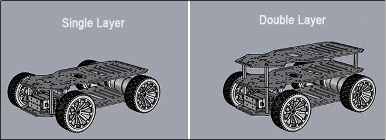
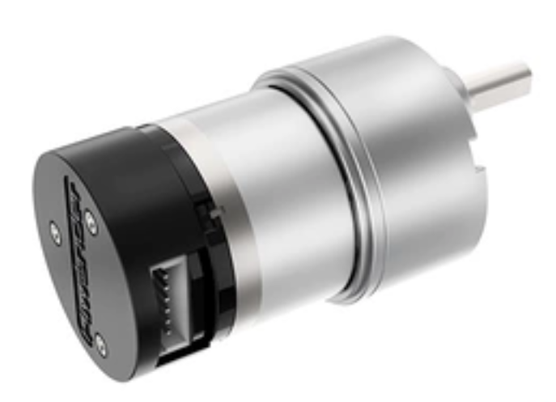

# 1. Introduction & Installation

## 1.1 Ackermann Chassis Introduction

### 1.1.1 Product Introduction

The Ackermann steering chassis represents a standard configuration extensively employed in the new energy market and is a popular choice within the realm of autonomous driving. Specifically developed by Hiwonder, for educational scenarios, this Ackermann car chassis aligns with the standard structure of modern car chassis. In this design, the rear wheels consistently maintain a parallel orientation, while the inner wheels articulate at an angle during turns. Ackermann steering is characterized by the inner wheel turning at a greater angle than the outer wheel, and the disparity in turning angles is termed Ackermann steering.

This chassis employs the forward Ackermann steering structure, and the rear wheels are driven with electronic differential speed. This feature serves to enhance users' comprehension of robots equipped with Ackermann steering structures. To validate these claims, further verification is recommended.

Key features of the Ackermann chassis include:

* **Easy Disassembly and Modification**

(1) The chassis features a double-layer structure design with a bottom layer designed for battery installation.

(2) Numerous `M3` and `M4` installation holes are strategically placed, allowing for the installation of various components such as Raspberry Pi, microcontrollers, control systems, Lidar, depth cameras, sensors, and robotic arms.

(1) High Steering Precision and Reliable Movement

① The steering structure employs high-precision components and is equipped with precision bearings, ensuring both accuracy and strong load-bearing capacity.

② Enhanced steering power is provided by a 15KG high-torque digital servo.

③ The Ackermann chassis utilizes high-quality plastic tire treads, offering dense, large friction for a robust grip, anti-skid properties, and precise and reliable car movement.

(2) Strong Driving Ability

① Equipped with a high-performance DC reduction motor featuring its own high-precision encoder.

② The motor operates at a rated voltage of 12V, delivering strong horsepower and excellent performance.

In conjunction with this course, participants will gain insights into:

* **The assembly of accessories required for car assembly.**

(1) Connection methods between various components.

(2) Programming skills to control the movement of the car chassis using different main control boards.

(3) Understanding the software and hardware connections involved in the process.

### 1.1.2 Ackermann Hardware Introduction

* **Hardware Structure**

The front wheel transmission system of the Ackerman chassis consists of a steering gear, connecting rod, and wheel. The steering gear is linked to the connecting rod, and the connecting rod is connected to the wheel. By rotating the steering gear, the rotation amplitude of the connecting rod is controlled, consequently managing the steering of the front wheel.

During turns, the two front wheels maintain a parallel alignment, meaning they rotate at the same angle. The control of the rear wheels involves motors and wheels. The robot's forward, backward, and speed movements are regulated by the motor's rotation.

The Ackerman car is equipped with a 520 Hall-coded DC reduction motor—a high-torque, high-load motor with a 12V DC power supply and a reduction ratio of 1:30. This motor design enhances the performance and efficiency of the Ackerman chassis.

* **Physical Characteristic**

The Ackermann chassis is crafted with the goal of optimizing steering performance and stability. This design enhances the vehicle's controllability during cornering while minimizing sideslip when making turns.

Furthermore, the Ackermann chassis takes into account the positioning of the vehicle's center of gravity. The location of the center of gravity significantly influences the vehicle's stability and handling performance. Generally, Ackermann chassis designs incorporate a lower center of gravity to mitigate the risk of pitching and skidding, thereby enhancing overall safety and control.

### 1.1.3 Development Tutorials Description

The development tutorials are edited based on different controllers, including `Arduino Uno`, `STM32` controller, and `Raspberry Pi 4B`. You can select the appropriate course based on your specific controller.

## 1.2 Double-layer board installation tutorial

### 1.2.1 Double-layer board installation tutorial

Greetings, everyone! In today's video, I'll guide you through the step-by-step assembly process of the double-layer Ackermann chassis. Let's dive in! Begin by removing the four screws. Here's a helpful tip: hold the column with your hand to keep the bottom screw secure. Next, attach the single-pass copper column to these designated holes. Moving on, affix the second layer onto the columns and secure them together using screws. And there you have it – assembly is complete! For details on wiring and controller installation, please check out the next video.

### 1.2.2 Ackermann chassis controller and wiring instructions

Hello everyone. In this video, I'll demonstrate how to install the `STM32` controller onto the Ackermann chassis. Before installation, ensure to pass this wire through the designated hole for future wiring purposes. Now, let's proceed with the `STM32` controller installation. Align the four holes on the controller with those on the chassis. Next, attach four columns to the corresponding holes on the chassis using nuts. Then, secure the controller onto these columns using screws. It's important to note that the four motor interfaces on the `STM32` controller should face towards the rear of the car. Now, connect the wire from the servo that controls the steering of the front wheels to the third row of pins (`J1`) on the controller. Be sure to connect it to the correct terminal. Next, connect the right rear wheel to the `M1` port and the left rear wheel to the `M2` port. Great! The installation and wiring of the controller are now complete.

### 1.2.3 Battery Installation

Hello everyone. In this video, I'll demonstrate how to connect the battery to the controller. The '+' symbol represents the positive power electrode, while the '-' symbol denotes the negative power electrode. Start by passing the battery wire through this designated hole, then use a screwdriver to loosen the screw of the power terminal. Next, connect the black wire to the negative terminal and the red wire to the positive terminal. Once done, prepare the hook and loop to securely attach the battery to the car chassis. Then, connect the connector ensuring the red wire aligns with the red wire, and the black wire aligns with the black wire. The plug features an anti-reverse plug-in design, so avoid forcefully plugging them in. It's crucial not to connect the connector before attaching the battery wire to the power terminal of the controller, as this could result in a short circuit.

### 1.2.4 Introduction to hardware required for Raspberry Pi development

Hello, everyone! Welcome to this video where I'll guide you through the components required for `Raspberry Pi` development. Let's start by examining the Ackermann chassis. These two rear wheels are responsible for driving the chassis forward and backward. The `6PIN` motor wire attached to them will be detailed in our next video on connecting them to the `Raspberry Pi`.

Additionally, we have a `PWM` servo used to steer the front wheels. Again, we'll cover the wiring method for this in our upcoming video.

For power, we'll be using an 11.1V Lithium battery. You'll also need three female-to-male Dupont wires for connecting the `PWM` servo to the `Raspberry Pi`, and three female-to-female DuPont wires for `IIC` communication between the motor driver and `Raspberry Pi`.

Of course, you'll need a `Raspberry Pi`. Remember to write the system image provided into the SD card and insert it into the `Raspberry Pi`. Instructions for writing the system image can be found in the provided tutorial.

To ensure sufficient power for the `Raspberry Pi` components, connect a power bank to the `type-C` port for power supply.

Now, onto the motor driver. It's important to note that you'll need to solder the four pins yourself. The battery wire is already attached to the driver, allowing you to connect the battery easily. You can also supply power to the motor driver through the provided port. Simply connect the power source's positive and negative terminals to this port. It's essential to use separate power supplies for the `Raspberry Pi` and the motor driver.

Finally, make sure to have the necessary screw accessories on hand for assembly. Stay tuned for more detailed instructions on wiring and assembly in our upcoming videos!

## 1.3 Double-Layer Version Installation

[Double-Layer Version Installation Video](https://youtu.be/8mtxbLwPIhk)
