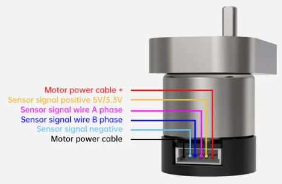
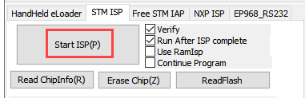
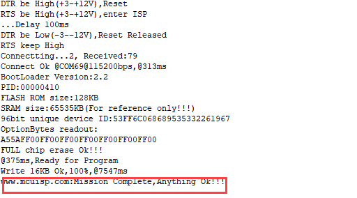
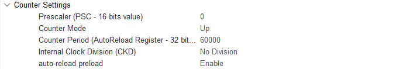
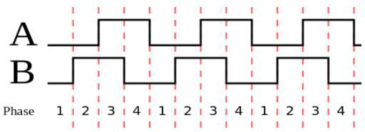

# 1. Tutorials

## 1.1 Introduction & Installation

### 1.1.1 Ackermann Chassis Introduction


The Ackermann steering chassis represents a standard configuration extensively employed in the new energy market and is a popular choice within the realm of autonomous driving. Specifically developed by Hiwonder, for educational scenarios, this Ackermann car chassis aligns with the standard structure of modern car chassis. In this design, the rear wheels consistently maintain a parallel orientation, while the inner wheels articulate at an angle during turns. Ackermann steering is characterized by the inner wheel turning at a greater angle than the outer wheel, and the disparity in turning angles is termed Ackermann steering.

This chassis employs the forward Ackermann steering structure, and the rear wheels are driven with electronic differential speed. This feature serves to enhance users' comprehension of robots equipped with Ackermann steering structures. To validate these claims, further verification is recommended. Key features of the Ackermann chassis include:

* **Easy Disassembly and Modification:**

(1) The chassis features a double-layer structure design with a bottom layer designed for battery installation.
(2) Numerous M3 and M4 installation holes are strategically placed, allowing for the installation of various components such as Raspberry Pi, microcontrollers, control systems, Lidar, depth cameras, sensors, and robotic arms.

* **High Steering Precision and Reliable Movement:**

(1) The steering structure employs high-precision components and is equipped with precision bearings, ensuring both accuracy and strong load-bearing capacity.
(2) Enhanced steering power is provided by a 15KG high-torque digital servo.
(3) The Ackermann chassis utilizes high-quality plastic tire treads, offering dense, large friction for a robust grip, anti-skid properties, and precise and reliable car movement.

* **Strong Driving Ability:**

(1) Equipped with a high-performance DC reduction motor featuring its own high-precision encoder.
(2) The motor operates at a rated voltage of 12V, delivering strong horsepower and excellent performance.

In conjunction with this course, participants will gain insights into:

* The assembly of accessories required for car assembly.
* Connection methods between various components.
* Programming skills to control the movement of the car chassis using different main control boards.
* Understanding the software and hardware connections involved in the process.

* **Ackermann Hardware Introduction**

(1) Hardware Structure

The front wheel transmission system of the Ackerman chassis consists of a steering gear, connecting rod, and wheel. The steering gear is linked to the connecting rod, and the connecting rod is connected to the wheel. By rotating the steering gear, the rotation amplitude of the connecting rod is controlled, consequently managing the steering of the front wheel.

During turns, the two front wheels maintain a parallel alignment, meaning they rotate at the same angle. The control of the rear wheels involves motors and wheels. The robot's forward, backward, and speed movements are regulated by the motor's rotation.


The Ackerman car is equipped with a 520 Hall-coded DC reduction motor—a high-torque, high-load motor with a 12V DC power supply and a reduction ratio of 1:30. This motor design enhances the performance and efficiency of the Ackerman chassis.


(2) Physical Characteristic

The Ackermann chassis is crafted with the goal of optimizing steering performance and stability. This design enhances the vehicle's controllability during cornering while minimizing sideslip when making turns.

Furthermore, the Ackermann chassis takes into account the positioning of the vehicle's center of gravity. The location of the center of gravity significantly influences the vehicle's stability and handling performance. Generally, Ackermann chassis designs incorporate a lower center of gravity to mitigate the risk of pitching and skidding, thereby enhancing overall safety and control.

### 1.1.2 Double-layer board installation tutorial

* **Development Tutorials Description**

The development tutorials are edited based on different controllers, including Arduino Uno, STM32 controller, and Raspberry Pi 4B. You can select the appropriate course based on your specific controller.

* **Double-layer board installation tutorial**

Greetings, everyone! In today's video, I'll guide you through the step-by-step assembly process of the double-layer Ackermann chassis. Let's dive in! Begin by removing the four screws. Here's a helpful tip: hold the column with your hand to keep the bottom screw secure. Next, attach the single-pass copper column to these designated holes. Moving on, affix the second layer onto the columns and secure them together using screws. And there you have it – assembly is complete! For details on wiring and controller installation, please check out the next video.

## 1.2 STM32 Version

### 1.2.1 STM32 Installation & Wiring

* **Ackerman chassis controller and wiring instructions**

Hello everyone. In this video, I'll demonstrate how to install the STM32 controller onto the Ackermann chassis. Before installation, ensure to pass this wire through the designated hole for future wiring purposes. Now, let's proceed with the STM32 controller installation. Align the four holes on the controller with those on the chassis. Next, attach four columns to the corresponding holes on the chassis using nuts. Then, secure the controller onto these columns using screws. It's important to note that the four motor interfaces on the STM32 controller should face towards the rear of the car. Now, connect the wire from the servo that controls the steering of the front wheels to the third row of pins (J1) on the controller. Be sure to connect it to the correct terminal. Next, connect the right rear wheel to the M1 port and the left rear wheel to the M2 port. Great! The installation and wiring of the controller are now complete.

* **insert battery**

Hello everyone. In this video, I'll demonstrate how to connect the battery to the controller. The '+' symbol represents the positive power electrode, while the '-' symbol denotes the negative power electrode. Start by passing the battery wire through this designated hole, then use a screwdriver to loosen the screw of the power terminal. Next, connect the black wire to the negative terminal and the red wire to the a positive terminal. Once done, prepare the hook and loop to securely attach the battery to the car chassis. Then, connect the connector ensuring the red wire aligns with the red wire, and the black wire aligns with the black wire. The plug features an anti-reverse plug-in design, so avoid forcefully plugging them in. It's crucial not to connect the connector before attaching the battery wire to the power terminal of the controller, as this could result in a short circuit.

### 1.2.2 Development Tutorial (STM32 Version)

**Once the program is downloaded, the car chassis executes a sequence of actions in the following order:**

(1) **Move forward for 4 seconds**

(2) **Reverse for 4 seconds**

(3) **Turn left for 4 seconds**

(4) **Return to the initial position**

(5) **Move forward to the right for 4 seconds**

(6) **Return to the original position**

**A 1-second interval separates each action.**

* **Hardware Introduction**

(1) STM32 Main Control Module Introduction

The controller utilizes the STM32F407VET6 and the motor drive chip employed is the YX4055 (over-current protection). The voltage range is from 3V to 12V, depending on the actual voltage applied to the motor. The interface layout is as follow:


The interface instruction is as follow:

| Interface type | Mark | Instruction |
|:---:|:---:|:---:|
| Encoder motor interface | GND | The negative terminal of the hall power supply |
| | A | A phase pulse signal output terminal |
| | B | B phase pulse signal output terminal |
| | VCC | The positive terminal of the hall power supply |
| | M+ | The positive terminal of the motor power supply |
| | M- | The negative terminal of the motor power supply |
| Power port | + | The positive terminal of the power source |
| | - | The negative terminal of the power source |

:::{Note}
* The voltage between VCC and GND is depended on the voltage supplied to the microcontroller, typically using 3.3V or 5V.
* When the spine rotates clockwise, the output pulse A channel signal is prior to the B channel signal. When the spindle rotates counterclockwise, the A channel signal is prior to the B channel signal.
* The voltage between M+ and M+ is determined to the voltage supplied to the motor.
:::

(2) Steering Servo


The steering servo in this chassis utilizes the LD-1501MG PWM servo model.

The LD-1501MG operates on a PWM servo mechanism. To control it, a PWM signal with a 20ms period is sent to the signal end. The servo angle is adjusted by manipulating the pulse width within the range of 500 to 2500μs. This corresponds to an angle range of 0 to 180°, and the recommended operating voltage is between 6V and 8.4V.

The PWM waveform signal is employed to regulate the servo position. When the PWM signal is fed into the motor drive circuit, the motor rotation is controlled based on the signal level. A high PWM duty cycle results in a greater driving force, enabling a larger rotation angle. Conversely, a low duty cycle yields a smaller driving force, resulting in a reduced motor rotation angle.

By continuously fine-tuning the PWM duty cycle, the microcontroller can precisely control the motor's rotation angle. This, in turn, drives the mechanical structure to rotate, achieving accurate position control of the steering gear output shaft.


The above picture is the PWM servo wiring interface diagram, and the following table is the pin distribution table:

| PIN | Function |
|:---:|:---:|
| White wire | Signal wire |
| Red wire | Power positive electrode |
| Black wire | Ground wire |

(3) Encoder Geared Motor

The motor model employed by the suspension Ackermann chassis is **`JGB37-520R30-12`**, where J represents a DC motor, GB represents an electronic output shaft, 520 represents the motor type, R30 represents a reduction ratio of 1:30, 12 represents the a rated voltage of 12V. Its interface description is shown in the figure below:



The Hall encoder disk is aligned with the motor along the same shaft. As the motor rotates, the Hall device detects the motion and generates a series of pulse signals. To ascertain the steering direction, it typically produces two sets of square wave signals with a specific phase difference.

* **Wiring**

The Ackerman car's wiring setup is as follows: Connect the front steering servo to the J1 interface of the STM32 main control board using the specified wiring interface. Additionally, link the left motor to the M1 interface and the right motor to the M2 interface on the STM32 main control board. The detailed wiring method is illustrated below.


* **Program Download**

[Source Code](https://drive.google.com/drive/folders/1yav6eu1obCyiQb6E08EEPfVkPyGk9PeC?usp=sharing)

After the project is compiled completely, download the generated hex file to the STM32 control board. Please prepare the following hardware materials:

(1) Software & Hardware Preparation for USB Download

① **Software**: **`FlyMcu`** (it is located in **"2. Software Tools/ 01 STM32 Installation Pack/ USB Serial Port Download/ FlyMcu"**)


② **Hardware**: Type-C cable, STN32 main control board

(2) USB Download Operation Steps

The specific operation steps are as follow:

① Hardware connection:

Use Type-C cable to connect the Type-C port (UART) of the STM32 control board and the USB port of your computer:


② Basic setting:

Open `FlyMcu`. Click **"Enum Port"** at top menu bar, then set the baud rate (bps) as 115200:


Click **"STMISP"** option and configure as shown in the following figure.


Select **"DTR Low(＜-3V)，ISP @RTS High"**:


③ Software burning:

In the `FlyMcu` software interface, click to select the hex file to be burned. The program below is just for your reference, please rely on the actual program. Select the hex file in **"03 Program/RosRobotControllerM4_MINACKER/MDK-ARM/RosRobotControllerM4/RosRobotControllerM4.hex"**.


Go back to the previous interface and click the **"Start ISP"** to burn the generated hex file onto the STM32 main control board:



The burning is in progress.:



When the burning is complete, you will receive the following prompt.


In addition to use USB method for program download, you can also use either st-link or j-link method for direct compilation and burning.

:::{Note}
* To avoid the presence of any exception during the burning process, please strictly follow the above operation steps to operate!
:::

* **Outcome**

Following the program download, the car chassis executes a sequence of actions in the specified order:

(1) Move forward for 4 seconds.

(2) Reverse for 4 seconds.

(3) Turn left for 4 seconds.

(4) Return to the initial position.

(5) Move forward to the right for 4 seconds.

(6) Return to the original position.

Each action is separated by a 1-second interval.

* **Source Code Analysis**

[Source Code](https://drive.google.com/drive/folders/1yav6eu1obCyiQb6E08EEPfVkPyGk9PeC?usp=sharing)

(1) Robot Motion Program Analysis

① Robot Motion Settings

When the Ackerman chassis invokes the `chassis_init()` function to initialize the chassis type, the functions within various chassis structure variables are directed to their respective control functions, as illustrated in the figure below:

{lineno-start=133}
```c
chassis_init();
set_chassis_type(Chassis_run_type);
```

{lineno-start=28}
```c
uint32_t Chassis_run_type = CHASSIS_TYPE_MINACKER;
```

**In the program located at `..\Hiwonder\System\app.c`, the `minacker_control()` function is employed to manage the movement of the small Ackerman chassis. Here's a concise description of its functionality:**

Within this function, the following actions are executed:

* Set the speed of the small Ackerman chassis in the X-axis direction to 300 millimeters per second.
* Move the driving wheel forward with the steering wheel in a neutral position, resulting in the car moving straight ahead.
* After a 2-second delay, bring the car to a stop for 1 second.
* Move the driving wheel backward with the steering wheel in a neutral position, causing the car to move straight backward.
* After another 2-second delay, pause for 1 second.
* Move the driving wheel forward once more, this time turning the steering wheel left for a left turn.
* After a 1-second delay, return the steering wheel to the right direction, concluding the movement.

This describes the controlled movement of the small Ackerman chassis in the specified program.

{lineno-start=231}
```c
void minacker_control(void)
{
	static float speed = 150.of;
	chassis->set_velocity(chassis, speed, 0, 0);
	osDelay(2000);
	chassis->stop(chassis);
	osDelay(1000);
	chassis->set_velocity(chassis,-speed,0,0);
	osDelay(2000);
	chassis->stop(chassis);
	osDelay(1000);
	chassis->set_velocity_radius(chassis, speed, 50o, true);
	osDelay(2000);
	chassis->stop(chassis);
	osDelay(1000) ;
}
```

② Set Straight Line

Within the file path `..\Hiwonder\Chassis\ackermann_chassis.c`, the movement of the small Ackermann chassis is governed by the kinematic algorithm. The straight-line trajectory of the chassis is specifically regulated using the `set_velocity()` function.

{lineno-start=187}
```c
chassis->set_velocity(chassis,speed,0,0);
```

{lineno-start=117}
```c
void ackermann_chassis_object_init(AckermannChassisTypeDef *self){
	if(self->base.chassis_type == CHASSIS_TYPE_JETACKER)
	{
		self->base.stop = jetacker_stop;
		self->base.set_velocity = jetacker_set_velocity;
		self->base.set_velocity_radius = jetacker_set_velocity_radius;
	}else{
		self->base.stop = minacker_stop;
		self->base.set_velocity = minacker_set_velocity;
		self->base.set_velocity_radius = minacker_set_velocity_radius;
	}
}
```

{lineno-start=107}
```c
static void minacker_set_velocity(void *self, float vx, float vy, float r)
{
    minacker_chassis_move(self, vx, r);
}
```

The kinematic solution for the Ackermann chassis is depicted in the accompanying figure. To achieve regular car movement, the calculation involves determining the speed of each Ackermann motor. When the car moves straight, with a turning radius of 0 and a turning angle of 0 degrees, the speeds of the left and right wheels (`vl` and `vr`) are synchronized with the speed of `vx`. The `set_motors()` function is then employed to establish these motor speeds, with the servo angle set to 1500 to maintain a centered position. This comprehensive process ensures the Ackermann chassis exhibits consistent and predictable movements, particularly during straight-line motion.

{lineno-start=57}
```c
//minacker
void minacker_chassis_move(AckermannChassisTypeDef *self, float vx, float r )
{
	float vr = 0 , vl = 0;
	float angle =     0;
	if(r != 0)
	{
		angle = atan(self->shaft_length/r);
		vl = vx/r * (r - self->wheelbase/2);
		vr = vx/r * (r + self->wheelbase/2);
	}else{ //r == 0 go straight
		angle = 0;
		vr = vx;
		vl = vx;
	}
	vr = linear_speed_to_rps(self , vr); //get right wheel linear speed
	vl = linear_speed_to_rps(self , vl); //get left wheel linear speed
	if(angle > PI/4.5f)
	{
		angle = PI/4.5f;
	}else if(angle < -PI/4.5f)
	{
		angle = -PI/4.5f;
	}      
	angle = -2000/PI * angle + 1500; //get steering angle
	self->set_motors(self , vl , vr , angle);
}
```

③ Set Robot's Turning

Control the chassis turning using `set_velocity_radius()` function.

{lineno-start=112}
```c
static void minacker_set_velocity_radius(void* self, float linear, float r,bool swerve)
{
		minacker_chassis_move(self, linear, r);
}
```

**During turns, the rear motors operate similarly to when the robot moves straight ahead. The turning angle of the servo is computed based on the turning radius (r) and the length of the vehicle body shaft (`shaft_length`, i.e., the distance between the front and rear wheels). To determine the speeds (`vl` and `vr`) of the left and right driving wheels, respectively, the axis length (`wheelbase`) of the two wheels and the linear speed (`vx`) of the movement are considered. The function `linear_speed_to_rps()` converts the linear wheel speed into rotational speed, and the turning angle is restricted to prevent servo damage, capped at ±40 degrees. The expression `angle = -2000/PI * angle + 1500;` converts the servo angle value into a control value for servo rotation, with 1500 as the initial centering value for the servo.**

**Subsequently, the `set_motors(self, vl, vr, angle);` function assigns the motor and servo values to the motor motion control function, ultimately regulating the motion of both the motor and servo.**

{lineno-start=57}
```c
//minacker
void minacker_chassis_move(AckermannChassisTypeDef *self, float vx, float r )
{
	float vr = 0 , vl = 0;
    float angle = 0;
	if(r != 0)
    {
		angle = atan(self->shaft_length/r);
		vl = vx/r * (r - self->wheelbase/2);
		vr = vx/r * (r + self->wheelbase/2);
	}else{ //r == 0 go straight
		angle = 0;
		vr = vx;
		vl = vx;
    }
	vr = linear_speed_to_rps(self , vr); //get right wheel linear speed
	vl = linear_speed_to_rps(self , vl); //get left wheel linear speed
	if(angle > PI/4.5f)
    {    
	angle = PI/4.5f;
	}else if(angle < -PI/4.5f)
    {
		angle = -PI/4.5f;
    }
	angle = -2000/PI * angle + 1500; //get steering angle
	self->set_motors(self , vl , vr , angle);
}
```

**The figure below illustrates the application of Ackermann's kinematics formula in the program, providing a visual representation of the kinematic principles employed.**


**Steering servo angle formula**： 

**Left wheel speed formula**: 

**Right wheel speed formula**: 

④ Control Robot to Stop

The `stop()` function is designed to bring the robot to a halt by setting the motor speed to 0, effectively ceasing its movement.

{lineno-start=246}
```c
chassis->stop(chassis);
```

{lineno-start=102}
```c
static void minacker_stop(void *self)
{    
	((AckermannChassisTypeDef*)self) ->set_motors(self, 0, 0,1500);
}
```

(2) AB Quadrature Encoder Motor Analysis

The preceding analysis establishes the fundamental movements of the car, followed by a detailed examination of motor control specifics.

① Initialize Timer

{lineno-start=128}
```c
MX_TIM1_Init();
```

{lineno-start=130}
```c
MX_TIM5_Init();
```

{lineno-start=139}
```c
MX_TIM7_Init();
```

In the main function within the `main.c` file, several timers are initialized. We will focus on elucidating the motor control process for Motor 1, with the understanding that the control mechanisms for the other motors remain identical. Motor 1 involves the utilization of three timers: Timer 1 (for PWM control of motor speed), Timer 5 (for obtaining motor speed through encoder), and Timer 7 (for timed interrupts to update motor speed measurements and PID control frequency). Additionally, interrupt initialization is performed. The figure below illustrates the parameter configuration in STM32CubeMX, and for a more intuitive view, it is recommended to refer to the `tim.c` file or use the STM32CubeMX software interface for configuration settings.


**Timer 1 (PWM Control Motor Speed)**



**Timer 5 (Encoder measures and captures the speed of the motor)**


**Timer 7(update motor speed measurements and regulate the frequency of PID control)**

② Motor Initialization

**Before controlling the motor, it is necessary to initialize the relevant motor parameters located in the `app.c` function under the folder `..\Hiwonder\System\app.c`:**

{lineno-start=52}
```c
motors_init();
```

The below code segment shows the initialization of the motor, located in `..\Hiwonder\motor_porting.c`. It initializes the motor structure. In the next section, "**Chassis Motor Motion Parameter Initialization**", the parameters of this motor will be overridden. Pay attention to selecting the appropriate chassis type.

{lineno-start=43}
```c
void motors_init(void)
{
	for(int i = 0; i < 4; ++i) {
		motors[i] = LWMEM_CCM_MALLOC(sizeof( EncoderMotorObjectTypeDef));
		encoder_motor_object_init(motors[i]);
		motors[i]->ticks_overflow= 60000;
		motors[i]->ticks_per_circle = MOTOR_DEFAULT_TICKS_PER_CIRCLE;
		motors[i]->rps_limit=MOTOR_DEFAULT_RPS_LIMIT;
		motors[i]->pid_controller.set_point = 0.0f;
		motors[i]->pid_controller.kp=MOTOR_DEFAULT_PID_KP;
		motors[i]->pid_controller.ki= MOTOR_DEFAULT_PID_KI;
		motors[i]->pid_controller.kd= MOTOR_DEFAULT_PID_KD;
    }
	motors[0]->set_pulse = motor1_set_pulse;
	__HAL_TIM_SET_COUNTER(&htim1,0);
	__HAL_TIM_ENABLE(&htim1);
	__HAL_TIM_MOE_ENABLE(&htim1);
```

**`LWMEM_CCM_MALLOC()` dynamically creates a group of objects, allocating memory for objects of type `EncoderMotorObjectTypeDef`, and stores the memory address in the corresponding position of the `motors` array. The following is the structure parameters for motor1, located in `...\Hiwonder\Peripherals\encoder_motor.h`. For specific parameter contents, please refer to the annotations shown in the figure.**

{lineno-start=46}
```c
motors[i] = LWMEM_CCM_MALLOC(sizeof(EncoderMotorObjectTypeDef));
```

{lineno-start=20}
```c
/**
 *@brief Encoder motor object structure
*/
struct EncoderMotorObject {
	int64_t counter;
	/**<@brief Total value, 64-bit; it is considered that there will be no overflow*/
	int64_t overflow_num;
	/**<@brief Overflow counter*/
	int32_t ticks_overflow; /**<@brief Value indicating a count overflow*/
	float tps;
    /**<@brief Frequency of the ticks per second counter*/
	float rps;
	/**<@brief revolutions per second Output shaft rotational speed per second */
	int current_pulse;
	/**<@brief The current PWM value being output, with the sign indicating forward or reverse rotation */
	PID_ControllerTypeDef pid_controller; /**< @brief PID Controller */
```

**Initialize the defined structure (`encoder_motor_object_init`), located in `...\Hiwonder\Portings\motor_porting.c`.**

{lineno-start=47}
```c
encoder_motor_object_init(motors[i]);
```

The following program is located in `..\Hiwonder\Peripherals\encoder_motor.c`:

{lineno-start=72}
```c
void encoder_motor_object_init(EncoderMotorObjectTypeDef *self)
{
	self->counter = 0;
	self->overflow_num = 0;
	self->tps = 0;
	self->rps = 0;
	self->current_pulse = 0;
	self->ticks_overflow = 0;
	self->ticks_per_circle = 9999; /* The number of counts generated when the motor output shaft rotates one full circle. Please fill in according to the actual condition of the motor */
	pid_controller_init(&self->pid_controller, 0, 0, 0);
}
```

**Use Timer 1 to generate PWM signal, as shown in the below figure:**

{lineno-start=57}
```c
    /* Motor 1 */
    motors[0]->set_pulse = motor1_set_pulse;
    __HAL_TIM_SET_COUNTER(&htim1, 0);
    __HAL_TIM_ENABLE(&htim1);
    __HAL_TIM_MOE_ENABLE(&htim1);
```

**Use TIM5 to control the acquisition and start the encoder of the motor, as shown in the following figure:**

{lineno-start=63}
```c
    /* encoder */
    __HAL_TIM_SET_COUNTER(&htim5, 0);
    __HAL_TIM_CLEAR_IT(&htim5, TIM_IT_UPDATE);
    __HAL_TIM_ENABLE_IT(&htim5, TIM_IT_UPDATE);
    __HAL_TIM_ENABLE(&htim5);
    HAL_TIM_Encoder_Start(&htim5, TIM_CHANNEL_ALL);
```

**Use TIM7 to calculate the encoder value once to obtain the speed, as shown in the following figure:**

{lineno-start=114}
```c
    // Speed test update timer
    __HAL_TIM_SET_COUNTER(&htim7, 0);
    __HAL_TIM_CLEAR_IT(&htim7, TIM_IT_UPDATE);
    __HAL_TIM_ENABLE_IT(&htim7, TIM_IT_UPDATE);
    __HAL_TIM_ENABLE(&htim7);
```

③ Chassis Motor Motion Parameter Initialization

**In the program located in `..\Hiwonder\System\app.c`, initialize the motion parameters of the chassis motors. For the Ackermann chassis, use `CHASSIS_TYPE_MINACKER`.**

{lineno-start=27}
```c
//Chassis type (default is the Large Ackerman chassis)
uint32_t Chassis_run_type = CHASSIS_TYPE_JETACKER;
uint8_t  save_flash = 0;
```

{lineno-start=66}
```c
	//Initialize the motion parameters of the chassis motor
	chassis_init();
	//Select the chassis type
	//Note: Use of tracked chassis vehicles CHASSIS_TYPE_TANKBLACK!!!
	set_chassis_type(CHASSIS_TYPE_TANKBLACK);
```

**In the program located in `..\Hiwonder\Portings\chassis_porting.c`, the `chassis_init()` function initializes the motion parameters for the car chassis motors.**

{lineno-start=55}
```c
void chassis_init(void)
{
```

{lineno-start=113}
```c
	//Initialization of the small Ackermann chassis structure
    minacker.base.chassis_type = CHASSIS_TYPE_MINACKER;
    minacker.correction_factor = MINACKER_CORRECITION_FACTOR;
    minacker.wheel_diameter = MINACKER_WHEEL_DIAMETER;
    minacker.shaft_length = MINACKER_SHAFT_LENGTH;
    minacker.wheelbase = MINACKER_WHEELBASE;
    minacker.set_motors = minacker_set_motors;
	ackermann_chassis_object_init(&minacker); //The initialization of the structure is placed later
}
```

The macro definitions for the parameters are located in `..\Hiwonder\Chassis\chassis.h`. Among them, `WHEEL_DIAMETER` represents the diameter of the wheels. `SHAFT_LENGTH` represents the shaft length, i.e., the distance between the left and right wheels. `CORRECTION_FACTOR` is the conversion ratio coefficient, which is currently not in use.

{lineno-start=51}
```c
#define MINACKER_WHEEL_DIAMETER 60.0 /* mm */
#define MINACKER_CORRECITION_FACTOR 1.0 /* mm */
#define MINACKER_SHAFT_LENGTH 170.0 /* mm */
#define MINACKER_WHEELBASE  180.0 /* mm */
```

**Following initializes the motor of the ackerman chassis car.**

{lineno-start=96}
```c
void set_chassis_type(uint8_t chassis_type)
{
```

{lineno-start=162}
```c
		case CHASSIS_TYPE_MINACKER:
			chassis = (ChassisTypeDef*)&minacker;
			set_motor_type(motors[0],MOTOR_TYPE_JGB520);
			set_motor_type(motors[1],MOTOR_TYPE_JGB520);
			set_motor_type(motors[2],MOTOR_TYPE_JGB520);
			set_motor_type(motors[3],MOTOR_TYPE_JGB520);
			break;
```

**After jumping, you can obtain the corresponding parameters of the motor.**

{lineno-start=12}
```c
/* Each revolution of the motor shaft generates 11 pulses. The counter counts evenly at the rising and falling edges of phases A and B, meaning the count value is four times the number of pulses. The reduction ratio is 90.0.
 * That is, for each revolution of the motor output shaft, the counter value changes by 11.0 * 4.0 * 90.0 = 3960
 */
#define MOTOR_JGB520_TICKS_PER_CIRCLE 3960.0f
#define MOTOR_JGB520_PID_KP  63.0f
#define MOTOR_JGB520_PID_KI  2.6f
#define MOTOR_JGB520_PID_KD  2.4f
#define MOTOR_JGB520_RPS_LIMIT 1.5f
```

④ PWM Speed Control

**Based on our previous explanation, after setting the velocity along the x-axis and the angular velocity, perform kinematic analysis to obtain the speeds of the left and right motors, denoted as `rps_l` and `rps_r` respectively. Motor 1 corresponds to the left wheel, and Motor 2 corresponds to the right wheel. Finally, use the function `self->set_motors(self, rps_l, rps_r)` to set the motor speeds.**

{lineno-start=14}
```c
void diff_chassis_move(DifferentialChassisTypeDef *self, float vx, float angule_rate)
{
	float v_l = vx - angule_rate * ((DifferentialChassisTypeDef*)self)->shaft_length / 2.0f;
	float v_r = vx + angule_rate * ((DifferentialChassisTypeDef*)self)->shaft_length / 2.0f;
	float rps_l = linear_speed_to_rps(self, v_l);
	float rps_r = linear_speed_to_rps(self, v_r);
	self->set_motors(self, rps_l, rps_r);
}
```

**We have selected the `MINACKER` Ackermann chassis vehicle. The function `tankblack_set_motors` sets the speeds of the two motors.**

{lineno-start=57}
```c
//minacker
void minacker_chassis_move(AckermannChassisTypeDef *self, float vx, float r )
{
	float vr = 0 , vl = 0;
	float angle = 0;
	if(r != 0)
	{
		angle = atan(self->shaft_length/r);
		vl = vx/r * (r - self->wheelbase/2);
		vr = vx/r * (r + self->wheelbase/2);
	}else{ //r == 0 go straight
		angle = 0;
		vr = vx;
		vl = vx;
	}
	vr = linear_speed_to_rps(self , vr); //get right wheel linear speed
	vl = linear_speed_to_rps(self , vl); //get left wheel linear speed
	if(angle > PI/4.5f)
	{
		angle = PI/4.5f;
	}else if(angle < -PI/4.5f)
	{
		angle = -PI/4.5f;
	}
	angle = -2000/PI * angle + 1500; //get steering angle
	self->set_motors(self , vl , vr , angle);
}
```

**Navigate to the `minacker_set_motors` function, depicted in the figure below, to configure the motor speeds for both Motor 1 and Motor 2.**

{lineno-start=57}
```c
static void minacker_set_motors(void* self, float rps_lh, float rps_lt,int position)
{
	static int position_last = 0;
	if( position_last I= position）
    {
		pwm_servo_set_position(pwm_servos[1],position,100);
		position_Iastˉ= position;
     }
	encoder_motor_set_speed(motors[1],-rps_1h);
	encoder_motor_set_speed(motors[0], rps_It);
}
```

**In the program located in `..\Hiwonder\Peripherals\encoder_motor.c`, implement speed limitation and set the target speed for the PID controller.**

{lineno-start=60}
```c
void encoder_motor_set_speed(EncoderMotorObjectTypeDef *self, float rps)
{
	rps = rps > self->rps_limit ? self->rps_limit : (rps < -self->rps_limit ? -self->rps_limit : rps); /* Limit the speed */
    self->pid_controller.set_point = rps; /* Set the PID controller target */
}
```

**The `encoder_motor_control()` function is responsible for updating the speed control of the encoder motor. It adjusts the PWM value to stabilize the motor at the previously set target speed. First, it updates the PID parameters, then corrects the output PWM, and finally sets the new PWM signal using `self->set_pulse()`. The specific implementation of the program is as follows (in `..\Hiwonder\Peripherals\encoder_motor.c`):**

{lineno-start=32}
```c
/**
 * @brief Encoder motor speed control task
 * @detials The encoder motor speed PID control task needs to be specified at regular intervals to complete the PID control update
 * @param self Encoder motor object pointer
 * @param period The time interval between the current update and the last update (update cycle), measured in sec
 * @retval None.
*/
void encoder_motor_control(EncoderMotorObjectTypeDef *self, float period) 
{
	float pulse = 0;
    pid_controller_update(&self->pid_controller, self->rps, period);   /* Update the PID controller

 */
    pulse = self->current_pulse + self->pid_controller.output; /* Calculate the new PWM value*/
	
	/* Limit the output PWM value. The limit is determined by the timer setting. In this example, the duty cycle set by the timer from 0 to 100 corresponds to 0 to 1000 */
    pulse = pulse > 1000 ?  1000 : pulse; 
    pulse = pulse < -1000 ? -1000 : pulse;
	
    self->set_pulse(self, pulse > -250 && pulse < 250 ? 0 : pulse); /* Set a new PWM value and limit the minimum value of PWM. If the PWM is too small, the motor will only buzz but not move */
    self->current_pulse = pulse; /* Record the new PWM value */
}
```

**`self->set_pulse` passes the PWM value to the `motor1_set_pulse()` function. When the speed is positive, it starts `TIM_CHANNEL_4` (forward). When the speed is negative, it starts `TIM_CHANNEL_3` (reverse). When the speed is zero, both channels stop, and the motor does not rotate. As shown in the figure below, located in `..\Hiwonder\Portings\motor_porting.c`.**

{lineno-start=49}
```c
	self->set_pulse(self, pulse > -250 && pulse < 250 ? 0 : pulse),
```

{lineno-start=57}
```c
    /* Motor 1 */
    motors[0]->set_pulse = motor1_set_pulse;
```

{lineno-start=123}
```c
static void motor1_set_pulse(EncoderMotorObjectTypeDef *self, int speed)
{
    if(speed > 0) {
        __HAL_TIM_SET_COMPARE(&htim1, TIM_CHANNEL_3, 0);
        __HAL_TIM_SET_COMPARE(&htim1, TIM_CHANNEL_4, speed);
    } else if(speed < 0) {
        __HAL_TIM_SET_COMPARE(&htim1, TIM_CHANNEL_4, 0);
        __HAL_TIM_SET_COMPARE(&htim1, TIM_CHANNEL_3, -speed);
    } else {
        __HAL_TIM_SET_COMPARE(&htim1, TIM_CHANNEL_3, 0);
        __HAL_TIM_SET_COMPARE(&htim1, TIM_CHANNEL_4, 0);
    }
    HAL_TIM_PWM_Start(&htim1, TIM_CHANNEL_3);
    HAL_TIM_PWM_Start(&htim1, TIM_CHANNEL_4);
}
```

**Combined with the STM32CubeMX configuration, as shown in the figure below, the TIM1 clock frequency is 84MHz, the prescaler value is 839, and the counting period is 999. In each PWM cycle, the timer counter counts from 0 to 999. The "pulse" represents the PWM duty cycle. When the counter reaches the duty cycle value, the high and low voltage levels are inverted, and the counter resets when it reaches 999. "Pulse" is used to set the timer's compare-match register, thereby controlling the PWM signal's duty cycle.**


According to the following formula, the interrupt period of Timer 1 becomes 0.01 seconds, which means an update interrupt is generated every 10 milliseconds: Formula: **Timer overflow time = (prescaler value + 1) × (counting period + 1) / Timer clock frequency**


The calculation process is as follows: **Timer overflow time = (999+1) × (839+1) / 84MHz = 10 ms**

**Adjusting the PWM duty cycle enables the motor to adjust between maximum and minimum speeds. In `..\Hiwonder\Portings\motors_param.h`, the speed limit for the motor is set to 1.5 revolutions per second.**

{lineno-start=19}
```c
#define MOTOR_JGB520_RPS_LIMIT 1.5f
```

**According to the interrupt function of Timer 7, it updates every 10 milliseconds, and the PWM value is used to control the motor speed.**

{lineno-start=503}
```c
void TIM7_IRQHandler(void)
{
  /* USER CODE BEGIN TIM7_IRQn 0 */
    extern EncoderMotorObjectTypeDef *motors[4];
    if(__HAL_TIM_GET_FLAG(&htim7, TIM_FLAG_UPDATE) != RESET) {
        __HAL_TIM_CLEAR_FLAG(&htim7, TIM_FLAG_UPDATE);
		encoder_update(motors[0], 0.01, __HAL_TIM_GET_COUNTER(&htim5));
		encoder_update(motors[1], 0.01, __HAL_TIM_GET_COUNTER(&htim2));
		encoder_update(motors[2], 0.01, __HAL_TIM_GET_COUNTER(&htim4));
		encoder_update(motors[3], 0.01, __HAL_TIM_GET_COUNTER(&htim3));
		for(int i = 0; i < 4; ++i) {
			encoder_motor_control(motors[i], 0.01);
		}
    }
  /* USER CODE END TIM7_IRQn 0 */
  /* USER CODE BEGIN TIM7_IRQn 1 */

  /* USER CODE END TIM7_IRQn 1 */
}
```

**Combined with the STM32CubeMX configuration, as shown in the figure below, TIM7 is connected to APB1, with a clock frequency of 84MHz, which means a 84 prescaler gives a frequency of 1MHz.**


**According to the following formula, the interrupt period of Timer 7 becomes 0.01 seconds, which means an update interrupt is generated every 10 milliseconds: `Timer overflow time=(83+1)×(9999+1)84MHz=10 ms`**

**`Timer overflow time=84MHz(83+1)×(9999+1)=10 ms`**

⑤ Update Encoder Motor to Obtain Speed

**Timer 7 generates an update interrupt every 10 ms, which calculates the motor speed and updates PID parameters. Its update interrupt function is as follows (in `..\Core\Src\stm32f4xx_it.c`), where the encoder motor speed measurement of motor 1 obtained by Timer 5 is updated.**

{lineno-start=503}
```c
void TIM7_IRQHandler(void)
{
  /* USER CODE BEGIN TIM7_IRQn 0 */
    extern EncoderMotorObjectTypeDef *motors[4];
    if(__HAL_TIM_GET_FLAG(&htim7, TIM_FLAG_UPDATE) != RESET) {
        __HAL_TIM_CLEAR_FLAG(&htim7, TIM_FLAG_UPDATE);
		encoder_update(motors[0], 0.01, __HAL_TIM_GET_COUNTER(&htim5));
		encoder_update(motors[1], 0.01, __HAL_TIM_GET_COUNTER(&htim2));
		encoder_update(motors[2], 0.01, __HAL_TIM_GET_COUNTER(&htim4));
		encoder_update(motors[3], 0.01, __HAL_TIM_GET_COUNTER(&htim3));
		for(int i = 0; i < 4; ++i) {
			encoder_motor_control(motors[i], 0.01);
		}
    }
  /* USER CODE END TIM7_IRQn 0 */
  /* USER CODE BEGIN TIM7_IRQn 1 */

  /* USER CODE END TIM7_IRQn 1 */
}
```

**The `encoder_update()` function calculates and updates the motor speed based on the count obtained from the encoder. It calculates the motor speed based on the count of the encoder. `overflow_num` represents the number of overflows of Timer 5, which will be further detailed in the following content. `delta_count` represents the change in the encoder count within the timer period.**

The TPS (Ticks Per Second) is calculated to determine the pulse frequency (i.e., the number of pulses per second). It is achieved by dividing the change in count by the time interval. Here, a filter is applied (with coefficients of 0.9 and 0.1) to smooth the result.

Finally, RPS (Revolutions Per Second) represents the motor's rotational speed (in revolutions per second), and it is calculated as the TPS divided by the number of pulses generated by the motor in one revolution. The number of pulses generated by the motor in one revolution is described in point three below. The `encoder_update` program is located in `..\Hiwonder\Peripherals\encoder_motor.c`.

**Motor speed (rps) = pulses per second (tps) / number of pulses generated by the motor in one revolution (1320)**

{lineno-start=23}
```c
void encoder_update(EncoderMotorObjectTypeDef *self, float period, int64_t counter)
{
    counter = counter + self->overflow_num * self->ticks_overflow; /* Total counts, 60000 depends on actual timer overflow setting */
    int delta_count = counter - self->counter;
    self->counter = counter; /* store new count */
    self->tps = (float)delta_count / period * 0.9f + self->tps * 0.1f; /* calculate pulse frequency */
    self->rps = self->tps / self->ticks_per_circle; /* calculate rps */
}
```

**According to the motor manual, this motor generates 11 pulses per revolution of its shaft, and the gear ratio of the motor is 45:1. The timer is set to use a quadrature counting mode with a 4x frequency, meaning that for every rotation of the motor output shaft, the counter value changes by 11.0 * 4.0 * 30.0 = 1320. Therefore, whenever the motor's output shaft completes one revolution, the encoder interface records an increase of 3960 in the counter value. This information can be found in `..\Hiwonder\Portings\motors_param.h`**

{lineno-start=12}
```c
/* Each revolution of the motor shaft generates 11 pulses. The counter counts evenly at the rising and falling edges of phases A and B, meaning the count value is four times the number of pulses. The reduction ratio is 90.0.
 * That is, for each revolution of the motor output shaft, the counter value changes by 11.0 * 4.0 * 90.0 = 3960
 */
#define MOTOR_JGB520_TICKS_PER_CIRCLE 3960.0f
#define MOTOR_JGB520_PID_KP  63.0f
#define MOTOR_JGB520_PID_KI  2.6f
#define MOTOR_JGB520_PID_KD  2.4f
#define MOTOR_JGB520_RPS_LIMIT 1.5f
```

From the following diagram, we can see that the 4x frequency counting mode counts each pulse four times.



**When the encoder count overflows, it enters the interrupt of Timer 5, where the overflow count changes. The number of underflow occurrences decreases, and the number of overflow occurrences increases. The program is located in `..\Core\Src\stm32f4xx_it.c`**

{lineno-start=468}
```c
void TIM5_IRQHandler(void)
{
  /* USER CODE BEGIN TIM5_IRQn 0 */
    extern EncoderMotorObjectTypeDef *motors[4];
    if(__HAL_TIM_GET_FLAG(&htim5, TIM_FLAG_UPDATE) != RESET) {
        __HAL_TIM_CLEAR_FLAG(&htim5, TIM_FLAG_UPDATE);
        if(__HAL_TIM_IS_TIM_COUNTING_DOWN(&htim5)) {
            --motors[0]->overflow_num;
        } else {
            ++motors[0]->overflow_num;
        }
        //printf("motor1, counts:%d", motors[0]->overflow_num * 60000 + __HAL_TIM_GetCounter(&htim5));
    }
  /* USER CODE END TIM5_IRQn 0 */
  /* USER CODE BEGIN TIM5_IRQn 1 */
  /* USER CODE END TIM5_IRQn 1 */
}
```

(3) PID Stabilizing Target Speed Analysis

① Positional PID Algorithm

The PID controller update function, `pid_controller_update()`, implements positional PID control. The specific code implementation is shown in the following figure, located at `..\Hiwonder\Misc\pid.c`.

{lineno-start=15}
```c
void pid_controller_update(PID_ControllerTypeDef *self, float actual, float time_delta) {
	float err = self->set_point - actual;
	float proportion = err - self->previous_0_err;
	
	float integral = err * time_delta;
	float derivative = (err - 2 * self->previous_1_err + self->previous_0_err) / time_delta;
	
	self->output = (self->kp * err) + (self->ki * integral) + (self->kd * derivative);
	self->previous_1_err = self->previous_0_err;
	self->previous_0_err = err;

}
```

**The `err` variable represents the error between the current target value and the actual value: it calculates the difference between the setpoint (`self->set_point`, desired speed) and the actual measured value (`actual`, current speed).**

> **Error = Setpoint - Actual Value**

**The proportional (P) term, represented by "proportion," is the difference between the current error and the previous error. It is used to calculate the derivative.**

> **Proportional = Error - Previous Error**

**The integral (I) term, represented by "integral," accumulates the error over time. It is used in conjunction with the derivative term to calculate the overall control signal. This term calculates the integral of the error over time, helping to eliminate long-term steady-state errors.**

> **Integral = Error x Time Interval**

**The derivative (D) term, represented by "derivative," calculates the rate of change of the error. It predicts the future behavior of the system and quickly responds to changes in the error.**

> **Derivative = (Error - 2 x Previous Previous Error + Previous Error) / Time Interval**

**Converting PID output to PWM value: Finally, the function stores the output in the `PID_ControllerTypeDef` as "output." After calling the `pid_controller_update` function, the output of the PID controller (`self->output`) can be used to adjust the PWM signal's duty cycle to control the motor speed. Positive or negative PID outputs indicate forward or reverse rotation. Finally, update the previous and previous previous error parameters.**

> **PID Output = Kp x Error + Ki x Integral + Kd x Derivative**

**Finally, update the parameters for the last and previous errors.**

**The program utilizes the standard positional PID formula, as illustrated in the figure below:**


(4) Servo Control Analysis

Proceed to analyze the control of the servo.

① Initialize Timer

{lineno-start=510}
```c
void MX_TIM13_Init(void)
{

  /* USER CODE BEGIN TIM13_Init 0 */

  /* USER CODE END TIM13_Init 0 */

  TIM_OC_InitTypeDef sConfigOC = {0};

  /* USER CODE BEGIN TIM13_Init 1 */

  /* USER CODE END TIM13_Init 1 */
  htim13.Instance = TIM13;
  htim13.Init.Prescaler = 83;
  htim13.Init.CounterMode = TIM_COUNTERMODE_UP;
  htim13.Init.Period = 4999;
  htim13.Init.ClockDivision = TIM_CLOCKDIVISION_DIV1;
  htim13.Init.AutoReloadPreload = TIM_AUTORELOAD_PRELOAD_ENABLE;
  if (HAL_TIM_Base_Init(&htim13) != HAL_OK)
  {
    Error_Handler();
  }
  if (HAL_TIM_OC_Init(&htim13) != HAL_OK)
  {
    Error_Handler();
  }
  sConfigOC.OCMode = TIM_OCMODE_TIMING;
  sConfigOC.Pulse = 0;
  sConfigOC.OCPolarity = TIM_OCPOLARITY_HIGH;
  sConfigOC.OCFastMode = TIM_OCFAST_DISABLE;
  if (HAL_TIM_OC_ConfigChannel(&htim13, &sConfigOC, TIM_CHANNEL_1) != HAL_OK)
  {
    Error_Handler();
  }
  /* USER CODE BEGIN TIM13_Init 2 */

  /* USER CODE END TIM13_Init 2 */

}
```

Timer 13 facilitates real-time updates of the servo PWM value. Begin by configuring the parameters in STM32CubeMX. You can also review the corresponding generated program in the `tim.c` file for additional insights.


**Timer 13 (Update servo PWM value)**

② Servo Initialization

Before initiating control over the servo rotation, it's essential to initialize the pertinent parameters of the servo in the `app.c` function within the `..\Hiwonder\System\app.c` folder.

{lineno-start=110}
```c
	pwm_servos_init();  //Initialize gimbal servo
```

=The program snippet below displays a portion of the servo initialization, located in `..\Hiwonder\Portings\pwm_servo_porting.c`, where the servo structure is initialized.

{lineno-start=28}
```c
void pwm_servos_init(void)
{
    for(int i = 0; i < 4; ++i) {
	    pwm_servos[i] = LWMEM_CCM_MALLOC(sizeof(PWMServoObjectTypeDef));
        pwm_servo_object_init(pwm_servos[i]);  // Initialize PWM servo object memory
    }
    pwm_servos[0]->write_pin = pwm_servo1_write_pin;
    pwm_servos[1]->write_pin = pwm_servo2_write_pin;
    pwm_servos[2]->write_pin = pwm_servo3_write_pin;
    pwm_servos[3]->write_pin = pwm_servo4_write_pin;

    __HAL_TIM_SET_COUNTER(&htim13, 0);
    __HAL_TIM_CLEAR_FLAG(&htim13, TIM_FLAG_UPDATE);
    __HAL_TIM_CLEAR_FLAG(&htim13, TIM_FLAG_CC1);
    __HAL_TIM_ENABLE_IT(&htim13, TIM_IT_UPDATE);
    __HAL_TIM_ENABLE_IT(&htim13, TIM_IT_CC1);
    __HAL_TIM_ENABLE(&htim13);
}
```

**Utilize `LWMEM_CCM_MALLOC()` to dynamically create a set of objects. This allocates memory for objects of type `EncoderMotorObjectTypeDef` and stores the memory address at the corresponding position in the `pwm_servos` array.**

{lineno-start=31}
```c
	    pwm_servos[i] = LWMEM_CCM_MALLOC(sizeof(PWMServoObjectTypeDef));
```

{lineno-start=22}
```c
struct PWMServoObject {
    int id;     /**< @brief servo ID */
    int offset; /**< @brief servo offset */
    int target_duty;  /**< @brief target duty cycle */
    int current_duty; /**< @brief current duty cycle */
    int duty_raw;     /**< @brief raw duty cycle, the final duty cycle written to the timer, including offset, == current_duty + offset */

    /* Speed control variables */
    uint32_t duration;    /**< @brief The time for the servo to move from the current angle to the specified angle, which is to control the speed Unit:ms */
    float duty_inc; /**< @brief The duty cycle increment for each position update */
    int  inc_times; /**< @brief number of increments required */
    bool is_running;  /**< @brief whether the servo is in motion */
    bool duty_changed; /**< @brief whether the duty cycle has been changed */

    /* external, hardware abstraction interface */
    void (*write_pin)(uint32_t new_state); /* IO pin level setting */
};
```

**Initialize the pre-defined structure using `encoder_motor_object_init`. The file path for this initialization is in `..\Hiwonder\Portings\pwm_servo_porting.c`.**

{lineno-start=32}
```c
        pwm_servo_object_init(pwm_servos[i]);  // Initialize PWM servo object memory
```

The program location for this is in `..\Hiwonder\Peripherals\pwm_servo.c`.

{lineno-start=58}
```c
void pwm_servo_object_init(PWMServoObjectTypeDef *obj)
{
    memset(obj, 0, sizeof(PWMServoObjectTypeDef));
    obj->current_duty = 1500; /* Default position */
    obj->duty_raw = 1500;     /* Default raw duty cycle */
}
```

**Set up and activate the TIM13 timer for PWM-controlled servo. This is depicted in the figure below.**

{lineno-start=39}
```c
    __HAL_TIM_SET_COUNTER(&htim13, 0);
    __HAL_TIM_CLEAR_FLAG(&htim13, TIM_FLAG_UPDATE);
    __HAL_TIM_CLEAR_FLAG(&htim13, TIM_FLAG_CC1);
    __HAL_TIM_ENABLE_IT(&htim13, TIM_IT_UPDATE);
    __HAL_TIM_ENABLE_IT(&htim13, TIM_IT_CC1);
    __HAL_TIM_ENABLE(&htim13);
```

③ Servo Parameter Initialization

**In the program located in `..\Hiwonder\System\app.c`, initialize the motion parameters of the chassis motors. For the Ackermann chassis vehicle, use `CHASSIS_TYPE_MINACKER`.**

{lineno-start=133}
```c
    chassis_init();
```

{lineno-start=136}
```c
    set_chassis_type(Chassis_run_type);
```

**In the program located in `..\Hiwonder\Portings\chassis_porting.c`, the `chassis_init()` function initializes the motion parameters for the car chassis motors.**

{lineno-start=55}
```c
void chassis_init(void)
{
```

{lineno-start=113}
```c
//Initialization of the small Ackermann chassis structure
    minacker.base.chassis_type = CHASSIS_TYPE_MINACKER;
    minacker.correction_factor = MINACKER_CORRECITION_FACTOR;
    minacker.wheel_diameter = MINACKER_WHEEL_DIAMETER;
    minacker.shaft_length = MINACKER_SHAFT_LENGTH;
    minacker.wheelbase = MINACKER_WHEELBASE;
    minacker.set_motors = minacker_set_motors;
	ackermann_chassis_object_init(&minacker); //The initialization of the structure is placed later
}
```

**The configuration for the servo in the J2 port is as follows: In the `pwm_servo_set_position` function, `pwm_servos[1]` represents the servo number to be operated, and position indicates the target position for the servo to move to. Specifically, when set to 100, it implies that the servo will take 100ms to reach the designated position. The corresponding program path is located at `..\Hiwonder\Portings\chassis_porting.c`.**

{lineno-start=57}
```c
static void minacker_set_motors(void* self, float rps_lh, float rps_lt,int position)
{
	static int position_last = 0;
	if(position_last I= position)
    {
		pwm_servo_set_position(pwm_servos[1] , position, 100);
		position_last = position;
    }
	encoder_motor_set_speed(motors[1], -rps_1h);
	encoder_motor_set_speed(motors[e], rps_1t);
}
```

④ PWM Servo Control

**Select `MINACKER`'s Ackermann chassis. The function `Minacker_set_motors` not only adjusts the speed of the two motors but also manages the steering gear for comprehensive control.**

{lineno-start=113}
```c
//Initialization of the small Ackermann chassis structure
    minacker.base.chassis_type = CHASSIS_TYPE_MINACKER;
    minacker.correction_factor = MINACKER_CORRECITION_FACTOR;
    minacker.wheel_diameter = MINACKER_WHEEL_DIAMETER;
    minacker.shaft_length = MINACKER_SHAFT_LENGTH;
    minacker.wheelbase = MINACKER_WHEELBASE;
    minacker.set_motors = minacker_set_motors;
	ackermann_chassis_object_init(&minacker); //The initialization of the structure is placed later
}
```

**Navigate to the `minacker_set_motors` function. Refer to the `minacker_set_motors()` function illustrated in the figure below to implement the configuration of the servo.**

{lineno-start=59}
```c
static void minacker_set_motors(void* self, float rps_lh, float rps_lt,int position)
{
	static int position_last = 0;
	if(position_last I= position)
    {
		pwm_servo_set_position(pwm_servos[1] , position, 100);
		position_last = position;
    }
	encoder_motor_set_speed(motors[1], -rps_1h);
	encoder_motor_set_speed(motors[e], rps_1t);
}
```

**The program path is in `..\Hiwonder\Peripherals\pwm_servo.c`, which limits the minimum/maximum movement time of the servo to 20~30000 milliseconds. Limit the maximum/minimum pulse width to 500~2500. `self->target_duty` sets the pulse width value, and `self->duration` sets the movement time.**

{lineno-start=43}
```c
void pwm_servo_set_position (PWMServoObjectTypeDef *self, uint32_t duty, uint32_t duration)
{
    duration = duration < 20 ? 20 : (duration > 30000 ? 30000 : duration); /* Limit min/max movement time */
	duty = duty > 2500 ? 2500 : (duty < 500 ? 500 : duty); /* Limit max/min pulse width */
    self->target_duty = duty;
    self->duration = duration;
    self->duty_changed = true; /* Mark that the target position has changed, let pwm_servo_duty_compare calculate new motion parameters */
}
```

**The `pwm_servo_duty_compare` function implements the process of PWM (pulse width modulation) controlling the servo. The function is used to smoothly move the servo from the current position to the target position, that is, to ensure that the servo does not jump instantaneously, but gradually moves at a certain rate. The program path is as follows (in `..\Hiwonder\Peripherals\pwm_servo.c`). What follows is a step-by-step explanation of the procedure.**

{lineno-start=15}
```c
void pwm_servo_duty_compare(PWMServoObjectTypeDef *self)   //pulse width change comparison and speed control
{
    // recalculate servo control parameters based on new target settings
    if(self->duty_changed) {
        self->duty_changed = false;
        self->inc_times = self->duration / 20; // calculate the number of increments needed
        if(self->target_duty > self->current_duty) { /* calculate the total position change */
            self->duty_inc = (float)(-(self->target_duty - self->current_duty));
        } else {
            self->duty_inc = (float)(self->current_duty - self->target_duty);
        }
        self->duty_inc /= (float)self->inc_times; /* calculate the position increment per control cycle */
        self->is_running = true;  // servo starts moving
    }
		
		// need to control servo rotation to reach new position
    if(self->is_running) {
        --self->inc_times;
        if(self->inc_times == 0) {
            self->current_duty = self->target_duty;   //For the last increment, directly assign the set value to the current value to ensure the final position is correct
            self->is_running = false; //Reached the set position, servo stops moving
        } else {
            self->current_duty = self->target_duty + (int)(self->duty_inc * self->inc_times);
        }
    }
    self->duty_raw = self->current_duty + self->offset; // motion must include servo deviation
}
```

**Check whether the duty cycle has changed:**

If `self->duty_changed` is true, the target duty cycle (`target_duty`) has been updated, and the control parameters need to be recalculated. Then reset to false.

{lineno-start=18}
```c
    if(self->duty_changed) {
        self->duty_changed = false;
```

**Determine the number of increments (`inc_times`) by calculating the ratio of the time needed for the servo to transition from its present position to the desired position to the 20-millisecond control period. This value represents how many times the PWM duty cycle must be adjusted throughout the entire movement process.**

Formula: Number of PWM updates (`inc_times`) = total movement time (`duration`) / 20 milliseconds

{lineno-start=20}
```c
        self->inc_times = self->duration / 20; // calculate the number of increments needed
```

**Determine the total duty cycle increment: If the target duty cycle is higher than the initial duty cycle, find the numerical difference between them, and then express it as a negative value. This is necessary as the code utilizes subtraction for the decrement operation.**

Total duty cycle variable (`duty_inc`) = -[target duty cycle (`target_duty`) - current duty cycle (`current_duty`)]

{lineno-start=21}
```c
        if(self->target_duty > self->current_duty) { /* calculate the total position change */
            self->duty_inc = (float)(-(self->target_duty - self->current_duty));
        } else {
```

Based on the `pwm_servo_object_init` function provided below, it is evident that `self->current_duty` represents the PWM value at the default position, set to 1500.

{lineno-start=58}
```c
void pwm_servo_object_init(PWMServoObjectTypeDef *obj)
{
    memset(obj, 0, sizeof(PWMServoObjectTypeDef));
    obj->current_duty = 1500; /* Default position */
    obj->duty_raw = 1500;     /* Default raw duty cycle */
}
```

In the case where the current duty cycle exceeds the target duty cycle, the total duty cycle variable can be expressed as follows:

Total duty cycle variable (`duty_inc`) = Current duty cycle (`current_duty`) - Target duty cycle (`target_duty`)

{lineno-start=23}
```c
        } else {
            self->duty_inc = (float)(self->current_duty - self->target_duty);
        }
```

**The variable `self->duty_inc` governs the duty cycle adjustment during each control cycle, and when `self->is_running` is true, it signifies that the servo is in motion.**

To calculate the duty cycle change per control cycle (`duty_inc`), use the formula:

Change in duty cycle per control cycle (`duty_inc`) = Total duty cycle change (`duty_inc`) / Number of PWM updates (`inc_times`)

{lineno-start=26}
```c
        self->duty_inc /= (float)self->inc_times; /* calculate the position increment per control cycle */
        self->is_running = true;  // servo starts moving
    }
```

**When `self->is_running` is true, it indicates that the servo is in motion. As the servo moves, the count of PWM updates (`inc_times`) decreases. When it reaches 0, all servo actions are concluded. At this point, the target duty cycle is assigned to the current duty cycle, and setting `self->is_running` to false signifies that the servo has stopped moving.**

{lineno-start=31}
```c
    if(self->is_running) {
        --self->inc_times;
        if(self->inc_times == 0) {
            self->current_duty = self->target_duty;   //For the last increment, directly assign the set value to the current value to ensure the final position is correct
            self->is_running = false; //Reached the set position, servo stops moving
```

**If `inc_times` is not 0, compute the updated current duty cycle by multiplying the remaining increment times by the change in duty cycle for each control cycle and then adding this value to the target duty cycle.**

Formula:

Current duty cycle (`current_duty`) = target duty cycle (`target_duty`) + (change in duty cycle per control cycle, `duty_inc`) × remaining PWM update times (`inc_times`)

**`self->duty_raw` represents the ultimate duty cycle value transmitted to the PWM hardware. This value is derived by adding the current duty cycle to the offset value (`self->offset`). Typically set at the factory, the `self->offset` deviation value serves the purpose of calibrating or fine-tuning the precise position of the servo. In cases where the servo exhibits a deviation from left to right, positive values cause deflection to the right, while negative values cause deflection to the left. The adjustment range for this value is from 0 to ±100. The subsequent function enforces limits on the deviation value.**

{lineno-start=36}
```c
        } else {
            self->current_duty = self->target_duty + (int)(self->duty_inc * self->inc_times);
        }
    }
    self->duty_raw = self->current_duty + self->offset; // motion must include servo deviation
}
```

{lineno-start=52}
```c
void pwm_servo_set_offset(PWMServoObjectTypeDef *self, int offset)
{
    offset = offset < -100 ? -100 : (offset > 100 ? 100 : offset); /* Limit min/max deviation, different servos may have different limits, but 100 is a good choice*/
    self->offset = offset;
}
```

{lineno-start=58}
```c
void pwm_servo_object_init(PwMServoobjectTypeDef *obj)
{
	memset(obj, 0, sizeof(PWMServoObjectTypeDef));
	obj->current_duty=1500;/*default location*/
	obj->duty_raw = 1500;
	/*Default actual pulse width*/
	obj->offset=²-35;
	/*The deviation is set from 0 to +-100, with a right deviation for positive values and a left deviation for negative values*/
}
```

**In the interrupt handler of timer 13, the PWM value for servo control is regularly updated using the `__HAL_TIM_SET_COMPARE()` function, specifically with `pwm_servos[pwm_servo_index]->duty_raw`. The relevant code is located in the file `..\Core\Src\stm32f4xx_it.c`.**

{lineno-start=414}
```c
void TIM8_UP_TIM13_IRQHandler(void)
{
  /* USER CODE BEGIN TIM8_UP_TIM13_IRQn 0 */
    extern PWMServoObjectTypeDef *pwm_servos[4];
    static uint32_t pwm_servo_index = 0;

    if(__HAL_TIM_GET_FLAG(&htim13, TIM_FLAG_CC1) != RESET) {
        __HAL_TIM_CLEAR_FLAG(&htim13, TIM_FLAG_CC1);
        pwm_servos[pwm_servo_index]->write_pin(0);
        pwm_servo_index = pwm_servo_index == 3 ? 0 : pwm_servo_index + 1;
    }
    if(__HAL_TIM_GET_FLAG(&htim13, TIM_FLAG_UPDATE) != RESET) {
        __HAL_TIM_CLEAR_FLAG(&htim13, TIM_FLAG_UPDATE);
        pwm_servos[pwm_servo_index]->write_pin(1);
        pwm_servo_duty_compare(pwm_servos[pwm_servo_index]);
        __HAL_TIM_SET_COMPARE(&htim13, TIM_CHANNEL_1, pwm_servos[pwm_servo_index]->duty_raw);
    }
  /* USER CODE END TIM8_UP_TIM13_IRQn 0 */
  /* USER CODE BEGIN TIM8_UP_TIM13_IRQn 1 */

  /* USER CODE END TIM8_UP_TIM13_IRQn 1 */
}
```

**When examining the STM32CubeMX configuration alongside the illustration below, we observe that the TIM13 clock frequency is 84MHz. With a prescaler set to 83 and a counting period of 4999, the counter within each PWM cycle timer increments from 0 to 4999. The pulse represents the PWM duty cycle. Once the count reaches the duty cycle value, the high and low power phases alternate, and the count resets upon reaching 4999.**

This behavior is governed by the formula: the interrupt period of timer 13 is 0.005 seconds, resulting in an update interrupt every 5ms.


The formula is:

Timer overflow time = (prescaler + 1) x (counting period + 1) / timer clock frequency

The calculation process is as follows:

Timer overflow time = (83+1) * (4999+1) / 84MHz = 5 ms

That is, the timer updates the PWM value of the servo every 5 milliseconds.

For knowledge about PID, kinematics and encoder motors, you can view it in **"Extended Tutorial->01 Ackerman Car Working Principle"**.

### 1.2.3 Demo Video

[video]()

### 1.2.4 Source code program analysis

[video]()

## 1.3 Arduino Version

### 1.3.1 Arduino Installation & Wiring

[video]()

### 1.3.2 Development Tutorial (Arduino Version)

**After the program is downloaded, the car chassis performs actions in the following set order:**

(1) **Forward for 4 seconds.**

(2) **Back for 4 seconds.**

(3) **Turn left for 4 seconds.**

(4) **Return to the initial position.**

(5) **Forward to the right for 4 seconds.**

(6) **Return to the original position.**

**Each action is followed by a 1-second interval.**

* **Hardware Introduction**
(1) Arduino UNO Controller

Arduino is a convenient, flexible, and user-friendly open-source electronic prototyping platform. It features 14 digital input/output pins (with 6 capable of PWM output), 6 analog inputs, a 16 MHz ceramic resonator (CSTCE16M0V53-R0), a USB connection, a power socket, an ICSP header, and a reset button.

The following diagram illustrates the physical pin layout of Arduino UNO (please refer to your specific Arduino UNO main control board for accurate details):


(2) 4-Channel Encoder Motor Driver

This is a motor drive module designed to work with a microcontroller for driving TT motors or magnetic encoder motors. Each channel is equipped with a YX-4055AM motor drive chip, and its voltage range is DC 3V-12V. The specific voltage depends on the voltage requirements of the connected motor. The interface distribution is illustrated in the figure below:


The introduction to the interface on the driver is as below:

| Interface type | NO. | Function |
|:---:|:---:|:---:|
| Encoder motor interface | GND | Negative electrode of the Hall power |
| | A | A-phase pulse signal output terminal |
| | B | B-phase pulse signal output terminal |
| | VCC | Positive electrode of the Hall power |
| | M+ | Positive electrode of the motor power supply |
| | M- | Positive electrode of the motor power supply |
| IIC | SCL | Clock line |
| | SDA | Bi-directional data line |
| | GND | Power ground line |
| | 5V | 5V DC output |
| 3Pin power port | - | Power negative electrode |
| | + | Power positive input |
| | NC | Empty |
| Power port | + | Power positive input |
| | - | Power negative electrode |

:::{Note}
* The voltage between VCC and GND is determined based on the power supply voltage of the microcontroller used. Typically, 3.3V or 5V is used.
* When the spindle rotates clockwise, the output pulse signal of channel A is ahead of channel B; when the spindle rotates counterclockwise, the signal of channel A is behind channel B.
* The voltage between M+ and M- is determined based on the voltage requirements of the motor used.
:::

(3) Steering Servo


The steering servo in this chassis utilizes the LD-1501MG PWM servo model.

The LD-1501MG operates on a PWM servo mechanism. To control it, a PWM signal with a 20ms period is sent to the signal end. The servo angle is adjusted by manipulating the pulse width within the range of 500 to 2500μs. This corresponds to an angle range of 0 to 180°, and the recommended operating voltage is between 6V and 8.4V.

The PWM waveform signal is employed to regulate the servo position. When the PWM signal is fed into the motor drive circuit, the motor rotation is controlled based on the signal level. A high PWM duty cycle results in a greater driving force, enabling a larger rotation angle. Conversely, a low duty cycle yields a smaller driving force, resulting in a reduced motor rotation angle.

By continuously fine-tuning the PWM duty cycle, the microcontroller can precisely control the motor's rotation angle. This, in turn, drives the mechanical structure to rotate, achieving accurate position control of the steering gear output shaft.


The diagram above illustrates the wiring port distribution for the bus servo, accompanied by the pin distribution table below. Please note: When the servo and the microcontroller are powered by different sources, ensure both power supplies are grounded together.

| **PIN** | **Description** |
|:---:|:---:|
| White | Signal wire |
| Red | Positive power electrode |
| Black | Ground wire |

(4) Encoder Geared Motor

The motor model employed in this chassis is JGB37-520R30-12. Here's the breakdown: "**J**" signifies a DC motor, "**GB**" denotes an eccentric output shaft, "**37**" indicates the diameter of the reduction box, "**520**" represents the motor model, "**R30**" stands for the reduction ratio of 1:30, and "**12**" signifies the rated voltage of 12V. Please refer to the interface description illustrated in the figure below:


* **Wiring**

The Arduino Uno is outfitted with a 4-channel motor driver. It operates using an 11.1V 6000mAh lithium battery to power the motor, while a separate 7.4V battery is utilized to power the steering servo. Refer to the image below for the Arduino UNO wiring diagram.


* **Environment Configuration and Program Download**
(1) Environment Configuration

Prior to downloading, ensure that the Arduino IDE is installed on your computer. You can find the software package in the **'[2. Software Tools/01 Arduino Installation Package](Appendix.md)'**.

(2) Program Running

Open the '**`control.ino`**' program saved in '**3. Programs\ control**' using Arduino IDE.

① Choose the Arduino development board type. In this case, select **'Arduino UNO'** .


② Select the USB port the Arduino currently connecting to your computer. The IDE will detect it automatically; in this case, choose 'COM56'.


③ Connect Arduino UNO to the computer. Select 'Arduino UNO' in the tool bar, and click-on  to download the program.

④ The software will compile the program automatically. Please wait until the compilation process is successfully completed.


⑤ Wait for the program to finish uploading.


(3) Program Outcome

Once the program is downloaded, the car chassis executes the following actions in sequence: 1. Move forward for 4 seconds; 2. Move backward for 4 seconds; 3. Turn left for 4 seconds; 4. Return to the initial position; 5. Move forward to the right for 4 seconds; 6. Return to the original position. There is a 1-second interval between each action.

* **Program Analysis**

[Source Code](https://drive.google.com/drive/folders/1bp-iXLNBS8L3U8xNL61i6Pw19vn23lpQ?usp=sharing)

(1) Import Necessary Library

{lineno-start=57}
```arduino
#include <Wire.h>
```

The library is integrated into the Arduino IDE. To add it, navigate to **'Sketch -> Include Library'**. It incorporates write methods for I2C communication, enabling the control of motor rotation.

(2) Initialize Communication Address

{lineno-start=3}
```arduino
#define I2C_ADDR 0x34 // I2C communication address 
#define ADC_BAT_ADDR 0 
#define MOTOR_TYPE_ADDR 20// Setting for motor type encoding 
#define MOTOR_ENCODER_POLARITY_ADDR 21 // Set the encoding direction polarity
// If it is found that the motor speed is completely out of control, either it should rotate at the maximum speed or stop. The value of this address can be reset.
// Range 0 or 1, default is 0 
#define MOTOR_FIXED_PWM_ADDR 31 // Fixed PWM control, which is an open-loop control, operates within the range of (-100 to 100) //
#define SERVOS_ADDR_CMD 40 
#define MOTOR_FIXED_SPEED_ADDR 51 // Fixed-speed control, which is a type of closed-loop control. // Unit: Number of pulses per 10 milliseconds, Range (Depending on the specific encoded motor, it is affected by the number of encoding lines, voltage magnitude, load size, etc. Generally around 50) 
#define MOTOR_ENCODER_TOTAL_ADDR 60 // Total pulses for each of the 4 encoder motors 
// If the number of pulses generated per revolution of the motor is known as U, and the diameter of the wheel is known as D, then the distance traveled by each wheel can be determined through pulse counting. 
// For example, if the total number of pulses for motor 1 is P, then the distance traveled is (P/U) * (3.14159 * D) 
// For different motors, you can test the number of pulses per revolution U by yourself. You can manually rotate the motor 10 times to read the pulse count, and then take the average value to obtain it.
```

Define the I2C communication address and address codes for different types of encoded motors as macros, facilitating subsequent calls. The I2C communication address connected to the driver board is set as 0x34; this value is hardware-specific, and the default can be retained here. The encoded motor type is designated as 20, and its direction polarity is defined as 21. It's essential to note that these two numbers represent the address positions for writing parameters, not the actual parameter values. These values are hardware-specific, and for simplicity, the default values can be maintained in this context.

(3) Initialize Motor Type

{lineno-start=20}
```arduino
// Specific value of motor type 21 
#define MOTOR_TYPE_WITHOUT_ENCODER 0// Default motor (not usually used) 22
#define MOTOR_TYPE_TT 1// TT Model Motor 23 
#define MOTOR_TYPE_N20 2// N20 Model Motor 24
#define MOTOR_TYPE_JGB37_520_12V_110RPM 3// JGB model motor. Each rotation of the magnetic ring generates 44 pulses by default. Reduction ratio: 90
```

The 4-channel motor driver module is versatile and supports different motor types, such as TTL, N20, and JGB motors. Here, we use macro definitions to specify these types. For this development, JGB motors are employed, and their motor type is macro-defined as 3.

(4) Control Servo Using Function

```arduino
void servo(int myangle)
{
	pulsewidth=map(myangle,0,180, 500,2500);//Map the 0°-180° range to the 500-2500 range (the conversion from Angle to duty cycle)
	digitalWrite(servopin,HIGH);//Output high level
	delayMicroseconds(pulsewidth);//The analog duty cycle outputs a high-level signal
	digitalWrite(servopin, LOW);
	//output low level

	delay(20-pulsewidth/1000); //delayed
}
```

This function utilizes the `myangle` parameter to represent the servo's rotation angle, ranging from 0 to 180 degrees. Subsequently, this parameter is mapped to a pulse width spanning from 0 to 2500 using the `map` function. The signal's duty cycle, crucial for determining the output angle, is determined by this pulse width.

Firstly, a high-level signal is produced via `digitalWrite(servopin, HIGH)`. Then, a simulated duty cycle is generated by producing a high-level signal for the duration specified by `delayMicroseconds(pulsewidth)`. Following this, the function returns to a low-level signal using `digitalWrite(servopin, LOW)`.

Lastly, the `delay` function is employed to prevent the servo from immediately returning to its transition position after halting. This buffer period is crucial because if the servo halts abruptly after traversing from one end to the other, it might experience forward rotation due to inertia. Hence, this function introduces a buffer period to facilitate a smooth return to the specified position.

(5) Configure & Control Motor

```arduino
uint8_t MotorType = MOTOR_TYPE_JGB37_520_12V_11ORPM;//Motor mode Settings
uint8_t MotorEncoderPolarity = 0;//Motor polarity setting
void setup ()
{
	Wire.beginO;
	pinMode(servopin, OUTPUT);
	delay (200);
	WireWriteDataArray (MOTOR_TYPE_ADDR, &MotorType,1);
	delay (5) ;
	WireWriteDataArray (MOTOR_ENCODER_POLARITY_ADDR, &MotorEncoderPolarity,1);
	servo (90);
}
int8_t car_forward[4]={-16,0, 16,0];//retreat
int8_t car_retreat[4]={16,0,-16,0};//go forward
int8 t car stop[4]={0.0.0.0}：
```

The lines `"MOTOR_TYPE_JGB37_520_12V_110RPM"` and `"MotorEncoderPolarity = 0"` serve to define the motor type and encoder polarity, respectively.

`"MOTOR_TYPE_JGB37_520_12V_110RPM"` is a predefined constant representing a specific motor model with a 12V voltage requirement and a maximum speed of 110 rpm. Meanwhile, `"MotorEncoderPolarity"` being set to 0 indicates that the encoder polarity is configured to its default setting.

The function `Wire.begin();` initiates IIC communication, while `pinMode(servopin, OUTPUT);` configures the servopin pin to output mode, enabling control over the servo rotation.

The pauses introduced by `delay(200);` and `delay(5);` allow the program to wait for the hardware devices to respond and become ready.

The subsequent lines, `WireWriteDataArray(MOTOR_TYPE_ADDR, &MotorType, 1);` and `WireWriteDataArray(MOTOR_ENCODER_POLARITY_ADDR, &MotorEncoderPolarity, 1);` utilize the IIC protocol to transmit the motor type and encoder polarity settings to specified addresses.

Calling `servo(90);` rotates the servo to a 90-degree position. Additionally, functions like `int8_t car_forward[4] = {-16, 0, 16, 0};` define command sequences for the chassis to execute forward, backward, and stop movements. These sequences include speed values corresponding to motor rotation, with the absolute value indicating rotation speed, and the sign denoting the direction of rotation. The specific command sequence may vary based on motor characteristics and program implementation.

(6) Main Function

```arduino
/* The car moves forward */
WireWriteDataArray (MOTOR_FIXED _SPEED _ADDR,car_forward,4);
delay (4000) ;
WireWriteDataArray (MOTOR_FIXED_SPEED_ADDR,car_stop,4);
delay (1000);
/*The car moves backward */
WireWriteDataArray (MOTOR _FIXED _SPEED ADDR,car _retreat,4);
delay (4000);
WireWriteDataArray (MOTOR FIXED_SPEED_ADDR,car_stop,4);
delay (1000);
servo(45)； //Turn it to 90 degrees
/*The car moved to the left front. After 4 seconds, the direction remained unchanged and it returned to the starting point*/
WireWriteDataArray (MOToR FIXED_SPEED_ADDR,car_forward,4);
delay (4000) ;
WireWriteDataArray (MOToR FIXED_sPEED_ADDR,car_stop,4);
delay (1000);
WireWriteDataArray (MOTOR FIXED _SPEED _ADDR,car _retreat,4);
delay (4000) ;
servo(90) ;
WireWriteDataArray (MOTOR _FIXED _SPEED _ADDR,car_stop,4);
delay (1000);
servo(145);
/*The car moved forward to the right. After 4 seconds, the steering remained unchanged and it returned to the starting point*/
WireWriteDataArray (MOTOR_FIXED_SPEED _ADDR,car_forward,4);
delay(4000);
WireWriteDataArray (MOrOR _FIXED_SPEED _ADDR,car_stop,4);
delay (1000);
WireWriteDataArray (MOTOR_FIXED_SPEED _ADDR,car_retreat,4);
delay (4000) ;
WireWriteDataArray (MOTOR FIXED_SPEED_ADDR,car_stop,4);
servo(90) ;
delay (1000);
```

In the main function, the motor's operating mode is determined using the `WireWriteDataArray` function. Here, we'll focus on the forward movement of the car as an example.

For instance, calling `WireWriteDataArray(MOTOR_FIXED_SPEED_ADDR, car_retreat, 4)` establishes the forward mode. This mode corresponds to the `int8_t car_forward[4] = {-16, 0, 16, 0}` function, which sets the motor rotation speed for the M1 and M3 interfaces. Given that the motors' installation directions are opposite, the speed control values in `car_forward` include both positive and negative values (-16 and 16). Adjusting the absolute value of this parameter allows fine-tuning of the motor speed: the larger the absolute value, the faster the speed.

Furthermore, executing `servo(45)` directs the steering servo to turn left. Conversely, if the value passed to `servo` is negative, it turns the servo to the right. Subsequent control of the car chassis to achieve reverse turning can be implemented based on the aforementioned principles.

* **Development Notices**

(1) Given that the Arduino Uno operates at a rated working voltage of 5V, the encoding motor utilized in this car chassis (Ackerman) requires a 12V power supply for operation.

(2) Utilizing the IIC interface solution of the four-channel encoded motor drive module to provide power is unfeasible. This is because the 5V provided by this interface serves solely as a voltage input and cannot be used for output. Additionally, it is not advisable to employ other interfaces of the motor driver module to power the Arduino Uno, as this could lead to unstable voltage output from the Arduino Uno.

(3) To ensure the steering gear, responsible for controlling the vehicle's steering, receives its required operating voltage, a 7.4V lithium battery is employed in the tutorial. This battery powers the Arduino Uno main control board, thereby facilitating the steering gear's operation through the corresponding pin interface.

### 1.3.3 Demo Video

[video]()

### 1.3.4 Source code program analysis

[video]()

### 1.3.5 Assembly

[video]()

### 1.3.6 Ackermann Chassis Bluetooth Control

In this section, the car is controlled to move by receiving data sent from the mobile app via the Bluetooth module.

* **Program Logic**


* **Bluetooth Module**
(1) Module Introduction


The Bluetooth module is a hardware component that integrates Bluetooth communication capabilities and is commonly used for wireless data transmission between electronic devices. It fundamentally communicates through a UART serial interface.

(2) Module Connection

Connect the Bluetooth module to the Bluetooth port of the expansion board as below:


* **Program Download**

[Source Code](https://drive.google.com/drive/folders/1bp-iXLNBS8L3U8xNL61i6Pw19vn23lpQ?usp=sharing)

:::{Note}
* Please remove the Bluetooth module before downloading the program. Otherwise, a serial port conflict may occur, resulting in a failed download.
* When connecting the Type-B download cable, make sure the battery box switch is set to the "**OFF**" position. This helps prevent accidental contact between the cable and the power pins on the expansion board, which could cause a short circuit.
:::

(1) Locate and open the program file **“`3.2.3 Programs\Akerman_app\Akerman_app.ino`”** in the same directory as this section.


(2) Connect the Arduino to your computer using a Type-B USB data cable. Click on **"Select Board"** — the software will automatically detect the current Arduino port. Click to establish the connection.


(3) Click the **Upload**  button to download the program to the Arduino. Wait for the upload to complete.


* **Program Outcome**

Once the mobile app is connected to the Bluetooth module, you can control the Ackermann chassis movement directly through the app's buttons.

* **Program Analysis**

[Source Code](https://drive.google.com/drive/folders/1bp-iXLNBS8L3U8xNL61i6Pw19vn23lpQ?usp=sharing)

(1) Import Library Files

Import the chassis control library required for this activity.

```c
#include "Akerman_chassis.h"
```

(2) Define Variables and Create Objects

① First, an enumeration type is defined to represent the various control states of the chassis. Then, a key-value pair structure is defined to store the control states. An array of key-value pairs is initialized to map the app's commands to their corresponding control states.

```c
typedef enum
{
  NULL_KEY = 0，
  STOP，
  GO_FORWARD，
  TURN_LEFT,
  TURN RIGHT,
  GO_BACK，
  SPEED_UP，
  SPEED_DOWN,
  LEFT_SPIN,
  RIGHT_SPIN
}Mode_State;
// Define key-value pair structure
typedef struct{
    const char *value;
    Mode_State key;
}HashTableEntry;
/* Hash table */
#define TABLE _SIZE 9
HashTableEntry table[TABLE_SIZE] = {
	{("A"，GO_FORWARD},
	{"C"，TURN_LEFT},
	{"G",TURN_RIGHT},
	{"E"，GO_BACK},
	{"I"，STOP},
	{"j"，SPEED_UP},
	{"n"，SPEED_DOWN}，
	{"1", LEFT_SPIN},
	{"p",RIGHT_SPIN)
};
```

② An Ackermann chassis control object is defined, with the initial control state set to "**none**." A variable is created to store the speed, initialized at 150 mm/s. The `speed_limit` variable is used to define the maximum allowable speed.

```arduino
Akerman akerman;
Mode_State key = NULL_KEY;
float speed = 150.0f;
float speed_limit = 300.0f;
```

(3) Initialize Settings

In the `setup()` function, the serial port is first initialized with a baud rate of 9600 for communication. Then, the Ackermann chassis is initialized.

```c
void setup() {
	Serial.begin(9600);
	akerman.begin(MINACKER_CHASSIS);
}
```

(4) Main Function

① In the main function, `Serial.available()` is used to check whether there is incoming Bluetooth data in the buffer. If the value is greater than 0, it means Bluetooth data is available, which is then read using `Serial.read()` and stored in the `cmd` variable. The `lookup()` function is then called to determine the corresponding control state based on the received data.

```c
void loop(){
  if(Serial.available() > 0)
{
	char cmd;
	cmd = Serial.read();
	key = lookup(cmd);
```

② Based on the control state, the `akerman.move()` function is called to move the car accordingly. The car can be controlled to stop, move forward, turn left, turn right, or move backward.

```arduino
switch(key)
{
case STOP:
	akerman.move(0, 0.of);
	break;
	
case GO_FORWARD:
	akerman.move(speed, 0.of);
	break;
case TURN_LEFT:
	akerman.move(speed, -400.of);
	break;
case TURN_RIGHT:
	akerman.move(speed, 400.of);
	break;
case GO_BACK:
	akerman.move(-speed, 0.of);
	break;
```

③ If the parsed data corresponds to speed control, the speed variable is increased or decreased by 10 units with each command.

```c
case SPEED_UP:
  if(speed < speed_limit)
  {
      speed += 10.0f;
  }
  break;
case SPEED_DOWN:
  if(speed > 0)
  {
	  speed -= 10.0f;
  }
  break;
case LEFT_SPIN:
  if(akerman.cal_left_wheel_speed() > 0){
    akerman.move(speed, -230.0f);
  }else if(akerman.cal_left_wheel_speed() < 0){
    akerman.move(-speed, -230.0f);
  break;
case RIGHT_SPIN:
  if(akerman.cal_left_wheel_speed() > 0){
    akerman.move(speed, 230.0f);
  }else if(akerman.cal_left_wheel_speed() < 0){
    akerman.move(-speed, 230.0f);
  }
  break;
default:
  break;
}
```

④ If the data corresponds to a left or right rotation command, the chassis is controlled to move in a circular path with a radius of 230 mm, either counterclockwise or clockwise. After each command is executed, the received data is cleared to prepare for the next operation.

```c
 case LEFT_SPIN:
   if(akerman.cal_left_wheel_speed() > 0){
     akerman.move(speed, -230.0f);
   }else if(akerman.cal_left_wheel_speed() < 0){
     akerman.move(-speed, -230.of);
   }
   break;
 case RIGHT_SPIN:
   if(akerman.cal_left_wheel_speed() > 0){
     akerman.move(speed, 230.0f);
   }else if(akerman.cal_left_wheel_speed() < 0)(
     akerman.move(-speed, 230.of);
   }
   break;
 default:
   break;
 }
 key = NULL_KEY;
}
```

(5) Key-Value Lookup Function

This function is primarily used to search the predefined list of key-value pairs based on the received data. It returns the corresponding value if a match is found; otherwise, it returns `NULL_KEY`.

{lineno-start=57}
```c
Mode_State lookup(char val)
{
	for (int i = 0; i < TABLE_SIZE && table[i].value != NULL; ++i)
	{
		if (strcmp(table[i].value,&val) == 0)
		{
			return table[i].key;
		}
	}
	return NULL_KEY;
}
```

(6) Chassis Control Function

① In the chassis control function, motor and servo control values are calculated based on Ackermann kinematics. The parameter **`v`** controls the motor speed of the car (positive values indicate forward movement, negative values indicate reverse, with units in mm/s). The parameter **`r`** controls the turning radius of the car (positive for clockwise rotation, negative for counterclockwise rotation, units in mm). When the linear velocity **`v`** is not zero, the function calculates the speeds for the left and right wheels during turning. Since the right wheel follows a larger radius during a turn, it moves faster than the left wheel, which follows a smaller radius. The turning radius **`r`** determines these speeds. After calculating the wheel speeds, the steering angle needed for the turn is also computed.

```c
void Akerman::move(float v, float r)
{
   float akerman_vr, akerman_vl, akerman_angle;
   if(r == 0.Of)
   {
		akerman_vl = V;
		akerman_vr = V;
		akerman_angle = 0;
   }
   else
   {
		akerman_vl = v / r * (r + akerman.wheelbase / 2);
		akerman_vr = v / r * (r - akerman.wheelbase / 2);
		akerman_angle = atan(akerman.shaft_length / r);
   }
```

② After obtaining the steering angle, the angular velocity is checked. If the angular velocity is zero, it means the car is moving straight and no steering adjustment is needed. The steering angle is then constrained within the range of -π/5 to π/5 radians to ensure safe turning limits.

```c
 if(akerman_angle >= PI / 5.0f)
 {
 	 akerman_angle = PI / 5.0f;
 }
 else if(akerman_angle <= -PI / 5.0f)
 {
 	 akerman_angle = -PI / 5.Of;
 }
```

③ Once the steering angle is determined, it is mapped to the servo control value. This value is stored in the `akerman.angle` variable. At the same time, the rotational speeds for the left and right motors are calculated.

```c
if(akerman.chassis_type == TIACKER_CHASSIS){
  akerman.angle - -2ooe / PI * akerman_angle + 1500o; //Calculate the steering angle
}else if(akerman.chassis_type == MINACKER_CHASSIS){
  akerman.angle = 20oo / PI * akerman_angle + 15oo; //Calculate the steering angle
}

akerman.vl = linear_speed_to_rps(&akerman, akerman_vl);
akerman.vr = linear_speed_to_rps(&akerman, akerman_vr);
```

④ Finally, the servo is commanded to rotate to the calculated angle, and the motors are controlled to rotate at the specified speeds, enabling the Ackermann chassis to move as intended.

```c
 if(akerman.chassis_type == TIACKER_CHASSIS){
   akerman.angle = -2000/ PI *akerman_angle + 1500;// Find the steering Angle
 }else if(akerman.chassis_type == MINACKER_CHASSIS){
   akerman.angle = 2000/PI *akerman_angle + 1500;//Find the steering Angle
 }

 akerman.vl = linear_speed_to_rps(&akerman, akerman_vl);
 akerman.vr = linear_speed_to_rps(&akerman, akerman_vr);

 servos.set_servo(4, (uint16_t)akerman.angle);
 motor.set_speed(akerman.motor_type, 1, 0,akerman.vr);
 motor.set_speed(akerman.motor_type, 2, 0, akerman.vl);
}
```

* **FAQ**
(1) Q1: Code upload failed.

A: Please check if the Bluetooth module is connected to the expansion board. If it is, remove the Bluetooth module before attempting to upload the code again.

(2) Q2: Unable to find Bluetooth device.

A: Please ensure that the Bluetooth function on your phone is turned on. If it is already on, try restarting the app.

## 1.4 Raspberry Pi Version

### 1.4.1 Raspberry Pi Installation & Wiring

[video]()

### 1.4.2 Development Tutorial (Raspberry Pi Version)

**After the program is downloaded, the car chassis performs the following actions in the specified order:**

(1) **Forward motion for 4 seconds.**

(2) **Reverse motion for 4 seconds.**

(3) **Left turn for 4 seconds.**

(4) **Return to the initial position.**

(5) **Right turn for 4 seconds.**

(6) **Return to the original position.**

**There is a 1-second interval between each action.**

* **Hardware Introduction**
(1) Raspberry Pi 4B Controller

The Raspberry Pi 4B is a compact embedded computer featuring a built-in GPU with a frequency of 500MHz, equipped with 1/2/4GB LPDDR4 memory, a Gigabit network card, Bluetooth 5.0, USB 3.0 interface, and microHDMI interface. With the mentioned configuration, the Raspberry Pi provides a favorable hardware environment for programming and development.

The diagram below illustrates the pin port distribution of the Raspberry Pi 4B, which will be further discussed in the subsequent wiring and development process.


(2) 4-Channel Encoder Motor Driver

This is a motor drive module designed to work with a microcontroller for driving TT motors or magnetic encoder motors. Each channel is equipped with a YX-4055AM motor drive chip, and its voltage range is DC 3V-12V. The specific voltage depends on the voltage requirements of the connected motor. The interface distribution is illustrated in the figure below:


The introduction to the interface on the driver is as below:

| Interface type | NO. | Function |
|:---:|:---:|:---:|
| Encoder motor interface | GND | Negative electrode of the Hall power |
| | A | A-phase pulse signal output terminal |
| | B | B-phase pulse signal output terminal |
| | VCC | Positive electrode of the Hall power |
| | M+ | Positive electrode of the motor power supply |
| | M- | Positive electrode of the motor power supply |
| IIC | SCL | Clock line |
| | SDA | Bi-directional data line |
| | GND | Power ground line |
| | 5V | 5V DC output |
| 3Pin power port | - | Power negative electrode |
| | + | Power positive input |
| | NC | Empty |
| Power port | + | Power positive input |
| | - | Power negative electrode |

:::{Note}
* The voltage between VCC and GND is determined based on the power supply voltage of the microcontroller used. Typically, 3.3V or 5V is used.
* When the spindle rotates clockwise, the output pulse signal of channel A is ahead of channel B; when the spindle rotates counterclockwise, the signal of channel A is behind channel B.
* The voltage between M+ and M- is determined based on the voltage requirements of the motor used.
:::

(3) Steering Servo


The steering servo in this chassis utilizes the LD-1501MG PWM servo model.

The LD-1501MG operates on a PWM servo mechanism. To control it, a PWM signal with a 20ms period is sent to the signal end. The servo angle is adjusted by manipulating the pulse width within the range of 500 to 2500μs. This corresponds to an angle range of 0 to 180°, and the recommended operating voltage is between 6V and 8.4V.


| **PIN** | **Description** |
|:---:|:---:|
| White | Signal wire |
| Red | Positive power electrode |
| Black | Ground wire |

(4) Encoder Geared Motor

The motor model employed in this chassis is JGB37-520R30-12. Here's the breakdown: "**J**" signifies a DC motor, "**GB**" denotes an eccentric output shaft, "**37**" indicates the diameter of the reduction box, "**520**" represents the motor model, "**R30**" stands for the reduction ratio of 1:30, and "**12**" signifies the rated voltage of 12V. Please refer to the interface description illustrated in the figure below:


* **Wiring**

The example in this section utilizes a Raspberry Pi mainboard, a Raspberry Pi expansion board, and a 4-channel encoded motor driver, powered by an 11.1V 6000mAh lithium battery. The general wiring diagram controlled by the Raspberry Pi is depicted below. In the diagram, the left motor responsible for forward motion of the car is labeled as M1, while the right motor is labeled as M3. It's important to note that the wiring illustration provided is a representation, and the terminal pins correspond to their real counterparts. This depiction does not affect the actual application outcome, and all connections should adhere to the specifications of the real product.


* **Environment Configuration and Program Running**
(1) Environment Configuration

Prior to downloading, ensure that the Arduino IDE is installed on your computer. You can find the software package in the **'2. Software Tools/03 Remote Desktop Connection Tool (Raspberry Pi)'**.

(2) Program Running

First, you must establish a remote connection to the robot, and subsequently, transfer the program files to the designated directory within the system.

① Open NoMachine software, and connect the software to the device.


② Drag the demo file under the **"3 Program"** folder to the system image desktop, as shown in the figure below.


③ To access the terminal interface using NoMachine, follow these steps: Right-click on the desktop, and choose **"Open Terminal Here"**.


④ Enter the following command to grant executable permissions to the program.
```
sudo chmod +x acker_controller_dark_demo.py
```

⑤ Type the command to launch the car's control program.
```
python3 acker_controller_dark_demo.py
```

⑥ After the program is loaded, the car will execute corresponding movements as defined in the program.


⑦ To exit the program, simply press 'Ctrl+C' in the terminal to close it.

(3) Program Outcome

After the program is downloaded, the car chassis performs the following actions in the specified order:

① Forward motion for 4 seconds.

② Reverse motion for 4 seconds.

③ Left turn for 4 seconds.

④ Return to the initial position.

⑤ Right turn for 4 seconds.

⑥ Return to the original position.

There is a 1-second interval between each action.

* **Case Analysis**

[Source Code](https://drive.google.com/drive/folders/1INF5ixYUK-4zxY2lJeVi9GMXopfi5Vjm?usp=sharing)

(1) Import Required Module

```python
import sys
import rospy
import serial
import pigpio
import time
import RPi.GPIO as GPIO
```

Import the necessary configuration libraries, with key ones including:

* `sys` for system control;
* `rospy` for starting ROS services and executing corresponding functions;
* `serial` for sending data via serial ports and controlling bus servos;
* `Pigpio` for managing GPIO port pins on the Raspberry Pi to control PWM servos;
* `smbus2` for handling I2C communication to control the rotation of the car motor.

(2) Car Related Initialization Parameter Settings

```python
car_speed = 0 # car speed
car_speed_move = 80
car_wheel_angle = 90  # car direction angle, keep default
car_wheel_rotate = 0  # car yaw parameter, keep default
car_turn_mode = ['go','back','turn_left','left_back','turn_right','right_back']
```

The parameters mentioned above are explained within the program. Among them, **`car_turn_mode`** signifies the current movement state of the car, including forward, backward, left turn, left backward, right turn, and right backward. These states will be referenced in the subsequent sections of the program.

(3) Initialization Parameter Settings Related to Servos

```python
# Steering servo control angle
steering_servor_angle_pulse = 1500  # Center position (500 -- 2500)
steering_serv_turn_time = 100  # Time to target angle
```

You can consult the comments provided. **`Steering_servo_angle_pulse`** utilizes pulse width to control the orientation of the PWM servo. An angle of 0° corresponds to a pulse width of 500, while an angle of 180° corresponds to a pulse width of 2500. When the pulse width is set to 1500, the servo is in a neutral state, meaning the front wheels of the car are straight. We have the flexibility to define the initial width as needed.

(4) Define GPIO port pin 12 to control the PWM servo, specify the output range and frequency, and initialize the servo control position to 1500.

```python
pin = 12 # IO port for the front steering wheel servo
pi = pigpio.pi()
pi.set_PWM_range(pin, 20000)#pin is the IO port for PWM output, 20000 sets the PWM adjustment range.
                          #Our servo's control signal is 50Hz, which is a 20ms period, or 20000us.
                          #Setting to 20000 means the minimum adjustment is 1us.
pi.set_PWM_frequency(pin, 50) #Set PWM frequency, pin is the IO port, 50 is the frequency.
pi.set_PWM_dutycycle(pin, 1500)
```

(5) Angle control function (`servo_angle`): This function takes pulse width as input, with 'dc' representing the pulse width passed into the function.

```python
def servo_angle(dc):
    pi.set_PWM_dutycycle(pin, dc) #Set pwm pulse width, pin is the pin, i is the pulse width.
    time.sleep(0.5)
```

(6) Node initialization: This initializes the node, enabling the ROS master node to locate the current program's node location. Subsequently, it publishes messages through ROS to control motor rotation.

```python
    # Initialize node
    rospy.init_node('car_forward_demo', log_level=rospy.DEBUG)
    rospy.on_shutdown(stop)
```

(7) Chassis control section:

```python
  # Chassis control
    set_velocity = rospy.Publisher('/chassis_control/set_velocity', SetVelocity, queue_size=1)
    set_velocity.publish(car_speed,car_wheel_angle,car_wheel_rotate)
    servo_angle(steering_servor_angle_pulse)
```

**`set_velocity`**: This function controls the car chassis. `"/chassis_control/set_velocity"` denotes the control topic, with 'setVelocity' indicating the message type for control functions. 'queue_size=1' specifies the message queue length, which is set to 1 by default.

**`servo_angle`**: Used for controlling the angle of the bus servo. The input parameter 'steering_servor_angle_pulse' represents the input pulse width, currently set to 1500.

**`set_velocity`**: Publishes the car's speed topic to the main node, enabling control over the current car speed. Before the program initiates loop execution, the car's speed defaults to 0.

(8) Loop execution control

In the program fragment below, the car executes actions via a while loop. Different motion modes are determined by the variable 'i', where 'mode' denotes the current motion state. Six motion states are defined. 'car_speed' indicates the speed of movement, while 'steering_servor_angle_pulse' specifies the servo position adjustment.
```python

car_turn_mode = ['go','back','turn_left','left_back','turn_right','right_back']
    mode = None  # movement mode
    i = 0
    while start:
        # Publish chassis control message, linear velocity 60, yaw rate 0 (less than 0 is clockwise)
        # car moves forward
        rospy.sleep(1)
        if i >= 6:
            i = 0
        mode = car_turn_mode[i]
        # car_speed indicates car speed
        # steering_servor_angle indicates the angle the servo turns to
        if mode == 'go':
            car_speed = car_speed_move
            steering_servor_angle_pulse = 1500
        elif mode == 'back':
            car_speed = -car_speed_move
            steering_servor_angle_pulse = 1500
        elif mode == 'turn_left':
            car_speed = car_speed_move
            steering_servor_angle_pulse = 1000
        elif mode == 'left_back':
            car_speed = -car_speed_move
            steering_servor_angle_pulse = 1000
        elif mode == 'turn_right':
            car_speed = car_speed_move
            steering_servor_angle_pulse = 2000
        elif mode == 'right_back':
            car_speed = -car_speed_move
            steering_servor_angle_pulse = 2000
        else:
            print('wait the message')
```

The speed and direction of the car chassis movement can be adjusted by modifying the absolute values of these two parameters. It's important to note that in the position control of the bus servo, specifically in controlling the angle through 'steering_servor_angle_pulse', the range is limited to 500-2500. This limitation is intended to ensure that the rotation angle of the front wheels of the car chassis remains within the designed safety range. When 'mode == 'go'', the car is in straight mode, with 'car_speed_move' set to 80. A positive value indicates forward movement, while a negative value indicates backward movement.

```python
car_speed_move = 80
```

If the **`steering_servor_angle_pulse`** parameter equals 1500, the servo maintains its neutral position.

```python
        if mode == 'go':
            car_speed = car_speed_move
            steering_servor_angle_pulse = 1500
```

A **`steering_servor_angle_pulse`** value less than 1500 indicates a left turn, while a value greater than 1500 indicates a right turn.
```python
        elif mode == 'turn_left':
            car_speed = car_speed_move
            steering_servor_angle_pulse = 1000
```

* **Development Notices**
(1) Considering the rated operating voltage of the Raspberry Pi 4B motherboard is 5V, it's essential to note that the four-channel encoded IIC interface (5V, GND, SCL, SDA) solution from the motor drive module cannot be directly used for power supply. This is because the 5V of this interface only supports voltage input and cannot be used for output. However, using other interfaces of the motor driver module to power the Raspberry Pi GPIO is not recommended. It is advised to adopt a dual power supply solution, providing a separate external power supply to the motor drive module. For instance, using an 11.1V lithium battery (fully charged at 12V) to power the motor drive module, and supplying Raspberry Pi 4B with an additional 5V3A power supply for independent power.


Here, we clarify that powering the Raspberry Pi through the GPIO port is not recommended due to the following reasons:

* The Raspberry Pi lacks an additional protection circuit for the GPIO port. If power is supplied solely through the GPIO, unstable voltage may lead to current reactions that could potentially damage the built-in CPU, posing a risk to the device.
* Simultaneously, inadequate external current through the GPIO port may result in improper functioning of the Raspberry Pi 4B, while excessively high current can lead to damage to the built-in components. Therefore, it is advisable to power the Raspberry Pi 4B through the type-C port, using a stable power source such as a power bank with specified current and voltage (5V, 2.5A or 5V, 3A) to ensure the normal operation of the Raspberry Pi 4B motherboard.
* Using a separate power supply for the Raspberry Pi not only ensures its normal operation but also preserves the 5V and GND pins of the Raspberry Pi, facilitating future expansions of the Raspberry Pi.

(2) Coding Pin Wiring Diagram of Raspberry Pi

The diagram below illustrates the physical pin layout of the Raspberry Pi, featuring two encoding methods: BCM encoding and wiringPi encoding. It is evident from the picture that when writing code, you have the flexibility to set different encoding methods within the program for effective programming.


### 1.4.3 Demo Video

[video]()

### 1.4.4 Source code program analysis

[video]()

### 1.4.5 Required Components for Raspberry Pi Development

Hello, everyone! Welcome to this video where I'll guide you through the components required for Raspberry Pi development. Let's start by examining the Ackermann chassis. These two rear wheels are responsible for driving the chassis forward and backward. The 6PIN motor wire attached to them will be detailed in our next video on connecting them to the Raspberry Pi.

Additionally, we have a PWM servo used to steer the front wheels. Again, we'll cover the wiring method for this in our upcoming video.

For power, we'll be using an 11.1V Lithium battery. You'll also need three female-to-male Dupont wires for connecting the PWM servo to the Raspberry Pi, and three female-to-female DuPont wires for IIC communication between the motor driver and Raspberry Pi.

Of course, you'll need a Raspberry Pi. Remember to write the system image provided into the SD card and insert it into the Raspberry Pi. Instructions for writing the system image can be found in the provided tutorial.

To ensure sufficient power for the Raspberry Pi components, connect a power bank to the type-C port for power supply.

Now, onto the motor driver. It's important to note that you'll need to solder the four pins yourself. The battery wire is already attached to the driver, allowing you to connect the battery easily. You can also supply power to the motor driver through the provided port. Simply connect the power source's positive and negative terminals to this port. It's essential to use separate power supplies for the Raspberry Pi and the motor driver.

Finally, make sure to have the necessary screw accessories on hand for assembly. Stay tuned for more detailed instructions on wiring and assembly in our upcoming videos