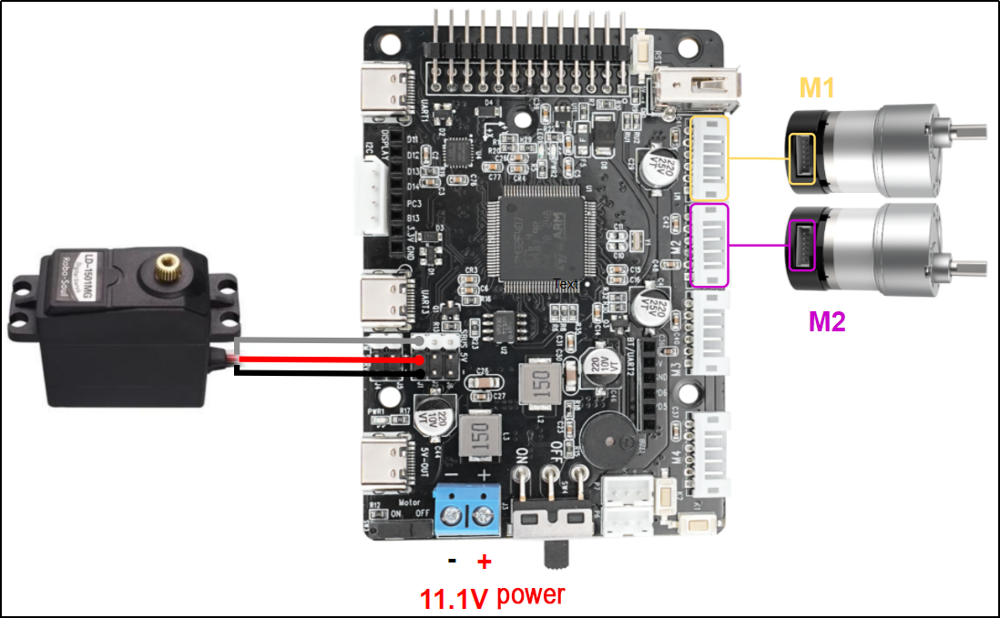
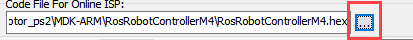
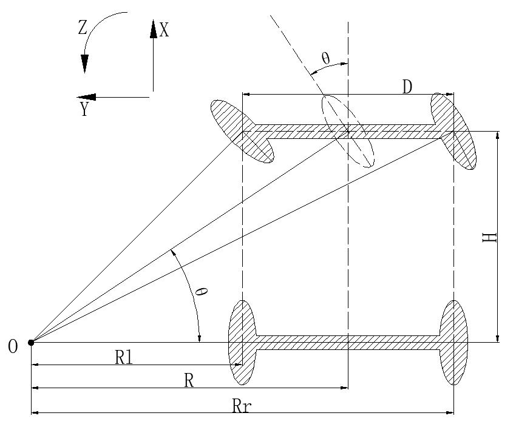
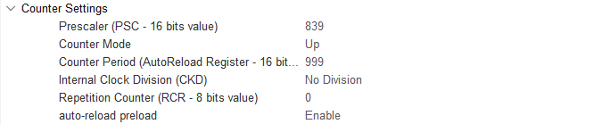
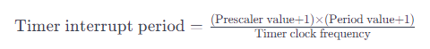
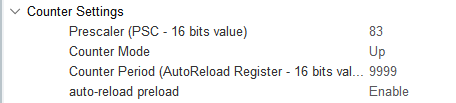

# 2. STM32 Version

## 2.1 STM32 Installation & Wiring

### 2.1.1 STM32 Controller Installation & Wiring

[STM32 Installation & Wiring  video](https://youtu.be/oita17M5Ra0)

### 2.1.2 Battery Installation & Wiring

[Battery Installation & Wiring video](https://youtu.be/c_n_P0V7X1Y)

## 2.2 Tutorial

### 2.2.1 Development Tutorial (STM32 Version)

Once the program is downloaded, the car chassis executes a sequence of actions in the following order:

**Execution Sequence**

(1) Move forward for 4 seconds
(2) Reverse for 4 seconds
(3) Turn left for 4 seconds
(4) Return to the initial position
(5) Move forward to the right for 4 seconds
(6) Return to the original position
(7) A 1-second interval separates each action.

**Hardware Introduction**

(1) STM32 Main Control Module Introduction
The controller utilizes the `STM32F407VET6` and the motor drive chip employed is the `YX4055` (over-current protection). The voltage range is from 3V to 12V, depending on the actual voltage applied to the motor. The interface layout is as follow:


The interface instruction is as follow:

<table border="1">
  <tr>
    <th>Interface type</th>
    <th>Mark</th>
    <th>Instruction</th>
  </tr>
  <!-- Encoder motor interface 合并6行 -->
  <tr>
    <td rowspan="6">Encoder motor interface</td>
    <td>GND</td>
    <td>The negative terminal of the hall power supply</td>
  </tr>
  <tr>
    <td>A</td>
    <td>A phase pulse signal output terminal</td>
  </tr>
  <tr>
    <td>B</td>
    <td>B phase pulse signal output terminal</td>
  </tr>
  <tr>
    <td>VCC</td>
    <td>The positive terminal of the hall power supply</td>
  </tr>
  <tr>
    <td>M+</td>
    <td>The positive terminal of the motor power supply</td>
  </tr>
  <tr>
    <td>M-</td>
    <td>The negative terminal of the motor power supply</td>
  </tr>
  <!-- Power port 合并2行 -->
  <tr>
    <td rowspan="2">Power port</td>
    <td>+</td>
    <td>The positive terminal of the power source</td>
  </tr>
  <tr>
    <td>-</td>
    <td>The negative terminal of the power source</td>
  </tr>
</table>
(2) Steering Servo


The steering servo in this chassis utilizes the `LD-1501MG` PWM servo model.

The `LD-1501MG` operates on a PWM servo mechanism. To control it, a PWM signal with a 20ms period is sent to the signal end. The servo angle is adjusted by manipulating the pulse width within the range of 500 to 2500μs. This corresponds to an angle range of 0 to 180°, and the recommended operating voltage is between 6V and 8.4V.

The PWM waveform signal is employed to regulate the servo position. When the PWM signal is fed into the motor drive circuit, the motor rotation is controlled based on the signal level. A high PWM duty cycle results in a greater driving force, enabling a larger rotation angle. Conversely, a low duty cycle yields a smaller driving force, resulting in a reduced motor rotation angle.

By continuously fine-tuning the PWM duty cycle, the microcontroller can precisely control the motor's rotation angle. This, in turn, drives the mechanical structure to rotate, achieving accurate position control of the steering gear output shaft.


The above picture is the PWM servo wiring interface diagram, and the following table is the pin distribution table:

| **PIN** | **Function** |
|:---:|:---:|
| White wire | Signal wire |
| Red wire | Power positive electrode |
| Black wire | Ground wire |

(3) Encoder Geared Motor
The motor model employed by the suspension Ackermann chassis is `JGB37-520R30-12`, where J represents a DC motor, GB represents an electronic output shaft, 520 represents the motor type, R30 represents a reduction ratio of 1:30, 12 represents the a rated voltage of 12V. Its interface description is shown in the figure below:


The Hall encoder disk is aligned with the motor along the same shaft. As the motor rotates, the Hall device detects the motion and generates a series of pulse signals. To ascertain the steering direction, it typically produces two sets of square wave signals with a specific phase difference.

* **Wiring**

The Ackerman car's wiring setup is as follows: Connect the front steering servo to the J1 interface of the STM32 main control board using the specified wiring interface. Additionally, link the left motor to the M1 interface and the right motor to the M2 interface on the STM32 main control board. The detailed wiring method is illustrated below.




* **Program Download**
[Source Code]()

After the project is compiled completely, download the generated hex file to the STM32 control board. Please prepare the following hardware materials:

(1) Software & Hardware Preparation for USB Download
① Software: `FlyMcu` (it is located in [2. Software Tools/ 01 STM32 Installation Pack/ USB Serial Port Download/ FlyMcu]())


② Hardware: Type-C cable, STN32 main control board
(2) USB Download Operation Steps
The specific operation steps are as follow:
① Hardware connection
Use Type-C cable to connect the Type-C port (UART) of the STM32 control board and the USB port of your computer:


[UART1]()
② Basic setting
Open FlyMcu. Click **"Enum Port"** at top menu bar, then set the baud rate (bps) as 115200:


Click **"STMISP"** option and configure as shown in the following figure.


Select **"DTR Low(＜-3V)，ISP @RTS High"**:


③ Software burning
In the FlyMcu software interface, click  to select the hex file to be burned. The program below is just for your reference, please rely on the actual program. Select the hex file in [03 Program/RosRobotControllerM4_MINACKER/MDK-ARM/ RosRobotControllerM4/RosRobotControllerM4.hex]().



Go back to the previous interface and click the **"Start ISP"** to burn the generated hex file onto the STM32 main control board:


The burning is in progress.:

The burning is complete, you will receive the following prompt.

In addition to use USB method for program download, you can also use either st-link or j-link method for direct compilation and burning.

::{Note}
To avoid the presence of any exception during the burning process, please strictly follow the above operation steps to operate!
:::

* **Outcome**

Following the program download, the car chassis executes a sequence of actions in the specified order:
(1) Move forward for 4 seconds.
(2) Reverse for 4 seconds.
(3) Turn left for 4 seconds.
(4) Return to the initial position.
(5) Move forward to the right for 4 seconds.
(6) Return to the original position.
(7) Each action is separated by a 1-second interval.

* **Source Code Analysis**
  [Source Code]()

(1) Robot Motion Program Analysis
① Robot Motion Settings
When the Ackerman chassis invokes the `chassis_init()` function to initialize the chassis type, the functions within various chassis structure variables are directed to their respective control functions, as illustrated in the figure below:

{lineno-start=132}
```c
    //Initialize the motion parameters of the chassis motor
    chassis_init();     

    //Select the chassis type
    set_chassis_type(Chassis_run_type);
```
{lineno-start=27}
```c
//Chassis type (default is the Large Ackerman chassis)
uint32_t Chassis_run_type = CHASSIS_TYPE_JETACKER;
```
In the program located at [..\Hiwonder\System\app.c](), the `minacker_control()` function is employed to manage the movement of the small Ackerman chassis. Here's a concise description of its functionality:

Within this function, the following actions are executed:

(1)Set the speed of the small Ackerman chassis in the X-axis direction to 300 millimeters per second.
(2)Move the driving wheel forward with the steering wheel in a neutral position, resulting in the car moving straight ahead.
(3)After a 2-second delay, bring the car to a stop for 1 second.
(4)Move the driving wheel backward with the steering wheel in a neutral position, causing the car to move straight backward.
(5)After another 2-second delay, pause for 1 second.
(6)Move the driving wheel forward once more, this time turning the steering wheel left for a left turn.
(7)After a 1-second delay, return the steering wheel to the right direction, concluding the movement.
This describes the controlled movement of the small Ackerman chassis in the specified program.

{lineno-start=230}
```c
void minacker_control(void)
{
    //Define the motor's movement speed
    //The suggested range is [50, 300]
    static float speed = 150.0f;
	
	//Move at a linear velocity of speed along the X-axis (i.e., move forward)
	chassis->set_velocity(chassis, speed, 0, 0);
	osDelay(2000); //Delay 2 seconds
	
	chassis->stop(chassis); //stop
	osDelay(1000); //Delay for 1 second
	
	chassis->set_velocity(chassis, -speed, 0, 0); //astern motion
	osDelay(2000); //Delay 2 seconds
	
	chassis->stop(chassis); //stop
	osDelay(1000); //Delay for 1 second
	
	//Perform a circular motion around a circle with a radius of 500mm to its left at the linear speed of the X-axis speed
	chassis->set_velocity_radius(chassis, speed, 500, true);
	osDelay(2000); //Delay 2 seconds
	
	chassis->stop(chassis); //stop
	osDelay(1000); //Delay for 1 second
	
	//Perform a circular motion around a circle with a radius of 500mm to its left at the linear speed of the X-axis speed
	chassis->set_velocity_radius(chassis, -speed, 500, true);
	osDelay(2000); //Delay 2 seconds
	
	chassis->stop(chassis); //stop
	osDelay(1000); //Delay for 1 second
```
② Set Straight Line
Within the file path [..\Hiwonder\Chassis\ackermann_chassis.c](), the movement of the small Ackermann chassis is governed by the kinematic algorithm. The straight-line trajectory of the chassis is specifically regulated using the `set_velocity()` function.

{lineno-start=186}
```c
	//Move at a linear velocity of speed along the X-axis (i.e., move forward)
	chassis->set_velocity(chassis, speed, 0, 0);
```
{lineno-start=117}
```c
void ackermann_chassis_object_init(AckermannChassisTypeDef *self){
	if(self->base.chassis_type == CHASSIS_TYPE_JETACKER)
	{
		self->base.stop = jetacker_stop;
		self->base.set_velocity = jetacker_set_velocity;
		self->base.set_velocity_radius = jetacker_set_velocity_radius;
	}else{
		self->base.stop = minacker_stop;
		self->base.set_velocity = minacker_set_velocity;
		self->base.set_velocity_radius = minacker_set_velocity_radius;
	}
}
```
{lineno-start=107}
```c
static void minacker_set_velocity(void *self, float vx, float vy, float r)
{
    minacker_chassis_move(self, vx, r);
}
```
The kinematic solution for the Ackermann chassis is depicted in the accompanying figure. To achieve regular car movement, the calculation involves determining the speed of each Ackermann motor. When the car moves straight, with a turning radius of 0 and a turning angle of 0 degrees, the speeds of the left and right wheels (`vl` and `vr`) are synchronized with the speed of `vx`. The `set_motors()` function is then employed to establish these motor speeds, with the servo angle set to 1500 to maintain a centered position. This comprehensive process ensures the Ackermann chassis exhibits consistent and predictable movements, particularly during straight-line motion.

{lineno-start=57}

```C
//minacker
void minacker_chassis_move(AckermannChassisTypeDef *self, float vx, float r )
{
	float vr = 0 , vl = 0;
	float angle = 0;
	if(r != 0)
	{
		angle = atan(self->shaft_length/r);
		vl = vx/r * (r - self->wheelbase/2);
		vr = vx/r * (r + self->wheelbase/2);
	}else{ //r == 0 go straight
		angle = 0;
		vr = vx;
		vl = vx;
	}
	vr = linear_speed_to_rps(self , vr); //Find the linear velocity of the right wheel
	vl = linear_speed_to_rps(self , vl); //Find the linear velocity of the left wheel
	if(angle > PI/4.5f)
	{
		angle = PI/4.5f;
	}else if(angle < -PI/4.5f)
	{
		angle = -PI/4.5f;
	}
	angle = -2000/PI * angle + 1500; //Find the steering Angle
	self->set_motors(self , vl , vr , angle);
}
```

③ Set Robot’s Turning
Control the chassis turning using `set_velocity_radius()` function.

{lineno-start=112}
```c
static void minacker_set_velocity_radius(void* self, float linear, float r,bool swerve)
{
		minacker_chassis_move(self, linear, r);
}
```
During turns, the rear motors operate similarly to when the robot moves straight ahead. The turning angle of the servo is computed based on the turning radius (`r`) and the length of the vehicle body shaft (`shaft_length`, i.e., the distance between the front and rear wheels). To determine the speeds (`vl` and `vr`) of the left and right driving wheels, respectively, the axis length (`wheelbase`) of the two wheels and the linear speed (`vx`) of the movement are considered. The function `linear_speed_to_rps()` converts the linear wheel speed into rotational speed, and the turning angle is restricted to prevent servo damage, capped at ±40 degrees. The expression `angle = -2000/PI * angle + 1500;` converts the servo angle value into a control value for servo rotation, with 1500 as the initial centering value for the servo.

Subsequently, the `set_motors(self, vl, vr, angle);` function assigns the motor and servo values to the motor motion control function, ultimately regulating the motion of both the motor and servo.

{lineno-start=57}
```c
//minacker
void minacker_chassis_move(AckermannChassisTypeDef *self, float vx, float r )
{
	float vr = 0 , vl = 0;
	float angle = 0;
	if(r != 0)
	{
		angle = atan(self->shaft_length/r);
		vl = vx/r * (r - self->wheelbase/2);
		vr = vx/r * (r + self->wheelbase/2);
	}else{ //r == 0 go straight
		angle = 0;
		vr = vx;
		vl = vx;
	}
	vr = linear_speed_to_rps(self , vr); //Find the linear velocity of the right wheel
	vl = linear_speed_to_rps(self , vl); //Find the linear velocity of the left wheel
	if(angle > PI/4.5f)
	{
		angle = PI/4.5f;
	}else if(angle < -PI/4.5f)
	{
		angle = -PI/4.5f;
	}
	angle = -2000/PI * angle + 1500; //Find the steering Angle
	self->set_motors(self , vl , vr , angle);
}
```
The figure below illustrates the application of Ackermann's kinematics formula in the program, providing a visual representation of the kinematic principles employed.



Steering servo angle formula： 

Left wheel speed formula: 

Right wheel speed formula: 

④ Control Robot to Stop
The `stop()` function is designed to bring the robot to a halt by setting the motor speed to 0, effectively ceasing its movement.

{lineno-start=246}
```c
	chassis->stop(chassis); //stop
```
{lineno-start=102}
```c
static void minacker_stop(void *self)
{
    ((AckermannChassisTypeDef*)self)->set_motors(self, 0, 0,1500);
}
```
(2) AB Quadrature Encoder Motor Analysis
The preceding analysis establishes the fundamental movements of the car, followed by a detailed examination of motor control specifics.
① Initialize Timer
{lineno-start=128}

```c
MX_TIM1_Init();
```
{lineno-start=130}
```c
MX_TIM5_Init();
```
{lineno-start=139}
```c
MX_TIM7_Init();
```
In the main function within the `main.c` file, several timers are initialized. We will focus on elucidating the motor control process for Motor 1, with the understanding that the control mechanisms for the other motors remain identical. Motor 1 involves the utilization of three timers: Timer 1 (for PWM control of motor speed), Timer 5 (for obtaining motor speed through encoder), and Timer 7 (for timed interrupts to update motor speed measurements and PID control frequency). Additionally, interrupt initialization is performed. The figure below illustrates the parameter configuration in STM32CubeMX, and for a more intuitive view, it is recommended to refer to the `tim.c` file or use the STM32CubeMX software interface for configuration settings.



Timer 1 (PWM Control Motor Speed)


Timer 5 (Encoder measures and captures the speed of the motor)


Timer 7(update motor speed measurements and regulate the frequency of PID control)

② Motor Initialization
Before controlling the motor, it is necessary to initialize the relevant motor parameters located in the `app.c` function under the folder [..\Hiwonder\System\app.c]():

{lineno-start=108}
```c
    /* hardware initialization*/
    motors_init();      //Motor initialization
```
The below code segment shows the initialization of the motor, located in [..\Hiwonder\motor_porting.c](). It initializes the motor structure. In the next section, "Chassis Motor Motion Parameter Initialization", the parameters of this motor will be overridden. Pay attention to selecting the appropriate chassis type.

{lineno-start=43}
```c
void motors_init(void)
{
    for(int i = 0; i < 4; ++i) {
        motors[i] = LWMEM_CCM_MALLOC(sizeof( EncoderMotorObjectTypeDef));
        encoder_motor_object_init(motors[i]);
		motors[i]->ticks_overflow = 60000;
        motors[i]->ticks_per_circle = MOTOR_DEFAULT_TICKS_PER_CIRCLE;
        motors[i]->rps_limit = MOTOR_DEFAULT_RPS_LIMIT;
        motors[i]->pid_controller.set_point = 0.0f;
        motors[i]->pid_controller.kp = MOTOR_DEFAULT_PID_KP;
        motors[i]->pid_controller.ki = MOTOR_DEFAULT_PID_KI;
        motors[i]->pid_controller.kd = MOTOR_DEFAULT_PID_KD;
    }

    /* Madagascar 1*/
    motors[0]->set_pulse = motor1_set_pulse;
    __HAL_TIM_SET_COUNTER(&htim1, 0);
    __HAL_TIM_ENABLE(&htim1);
    __HAL_TIM_MOE_ENABLE(&htim1);
```
`LWMEM_CCM_MALLOC()` dynamically creates a group of objects, allocating memory for objects of type `EncoderMotorObjectTypeDef`, and stores the memory address in the corresponding position of the `motors` array. The following is the structure parameters for `motor1`, located in [...\Hiwonder\Peripherals\encoder_motor.h](). For specific parameter contents, please refer to the annotations shown in the figure.

{lineno-start=46}
```c
        motors[i] = LWMEM_CCM_MALLOC(sizeof( EncoderMotorObjectTypeDef));
```
{lineno-start=20}
```c
/**
 * @brief Encoder motor object structure
*/
struct EncoderMotorObject{
    int64_t counter;        /**< @brief The total value, 64-bit, is considered not to overflow */
    int64_t overflow_num;   /**< @brief Overflow count */
    int32_t ticks_overflow; /**< @brief Count overflow value */
    float tps;              /**< @brief ticks per second Counter frequency */
    float rps;              /**< @brief revolutions per second The output shaft rotates at a speed of revolutions per second */
    int current_pulse;      /**< @brief The current output PWM value has a sign corresponding to the forward and reverse rotation */
    PID_ControllerTypeDef pid_controller; /**< @brief PID controller */
```
Initialize the defined structure (`encoder_motor_object_init`), located in [...\Hiwonder\Portings\motor_porting.c]().

{lineno-start=47}
```c
        encoder_motor_object_init(motors[i]);
```
The following program is located in [..\Hiwonder\Peripherals\encoder_motor.c]():

{lineno-start=72}
```c
void encoder_motor_object_init(EncoderMotorObjectTypeDef *self)
{
    self->counter = 0;
    self->overflow_num = 0;
    self->tps = 0; 
    self->rps = 0;
	self->current_pulse = 0;
	self->ticks_overflow = 0; 
    self->ticks_per_circle = 9999; /* The number of counts generated by one rotation of the motor output shaft should be filled in according to the actual situation of the motor */
	pid_controller_init(&self->pid_controller, 0, 0, 0);
}
```
Use Timer 1 to generate PWM signal, as shown in the below figure:

{lineno-start=57}
```c
    /* Madagascar 1 */
    motors[0]->set_pulse = motor1_set_pulse;
    __HAL_TIM_SET_COUNTER(&htim1, 0);
    __HAL_TIM_ENABLE(&htim1);
    __HAL_TIM_MOE_ENABLE(&htim1);
```
Use TIM5 to control the acquisition and start the encoder of the motor, as shown in the following figure:

{lineno-start=63}
```c
    /* encoder */
    __HAL_TIM_SET_COUNTER(&htim5, 0);
    __HAL_TIM_CLEAR_IT(&htim5, TIM_IT_UPDATE);
    __HAL_TIM_ENABLE_IT(&htim5, TIM_IT_UPDATE);
    __HAL_TIM_ENABLE(&htim5);
    HAL_TIM_Encoder_Start(&htim5, TIM_CHANNEL_ALL);
```
Use TIM7 to calculate the encoder value once to obtain the speed, as shown in the following figure:

{lineno-start=114}
```c
    // Speed test update timer
    __HAL_TIM_SET_COUNTER(&htim7, 0);
    __HAL_TIM_CLEAR_IT(&htim7, TIM_IT_UPDATE);
    __HAL_TIM_ENABLE_IT(&htim7, TIM_IT_UPDATE);
    __HAL_TIM_ENABLE(&htim7);
```
③ Chassis Motor Motion Parameter Initialization
In the program located in [..\Hiwonder\System\app.c](), initialize the motion parameters of the chassis motors. For the Ackermann chassis, use `CHASSIS_TYPE_MINACKER`.

{lineno-start=27}
```c
//Chassis type (default is the Large Ackerman chassis)
uint32_t Chassis_run_type = CHASSIS_TYPE_JETACKER;
```
{lineno-start=132}
```c
    //Initialize the motion parameters of the chassis motor
    chassis_init();     
    //Select the chassis type
    set_chassis_type(Chassis_run_type);
```
In the program located in [..\Hiwonder\Portings\chassis_porting.c](), the `chassis_init()` function initializes the motion parameters for the car chassis motors.

{lineno-start=73}
```c
void chassis_init(void)
{
```
{lineno-start=113}
```c
	//Initialization of the small Ackermann chassis structure
    minacker.base.chassis_type = CHASSIS_TYPE_MINACKER;
    minacker.correction_factor = MINACKER_CORRECITION_FACTOR;
    minacker.wheel_diameter = MINACKER_WHEEL_DIAMETER;
    minacker.shaft_length = MINACKER_SHAFT_LENGTH;
    minacker.wheelbase = MINACKER_WHEELBASE;
    minacker.set_motors = minacker_set_motors;
	ackermann_chassis_object_init(&minacker); //The initialization of the structure is placed later
}
```
The macro definitions for the parameters are located in [..\Hiwonder\Chassis\chassis.h](). Among them, `WHEEL_DIAMETER` represents the diameter of the wheels. `SHAFT_LENGTH` represents the shaft length, i.e., the distance between the left and right wheels. `CORRECTION_FACTOR` is the conversion ratio coefficient, which is currently not in use.

{lineno-start=55}
```c
#define MINACKER_WHEEL_DIAMETER 60.0 /* mm */
#define MINACKER_CORRECITION_FACTOR 1.0 /* mm */
#define MINACKER_SHAFT_LENGTH 170.0 /* mm */
#define MINACKER_WHEELBASE  180.0 /* mm */
```
Following initializes the motor of the ackerman chassis car.

{lineno-start=96}
```c
void set_chassis_type(uint8_tchassis_type)
{
```
{lineno-start=162}
```c
		case CHASSIS_TYPE_MINACKER:
			chassis = (ChassisTypeDef*)&minacker;
            set_motor_type(motors[0], MOTOR_TYPE_JGB520);
            set_motor_type(motors[1], MOTOR_TYPE_JGB520);
            set_motor_type(motors[2], MOTOR_TYPE_JGB520);
            set_motor_type(motors[3], MOTOR_TYPE_JGB520);
            break;
```
After jumping, you can obtain the corresponding parameters of the motor.

{lineno-start=112}
```c
/* Each revolution of the motor shaft generates 11 pulses. The counter counts evenly at the rising and falling edges of phases A and B, meaning the count value is four times the number of pulses. The reduction ratio is 90.0.
 * That is, for each revolution of the motor output shaft, the counter value changes by 11.0 * 4.0 * 90.0 = 3960
 */
#define MOTOR_JGB520_TICKS_PER_CIRCLE 3960.0f
#define MOTOR_JGB520_PID_KP  63.0f
#define MOTOR_JGB520_PID_KI  2.6f
#define MOTOR_JGB520_PID_KD  2.4f
#define MOTOR_JGB520_RPS_LIMIT 1.5f
```
④ PWM Speed Control
Based on our previous explanation, after setting the velocity along the x-axis and the angular velocity, perform kinematic analysis to obtain the speeds of the left and right motors, denoted as `rps_l` and `rps_r` respectively. Motor 1 corresponds to the left wheel, and Motor 2 corresponds to the right wheel. Finally, use the function `self->set_motors(self, rps_l, rps_r)` to set the motor speeds.

{lineno-start=14}
```c
void diff_chassis_move(DifferentialChassisTypeDef *self,float vx，float angule_rate)
{
	float v_l = VX - angule_rate *((DifferentialChassisTypeDef*)self)->shaft_length / 2.0f;
	float V_r =VX_+ angule_rate *((DifferentialChassisTypeDef*)self)->shaft_length / 2.0f;
	float rps_1=linear_speed_to_rps(self,v1);
	float rps_r =linear_speed_to_rps(self,v_r);
	self->set_motors(self,rps_1,rps_r);
}
```
We have selected the `MINACKER` Ackermann chassis vehicle. The function `tankblack_set_motors` sets the speeds of the two motors.

{lineno-start=113}
```c
	//Initialization of the small Ackermann chassis structure
    minacker.base.chassis_type = CHASSIS_TYPE_MINACKER;
    minacker.correction_factor = MINACKER_CORRECITION_FACTOR;
    minacker.wheel_diameter = MINACKER_WHEEL_DIAMETER;
    minacker.shaft_length = MINACKER_SHAFT_LENGTH;
    minacker.wheelbase = MINACKER_WHEELBASE;
    minacker.set_motors = minacker_set_motors;
	ackermann_chassis_object_init(&minacker); //The initialization of the structure is placed later
}
```
Navigate to the `minacker_set_motors` function, depicted in the figure below, to configure the motor speeds for both Motor 1 and Motor 2.

{lineno-start=59}
```c
static void minacker_set_motors(void* self, float rps_lh, float rps_lt,int position)
{
	static int position_last = 0;
	if( position_last != position )
	{
		pwm_servo_set_position(pwm_servos[0] , position , 100);
		position_last = position;
	}
    encoder_motor_set_speed(motors[1], -rps_lh);
    encoder_motor_set_speed(motors[0], rps_lt);
}
```
In the program located in [..\Hiwonder\Peripherals\encoder_motor.c](), implement speed limitation and set the target speed for the PID controller.

{lineno-start=60}
```c
void encoder_motor_set_speed(EncoderMotorObjectTypeDef *self, float rps)
{
	rps = rps > self->rps_limit ? self->rps_limit : (rps < -self->rps_limit ? -self->rps_limit : rps); /* Limit the speed */
    self->pid_controller.set_point = rps; /* Set the PID controller target */
}
```
The `encoder_motor_control()` function is responsible for updating the speed control of the encoder motor. It adjusts the PWM value to stabilize the motor at the previously set target speed. First, it updates the PID parameters, then corrects the output PWM, and finally sets the new PWM signal using `self->set_pulse()`. The specific implementation of the program is as follows (in [..\Hiwonder\Peripherals\encoder_motor.c]()):

{lineno-start=32}
```c
/**
 * @brief Encoder motor speed control task
 * @detials The encoder motor speed PID control task needs to be specified at regular intervals to complete the PID control update
 * @param self Encoder motor object pointer
 * @param period The time interval between the current update and the last update (update cycle), measured in sec
 * @retval None.
*/
void encoder_motor_control(EncoderMotorObjectTypeDef *self, float period) 
{
	float pulse = 0;
    pid_controller_update(&self->pid_controller, self->rps, period);   /* Update the PID controller */
    pulse = self->current_pulse + self->pid_controller.output; /* Calculate the new PWM value */
	
	/* Limit the output PWM value. The limit is determined by the timer setting. In this example, the duty cycle set by the timer from 0 to 100 corresponds to 0 to 1000 */
    pulse = pulse > 1000 ?  1000 : pulse; 
    pulse = pulse < -1000 ? -1000 : pulse;
	
    self->set_pulse(self, pulse > -250 && pulse < 250 ? 0 : pulse); /* Set a new PWM value and limit the minimum value of PWM. If the PWM is too small, the motor will only buzz but not move */
    self->current_pulse = pulse; /* Record the new PWM value */
}
```
`self->set_pulse` passes the PWM value to the `motor1_set_pulse()` function. When the speed is positive, it starts `TIM_CHANNEL_4` (forward). When the speed is negative, it starts `TIM_CHANNEL_3` (reverse). When the speed is zero, both channels stop, and the motor does not rotate. As shown in the figure below, located in [..\Hiwonder\Portings\motor_porting.c]().

{lineno-start=49}
```c
	self->set_pulse(self, pulse > -250 && pulse < 250 ? 0 : pulse);
```
{lineno-start=57}
```c
    /* Madagascar 1 */
    motors[0]->set_pulse = motor1_set_pulse;
```
{lineno-start=123}
```c
static void motor1_set_pulse(EncoderMotorObjectTypeDef *self, int speed)
{
    if(speed > 0) {
        __HAL_TIM_SET_COMPARE(&htim1, TIM_CHANNEL_3, 0);
        __HAL_TIM_SET_COMPARE(&htim1, TIM_CHANNEL_4, speed);
    } else if(speed < 0) {
        __HAL_TIM_SET_COMPARE(&htim1, TIM_CHANNEL_4, 0);
        __HAL_TIM_SET_COMPARE(&htim1, TIM_CHANNEL_3, -speed);
    } else {
        __HAL_TIM_SET_COMPARE(&htim1, TIM_CHANNEL_3, 0);
        __HAL_TIM_SET_COMPARE(&htim1, TIM_CHANNEL_4, 0);
    }
    HAL_TIM_PWM_Start(&htim1, TIM_CHANNEL_3);
    HAL_TIM_PWM_Start(&htim1, TIM_CHANNEL_4);
}
```
Combined with the STM32CubeMX configuration, as shown in the figure below, the TIM1 clock frequency is 84MHz, the prescaler value is 839, and the counting period is 999. In each PWM cycle, the timer counter counts from 0 to 999. The "pulse" represents the PWM duty cycle. When the counter reaches the duty cycle value, the high and low voltage levels are inverted, and the counter resets when it reaches 999. "Pulse" is used to set the timer's compare-match register, thereby controlling the PWM signal's duty cycle.


According to the following formula, the interrupt period of Timer 1 becomes 0.01 seconds, which means an update interrupt is generated every 10 milliseconds: Formula: **Timer overflow time = (prescaler value + 1) × (counting period + 1) / Timer clock frequency**



The calculation process is as follows: **Timer overflow time = (999+1) × (839+1) / 84MHz = 10 ms**

Adjusting the PWM duty cycle enables the motor to adjust between maximum and minimum speeds. In [.\Hiwonder\Portings\motors_param.h](), the speed limit for the motor is set to 1.5 revolutions per second.

{lineno-start=19}
```c
#define MOTOR_JGB520_RPS_LIMIT 1.5f
```
According to the interrupt function of Timer 7, it updates every 10 milliseconds, and the PWM value is used to control the motor speed.

{lineno-start=504}
```c
void TIM7_IRQHandler(void)
{
  /* USER CODE BEGIN TIM7_IRQn 0 */
    extern EncoderMotorObjectTypeDef *motors[4];
    if(__HAL_TIM_GET_FLAG(&htim7, TIM_FLAG_UPDATE) != RESET) {
        __HAL_TIM_CLEAR_FLAG(&htim7, TIM_FLAG_UPDATE);
		encoder_update(motors[0], 0.01, __HAL_TIM_GET_COUNTER(&htim5));
		encoder_update(motors[1], 0.01, __HAL_TIM_GET_COUNTER(&htim2));
		encoder_update(motors[2], 0.01, __HAL_TIM_GET_COUNTER(&htim4));
		encoder_update(motors[3], 0.01, __HAL_TIM_GET_COUNTER(&htim3));
		for(int i = 0; i < 4; ++i) {
			encoder_motor_control(motors[i], 0.01);
		}
    }
```
Combined with the STM32CubeMX configuration, as shown in the figure below, TIM7 is connected to APB1, with a clock frequency of 84MHz, which means a 84 prescaler gives a frequency of 1MHz.



According to the following formula, the interrupt period of Timer 7 becomes 0.01 seconds, which means an update interrupt is generated every 10 milliseconds: Timer overflow time = (83+1)×(9999+1)/84MHz = 10 ms

⑤ Update Encoder Motor to Obtain Speed
Timer 7 generates an update interrupt every 10 ms, which calculates the motor speed and updates PID parameters. Its update interrupt function is as follows (in [..\Core\Src\stm32f4xx_it.c]()), where the encoder motor speed measurement of motor 1 obtained by Timer 5 is updated.

{lineno-start=504}
```c
void TIM7_IRQHandler(void)
{
  /* USER CODE BEGIN TIM7_IRQn 0 */
    extern EncoderMotorObjectTypeDef *motors[4];
    if(__HAL_TIM_GET_FLAG(&htim7, TIM_FLAG_UPDATE) != RESET) {
        __HAL_TIM_CLEAR_FLAG(&htim7, TIM_FLAG_UPDATE);
		encoder_update(motors[0], 0.01, __HAL_TIM_GET_COUNTER(&htim5));
		encoder_update(motors[1], 0.01, __HAL_TIM_GET_COUNTER(&htim2));
		encoder_update(motors[2], 0.01, __HAL_TIM_GET_COUNTER(&htim4));
		encoder_update(motors[3], 0.01, __HAL_TIM_GET_COUNTER(&htim3));
		for(int i = 0; i < 4; ++i) {
			encoder_motor_control(motors[i], 0.01);
		}
    }
```
The `encoder_update()` function calculates and updates the motor speed based on the count obtained from the encoder. It calculates the motor speed based on the count of the encoder. `overflow_num` represents the number of overflows of Timer 5, which will be further detailed in the following content. `delta_count` represents the change in the encoder count within the timer period.

The TPS (Ticks Per Second) is calculated to determine the pulse frequency (i.e., the number of pulses per second). It is achieved by dividing the change in count by the time interval. Here, a filter is applied (with coefficients of 0.9 and 0.1) to smooth the result.

Finally, RPS (Revolutions Per Second) represents the motor's rotational speed (in revolutions per second), and it is calculated as the TPS divided by the number of pulses generated by the motor in one revolution. The number of pulses generated by the motor in one revolution is described in point three below. The `encoder_update` program is located in [..\Hiwonder\Peripherals\encoder_motor.c]().

Motor speed (rps) = pulses per second (tps) / number of pulses generated by the motor in one revolution (1320)

{lineno-start=15}
```c
/**
 * @brief Update of encoder motor speed measurement
 * @detials
 * @param self Encoder motor object pointer
 * @param period The time interval between the current update and the last update (update cycle), measured in sec
 * @param counter The current count value of the encoder
 * @retval None.
*/
void encoder_update(EncoderMotorObjectTypeDef *self, float period, int64_t counter)
{
    counter = counter + self->overflow_num * self->ticks_overflow; /* The total count value is 60,000 based on the actual timer overflow value set*/
    int delta_count = counter - self->counter;
    self->counter = counter; /* Store the new count value */
    self->tps = (float)delta_count / period * 0.9f + self->tps * 0.1f; /* Calculate the pulse frequency */
    self->rps = self->tps / self->ticks_per_circle; /* The unit for calculating rotational speed is rps, which is revolutions per second */
}
```
According to the motor manual, this motor generates 11 pulses per revolution of its shaft, and the gear ratio of the motor is 45:1. The timer is set to use a quadrature counting mode with a 4x frequency, meaning that for every rotation of the motor output shaft, the counter value changes by 11.0 * 4.0 * 30.0 = 1320. Therefore, whenever the motor's output shaft completes one revolution, the encoder interface records an increase of 3960 in the counter value. This information can be found in [..\Hiwonder\Portings\motors_param.h]()

{lineno-start=15}
```c
/* Each revolution of the motor shaft generates 11 pulses. The counter counts evenly at the rising and falling edges of phases A and B, meaning the count value is four times the number of pulses. The reduction ratio is 90.0.
 * That is, for each revolution of the motor output shaft, the counter value changes by 11.0 * 4.0 * 90.0 = 3960
 */
#define MOTOR_JGB520_TICKS_PER_CIRCLE 3960.0f
#define MOTOR_JGB520_PID_KP  63.0f
#define MOTOR_JGB520_PID_KI  2.6f
#define MOTOR_JGB520_PID_KD  2.4f
#define MOTOR_JGB520_RPS_LIMIT 1.5f
```


From the following diagram, we can see that the 4x frequency counting mode counts each pulse four times.


When the encoder count overflows, it enters the interrupt of Timer 5, where the overflow count changes. The number of underflow occurrences decreases, and the number of overflow occurrences increases. The program is located in [..\Core\Src\stm32f4xx_it.c]()

{lineno-start=469}
```c
void TIM5_IRQHandler(void)
{
  /* USER CODE BEGIN TIM5_IRQn 0 */
    extern EncoderMotorObjectTypeDef *motors[4];
    if(__HAL_TIM_GET_FLAG(&htim5, TIM_FLAG_UPDATE) != RESET) {
        __HAL_TIM_CLEAR_FLAG(&htim5, TIM_FLAG_UPDATE);
        if(__HAL_TIM_IS_TIM_COUNTING_DOWN(&htim5)) {
            --motors[0]->overflow_num;
        } else {
            ++motors[0]->overflow_num;
        }
```
(3) PID Stabilizing Target Speed Analysis
① Positional PID Algorithm
The PID controller update function, `pid_controller_update()`, implements positional PID control. The specific code implementation is shown in the following figure, located at [..\Hiwonder\Misc\pid.c]().

{lineno-start=15}
```c
void pid_controller_update(PID_ControllerTypeDef *self, float actual, float time_delta) {
	float err = self->set_point - actual;
	float proportion = err - self->previous_0_err;
	
	float integral = err * time_delta;
	float derivative = (err - 2 * self->previous_1_err + self->previous_0_err) / time_delta;
	
	self->output = (self->kp * err) + (self->ki * integral) + (self->kd * derivative);
	self->previous_1_err = self->previous_0_err;
	self->previous_0_err = err;

}
```
The `"err"` variable represents the error between the current target value and the actual value: it calculates the difference between the setpoint (`self->set_point`, desired speed) and the actual measured value (`actual`, current speed).

**Error = Setpoint - Actual Value**

The proportional (P) term, represented by `"proportion,"` is the difference between the current error and the previous error. It is used to calculate the derivative.

**Proportional = Error - Previous Error**

The integral (I) term, represented by `"integral,"` accumulates the error over time. It is used in conjunction with the derivative term to calculate the overall control signal. This term calculates the integral of the error over time, helping to eliminate long-term steady-state errors.

**Integral = Error x Time Interval**

The derivative (D) term, represented by `"derivative,"` calculates the rate of change of the error. It predicts the future behavior of the system and quickly responds to changes in the error.

**Derivative = (Error - 2 x Previous Previous Error + Previous Error) / Time Interval**

Converting PID output to PWM value: Finally, the function stores the output in the `PID_ControllerTypeDef` as `"output."` After calling the `pid_controller_update` function, the output of the PID controller (`self->output`) can be used to adjust the PWM signal.