# 2. Software Tools

## 2.1 STM32 Installation Pack

### 2.1.1 Set Up Development Environment

:::{Note}
Please activate the software first after installing Keil software, otherwise failure compilation will occur and affect the normal use.
:::

* **Keil Software Installation**

Keil is specialized software designed for microcontrollers, equipped with powerful functionalities. Regardless of the version, the installation process remains consistent. This section uses V5.36 as an example:

(1) Double click 'MDK536' folder to open it.

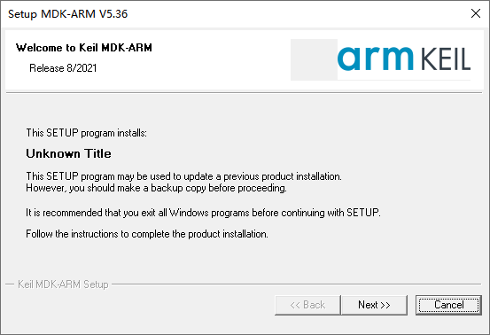

(2) Check to agree, and then click **"Next"** to proceed.

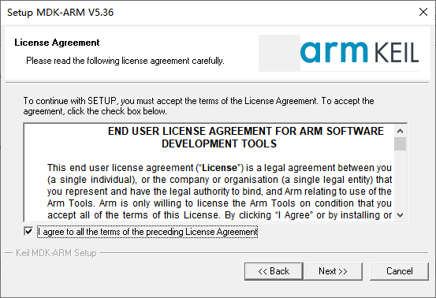

(3) Select the installation path.

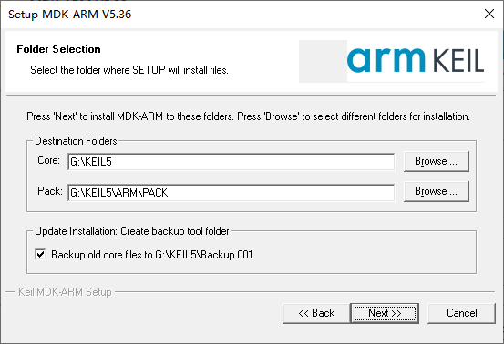

(4) Enter user information. You can enter arbitrarily but not be blank, otherwise can not proceed to the next step.

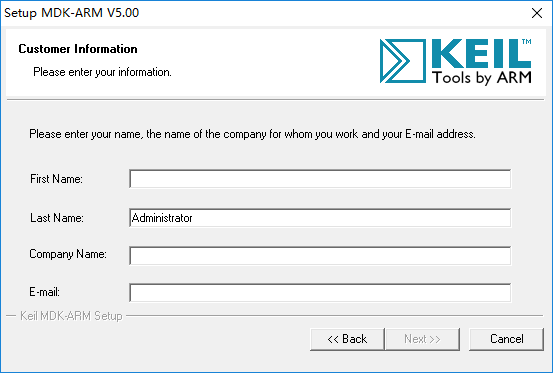

(5) After entering, click **"Next"** to install.

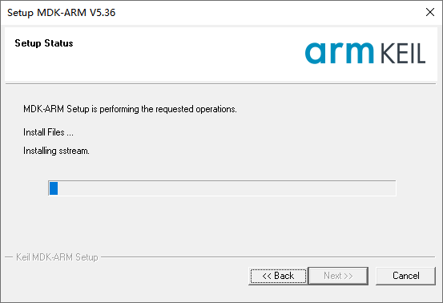

(6) Wait a while. When the interface prompting the installation of Ulink driver pops up, click **"Install"**.

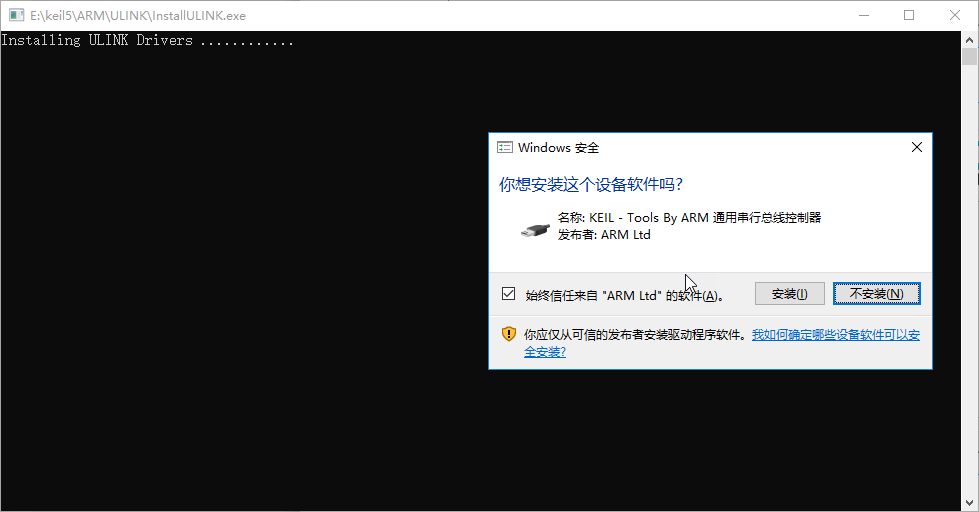

(7) When the installation is complete, click "**Finish**".

* **Configuration**

(1) Add Chip Support Pack

After the prior installation of Keil5 software, it is necessary to manually install the corresponding chip package. The chip package is available in the same directory. Upon opening, click on "**Next**".

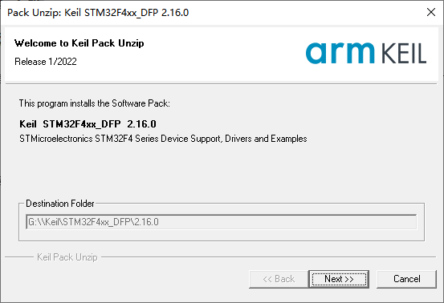

After the installation is complete, click-on 'Finish' button.

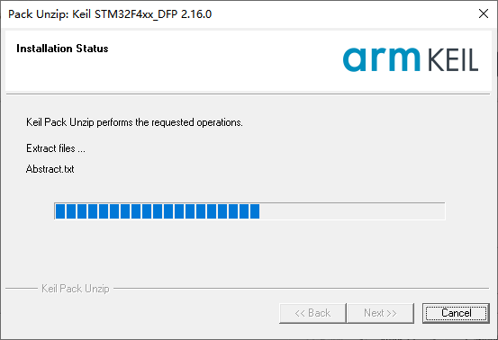

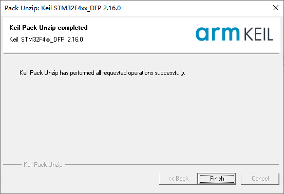

Reopen Keil software, and click-on the magic stick icon.

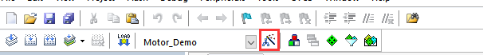

Click-on 'Device', then select , and click-on 'OK'.

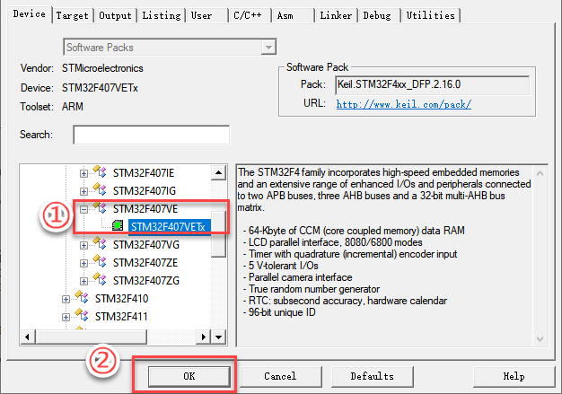

(2) Install J-Link Driver

J-Link serves as a widely utilized debugger/emulator in conjunction with Keil5 for microcontroller development and debugging. Therefore, to utilize J-Link for microcontroller programming and debugging in Keil5, the J-Link driver must be installed.

Locate the J-Link installation package in the directory of this section, double-click to open it, and proceed by clicking "**Next**".

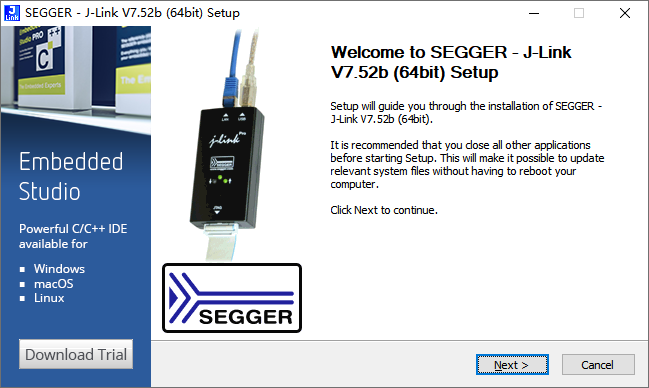

Choose 'I Agree'.

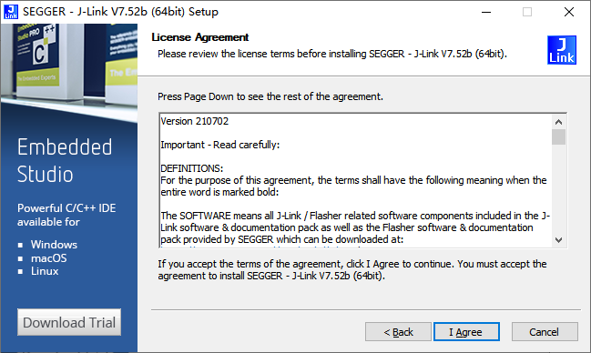

Select the storage path. Pay attention the driver should be installed to the same directory as Keil5.

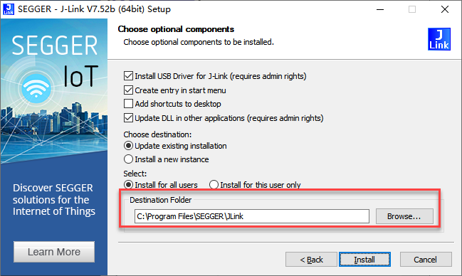

Wait for the installation to be completed.

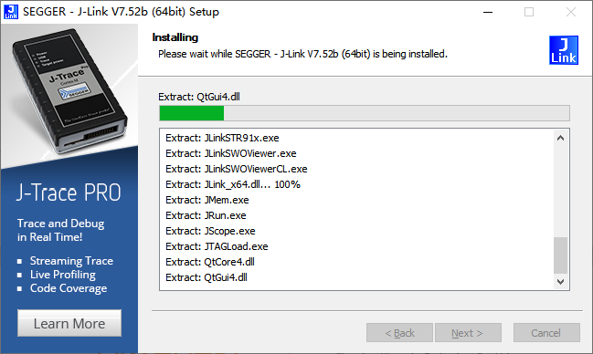

If the version update prompt occurs after the installation is complete, please directly close the pop-up.

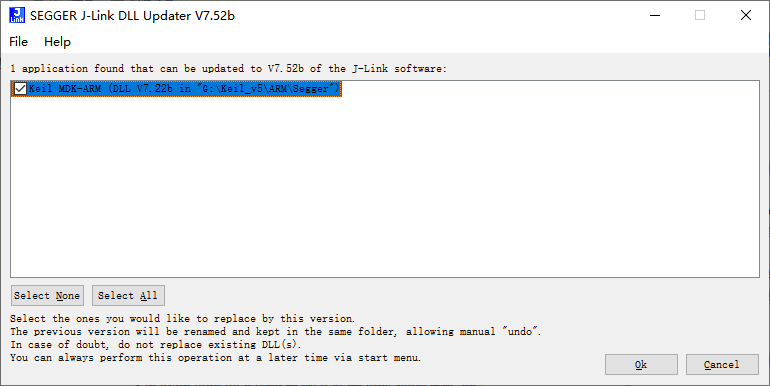

* **STM32CubeMX Installation**

STM32CubeMX is a graphical tool designed for configuring STM32 microcontrollers. It aids developers in swiftly configuring various aspects of the STM32 microcontroller, such as clock settings, GPIO, interrupts, DMA, and other peripherals. Additionally, it can generate initialization code and is compatible with different development environments, including Keil, IAR, and GCC.

Locate the installation package in the directory of this section, double-click to open it, and proceed by clicking "**Next**."

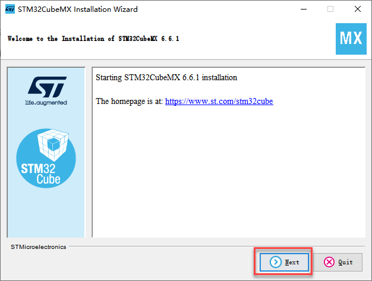

Tick 'I accept the terms of this license agreement', then click-on 'Next.'

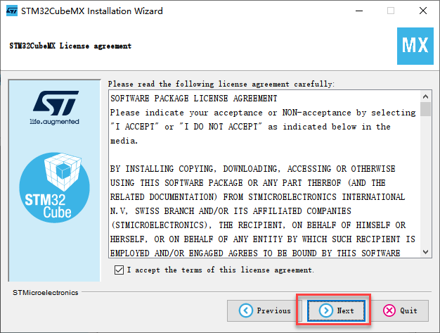

Check 'I have read and understood the ST..', then click-on 'Next'.

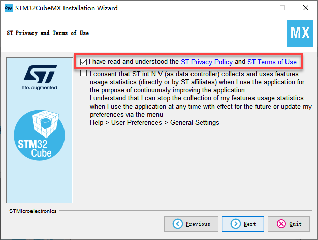

Choose the installation path, ensuring that the path does not contain Chinese characters. Proceed by clicking **"Next"** and wait for the installation progress bar to complete.

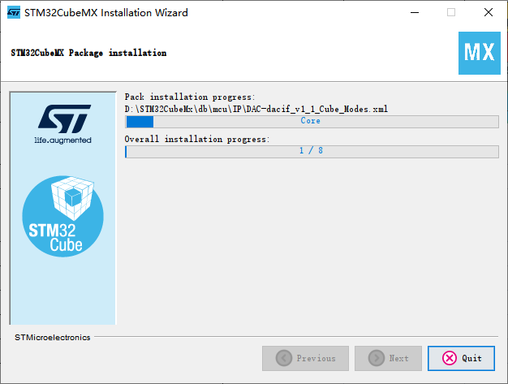

Wait for the installation process to finish. Afterwards, click 'Next' and then 'Done'.

## 2.2 Remote Desktop Accessing

* **Nomachine Introduction**

Nomachine allows users to remotely access and control Windows, Linux PCs, or other devices from a different computer, facilitating both work and entertainment.

Nomachine's remote desktop technology utilizes an innovative protocol to extract desktop data and transmits only essential parameters. The encrypted data is then transmitted through SSH, resulting in faster and more secure performance compared to VNC or direct XDMP.

* **NoMachine Installation and Usage**

(1) NoMachine Installation

① Double click to open **"nomachine_8.4.2_10_x64"** and then click "**Next**".

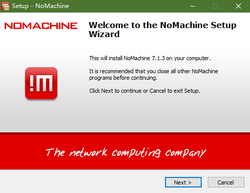

② Select **"English"** as language in the pop-up interface and click "**I accept the agreement**". Then click "**Next**".

③ Select the path to install software and then click **"Next"**.

④ Wait for the installation to complete. When completing the installation, click **"Finish"**.

⑤ After installing, click **"Yes"** to restart computer in the pop-up interface. (**Please do not skip this step**.)

(2) NoMachine Usage

① Open NoMachine, and enter the IP address of the controller, for example **'192.168.43.47'**.

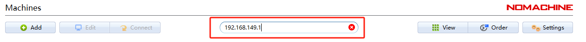

② Enter the user name: **ubuntu** and password: **hiwonder**, then login the robot system desktop.

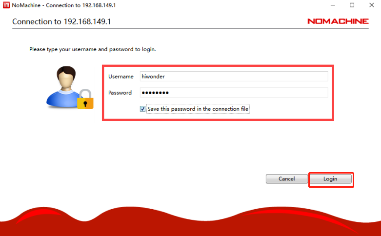

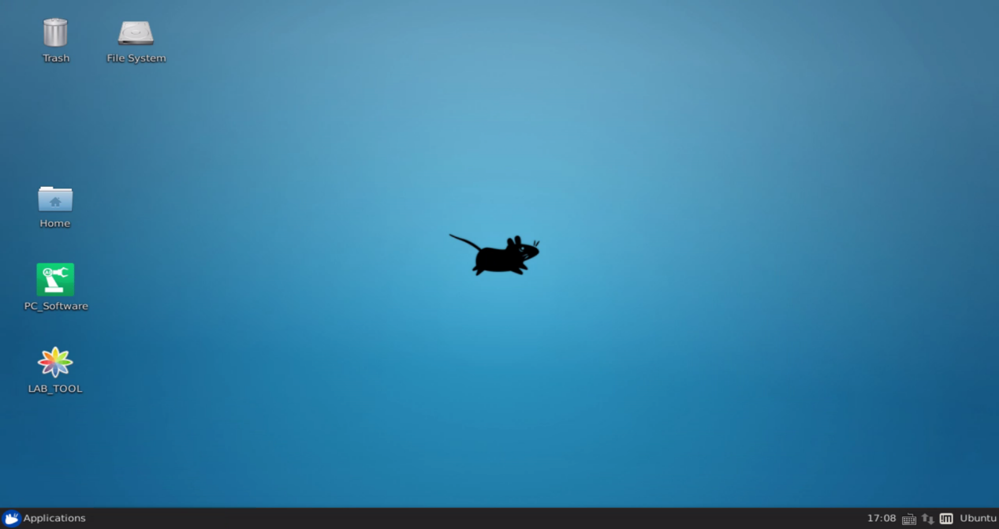

(3) Data Cable Connection

To enhance the smoothness of operation, you can activate remote NDIS-compatible devices by following these specific steps:

① Connect the controller to the computer using a Micro USB data cable.

② Right-click on **"This Computer"** on the desktop and choose the **"Manage"** option.

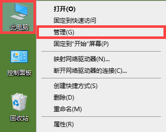

③ Click on **"Device Manager,"** locate the NDIS driver under the **"Network Adapter"** column, right-click on the driver item, and choose the **"Update Driver"** option.

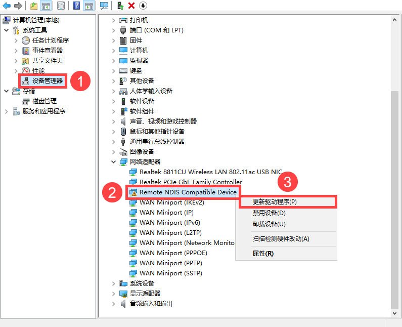

④ Once the driver installation is finished, launch NoMachine. Enter the IP address **"192.168.55.1"** to establish a connection.

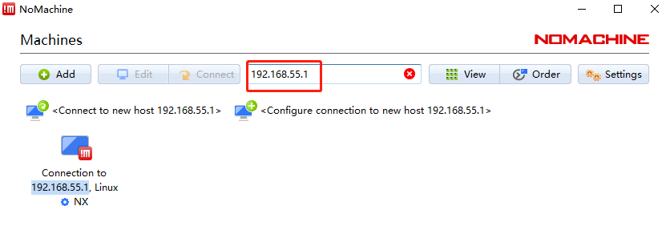