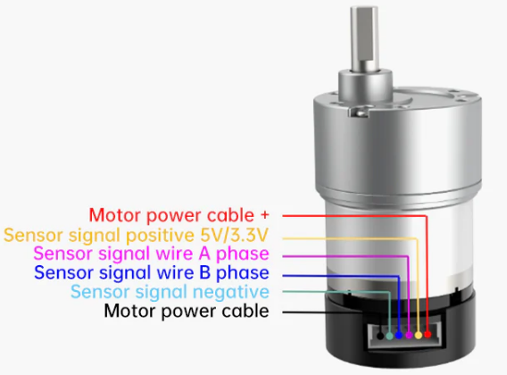
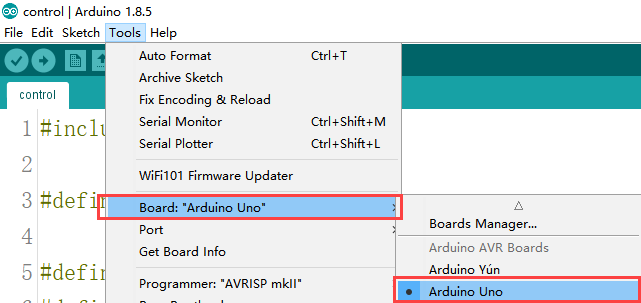

# 3. Arduino Car Chassis Development Guide

## 3.1 Introduction

### 3.1.1 Arduino Introduction to the Required Hardware for Development

<p>
<iframe width="100%" height="713" src="https://www.youtube.com/embed/PWT2Nt6tZuo" title="Ardunio Development Hardware Introduction" frameborder="0" allow="accelerometer; autoplay; clipboard-write; encrypted-media; gyroscope; picture-in-picture; web-share" referrerpolicy="strict-origin-when-cross-origin" allowfullscreen></iframe>
</p>

### 3.1.2 Install the motor drive module

<p>
<iframe width="100%" height="713" src="https://www.youtube.com/embed/dGeaY-VIu6Q" title="Arduino Development -- Install Motor Driver Module" frameborder="0" allow="accelerometer; autoplay; clipboard-write; encrypted-media; gyroscope; picture-in-picture; web-share" referrerpolicy="strict-origin-when-cross-origin" allowfullscreen></iframe>
</p>

### 3.1.3 Install the Arduino development board

<p>
<iframe width="100%" height="713" src="https://www.youtube.com/embed/ufkTrW1kKQM" title="Arduino Development -- Install Arduino Development Board" frameborder="0" allow="accelerometer; autoplay; clipboard-write; encrypted-media; gyroscope; picture-in-picture; web-share" referrerpolicy="strict-origin-when-cross-origin" allowfullscreen></iframe>
</p>

### 3.1.4 Connection Instructions

<p>
<iframe width="100%" height="713" src="https://www.youtube.com/embed/VxJE-gEcRqI" title="Arduino Development -- Battery Wiring" frameborder="0" allow="accelerometer; autoplay; clipboard-write; encrypted-media; gyroscope; picture-in-picture; web-share" referrerpolicy="strict-origin-when-cross-origin" allowfullscreen></iframe>
</p>

### 3.1.5 Battery connection and power supply precautions

* **Development Tutorial (Arduino Version)**

(1) Forward for 4 seconds.

(2) Back for 4 seconds.

(3) Turn left for 4 seconds.

(4) Return to the initial position.

(5) Forward to the right for 4 seconds.

(6) Return to the original position.

## 3.2 Hardware Introduction

### 3.2.1 Arduino UNO Controller

Arduino is a convenient, flexible, and user-friendly open-source electronic prototyping platform. It features 14 digital input/output pins (with 6 capable of PWM output), 6 analog inputs, a 16 MHz ceramic resonator (CSTCE16M0V53-R0), a USB connection, a power socket, an ICSP header, and a reset button.

The following diagram illustrates the physical pin layout of Arduino UNO (please refer to your specific Arduino UNO main control board for accurate details):


### 3.2.2 4-Channel Encoder Motor Driver

This is a motor drive module designed to work with a microcontroller for driving TT motors or magnetic encoder motors. Each channel is equipped with a `YX-4055AM` motor drive chip, and its voltage range is DC 3V-12V. The specific voltage depends on the voltage requirements of the connected motor. The interface distribution is illustrated in the figure below:


The introduction to the interface on the driver is as below:

<table>
<thead>
<tr>
<th>Interface Type</th>
<th>Number</th>
<th>Function</th> </tr>
</thead>
<tbody>
<tr>
<td rowspan="7"><strong>Encoder Motor Interface</strong></td> <td>GND</td>
<td>Negative terminal of Hall power supply</td> </tr>
<tr>
<td>A</td>
<td>Output terminal of A phase pulse signal</td> </tr>
<tr>
<td>B</td>
<td>Output terminal of B phase pulse signal</td> </tr>
<tr>
<td>VCC</td>
<td>Positive terminal of Hall power supply</td> </tr>
<tr>
<td>M+</td>
<td>Positive terminal of the motor power supply</td> </tr>
<tr>
<td>M-</td>
<td>Motor power negative terminal</td> </tr>
<tr>
<td></td>
<td><strong>Note:</strong><br>
The voltage between `VCC` and `GND` is determined based on the power supply voltage of the microcontroller being used. Typically, `3.3V` or `5V` is employed. 2. When the spindle rotates clockwise, the output pulse signal of channel `A` is ahead of channel `B`; when the spindle rotates counterclockwise, the signal of channel `A` is behind channel `B`. <br>
3. The voltage between `M+` and `M-` is determined based on the voltage requirements of the motor used.</td>
</tr>
<tr>
<td rowspan="4"><strong>IIC</strong></td>
<td>SCL</td>
<td>Clock line</td> </tr>
<tr>
<td>SDA</td>
<td>Bidirectional data cable</td> </tr>
<tr>
<td>GND</td>
<td>Power ground wire</td> </tr>
<tr>
<td>5V</td>
<td>5V DC output</td> </tr>
<tr>
<td rowspan="1"><strong>3-Pin Power Supply</strong></td> <td>-</td>
<td>Power negative terminal</td> </tr>
<tr>
<td rowspan="2"><strong>Port</strong></td> <td>+</td>
<td>Positive terminal input of power supply</td> </tr>
<tr>
<td>NC</td>
<td>Vacant</td> </tr>
<tr>
<td rowspan="2"><strong>Power Port</strong></td> <td>+</td>
<td>Positive terminal input of power supply</td> </tr>
<tr>
<td>-</td>
<td>Power negative terminal</td> </tr>
</tbody>
</table>

### 3.2.3 Steering Servo


The steering servo in this chassis utilizes the `LD-1501MG PWM` servo model.

The `LD-1501MG` operates on a `PWM` servo mechanism. To control it, a `PWM` signal with a 20ms period is sent to the signal end. The servo angle is adjusted by manipulating the pulse width within the range of 500 to 2500μs. This corresponds to an angle range of 0 to 180°, and the recommended operating voltage is between `6V` and `8.4V`.

The `PWM` waveform signal is employed to regulate the servo position. When the `PWM` signal is fed into the motor drive circuit, the motor rotation is controlled based on the signal level. A high `PWM` duty cycle results in a greater driving force, enabling a larger rotation angle. Conversely, a low duty cycle yields a smaller driving force, resulting in a reduced motor rotation angle.

By continuously fine-tuning the `PWM` duty cycle, the microcontroller can precisely control the motor's rotation angle. This, in turn, drives the mechanical structure to rotate, achieving accurate position control of the steering gear output shaft.


The diagram above illustrates the wiring port distribution for the bus servo, accompanied by the pin distribution table below. **"Please note: When the servo and the microcontroller are powered by different sources, ensure both power supplies are grounded together."**

| **PIN** | **Description** |
|:-------:|:---------------:|
| White | Signal wire |
| Red | Positive power electrode |
| Black | Ground wire |

### 3.2.4 Encoder Geared Motor

The motor model employed in this chassis is `JGB37-520R30-12`. Here's the breakdown: **"J"** signifies a DC motor, **"GB"** denotes an eccentric output shaft, **"37"** indicates the diameter of the reduction box, **"520"** represents the motor model, **"R30"** stands for the reduction ratio of 1:30, and **"12"** signifies the rated voltage of `12V`. Please refer to the interface description illustrated in the figure below:



## 3.3 Wiring

The `Arduino Uno` is outfitted with a 4-channel motor driver. It operates using an `11.1V 6000mAh` lithium battery to power the motor, while a separate `7.4V` battery is utilized to power the steering servo. Refer to the image below for the `Arduino UNO` wiring diagram.


## 3.4 Environment Configuration and Program Download

### 3.4.1 Environment Configuration

Prior to downloading, ensure that the **"Arduino IDE"** is installed on your computer. You can find the software package in the [2. Software Tools->01 Arduino Installation Package]().

### 3.4.2 Program Running

Open the `control.ino` program saved in [3. Programs->control]() using **"Arduino IDE"**.

(1) Choose the Arduino development board type. In this case, select **"Arduino UNO"**.



(2) Select the USB port the Arduino currently connecting to your computer. The IDE will detect it automatically; in this case, choose **"COM56"**.


(3) Connect `Arduino UNO` to the computer. Select **"Arduino UNO"** in the tool bar, and click-on  to download the program.

(4) The software will compile the program automatically. Please wait until the compilation process is successfully completed.


(5) Wait for the program to finish uploading.


### 3.4.3 Program Outcome

Once the program is downloaded, the car chassis executes the following actions in sequence: (1) Move forward for 4 seconds; (2) Move backward for 4 seconds; (3) Turn left for 4 seconds; (4) Return to the initial position; (5) Move forward to the right for 4 seconds; (6) Return to the original position. There is a 1-second interval between each action.

## 3.5 Program Analysis

[Source Code]()

### 3.5.1 Import Necessary Library

{lineno-start=1}
```c
#include <Wire.h>
```
The library is integrated into the **"Arduino IDE"**. To add it, navigate to **"Sketch -> Include Library"**. It incorporates write methods for `I2C` communication, enabling the control of motor rotation.

### 3.5.2 Initialize Communication Address

{lineno-start=3}
```c
#define I2C_ADDR        0x34

#define ADC_BAT_ADDR                  0
#define MOTOR_TYPE_ADDR               20 //Encoding motor type Settings
#define MOTOR_ENCODER_POLARITY_ADDR   21 //Set the polarity of the encoding direction. If it is found that the motor speed is completely out of control, either rotate at the maximum speed or stop. The value of this address can be reset to range 0 or 1. The default is 0
#define MOTOR_FIXED_PWM_ADDR      31 //Fixed PWM control, belonging to open-loop control, with a range of (-100 to 100)
//#define SERVOS_ADDR_CMD 40        
#define MOTOR_FIXED_SPEED_ADDR    51 //Fixed-speed control, belonging to closed-loop control, unit: pulse count per 10 milliseconds, range (depending on the specific encoded motor, affected by the number of encoded lines, voltage size, load size, etc., generally within ±50)

#define MOTOR_ENCODER_TOTAL_ADDR  60 //The total pulse values of each of the four encoded motors
//If it is known that the number of pulses per revolution of the motor is U and the diameter of the wheel is D, then the distance traveled by each wheel can be known through pulse counting
//For instance, if the total number of pulses of motor 1 is read as P, then the distance traveled is (P/U) * (3.14159*D).
//For different motors, you can test the pulse number U per revolution by yourself. You can manually rotate 10 revolutions to read the pulse number and then take the average value to obtain it
```
Define the `I2C` communication address and address codes for different types of encoded motors as macros, facilitating subsequent calls. The `I2C` communication address connected to the driver board is set as `0x34`; this value is hardware-specific, and the default can be retained here. The encoded motor type is designated as `20`, and its direction polarity is defined as `21`. It's essential to note that these two numbers represent the address positions for writing parameters, not the actual parameter values. These values are hardware-specific, and for simplicity, the default values can be maintained in this context.

### 3.5.3 Initialize Motor Type

{lineno-start=21}
```c
//Specific values of the motor type
#define MOTOR_TYPE_WITHOUT_ENCODER        0
#define MOTOR_TYPE_TT                     1
#define MOTOR_TYPE_N20                    2
#define MOTOR_TYPE_JGB                    3  //The magnetic ring has 44 pulses per revolution, with a reduction ratio of 131 by default
```
The 4-channel motor driver module is versatile and supports different motor types, such as `TTL`, `N20`, and `JGB` motors. Here, we use macro definitions to specify these types. For this development, `JGB` motors are employed, and their motor type is macro-defined as `3`.

### 3.5.4 Control Servo Using Function

{lineno-start=27}
```c
void servo(int myangle)
{
	pulsewidth=map(myangle,0,180,500,2500);	//Map the 0°-180° range to the 500-2500 range (i.e., the conversion from Angle to duty cycle)
	digitalWrite(servopin,HIGH);			//Output high level
	delayMicroseconds(pulsewidth);			//The analog duty cycle outputs a high-level signal
	digitalWrite(servopin,LOW);			//output low level
	delay(20-pulsewidth/1000);				//delayed
}
```
This function utilizes the `myangle` parameter to represent the servo's rotation angle, ranging from 0 to 180 degrees. Subsequently, this parameter is mapped to a pulse width spanning from 0 to 2500 using the `map` function. The signal's duty cycle, crucial for determining the output angle, is determined by this pulse width.

Firstly, a high-level signal is produced via `digitalWrite(servopin, HIGH)`. Then, a simulated duty cycle is generated by producing a high-level signal for the duration specified by `delayMicroseconds(pulsewidth)`. Following this, the function returns to a low-level signal using `digitalWrite(servopin, LOW)`.

Lastly, the `delay` function is employed to prevent the servo from immediately returning to its transition position after halting. This buffer period is crucial because if the servo halts abruptly after traversing from one end to the other, it might experience forward rotation due to inertia. Hence, this function introduces a buffer period to facilitate a smooth return to the specified position.

### 3.5.5 Configure & Control Motor

{lineno-start=88}
```cpp
uint8_t MotorType = MOTOR_TYPE_JGB;
uint8_t MotorEncoderPolarity = 0; 

void setup()
{
  
  Wire.begin();
  delay(200);
  WireWriteDataArray(MOTOR_TYPE_ADDR,&MotorType,1);
  delay(5);
  WireWriteDataArray(MOTOR_ENCODER_POLARITY_ADDR,&MotorEncoderPolarity,1);
  delay(2000);
}

int8_t car_forward[4]={30,-30,-30,30};                  // go forward
int8_t car_back[4]={-30,30,30,-30};                     // retreat
```
The lines **"MOTOR_TYPE_JGB37_520_12V_110RPM"** and **"MotorEncoderPolarity = 0"** serve to define the motor type and encoder polarity, respectively.

`MOTOR_TYPE_JGB37_520_12V_110RPM` is a predefined constant representing a specific motor model with a `12V` voltage requirement and a maximum speed of 110 rpm. Meanwhile, `MotorEncoderPolarity` being set to `0` indicates that the encoder polarity is configured to its default setting.

The function `Wire.begin();` initiates `IIC` communication, while `pinMode(servopin, OUTPUT);` configures the `servopin` pin to output mode, enabling control over the servo rotation.

The pauses introduced by `delay(200);` and `delay(5);` allow the program to wait for the hardware devices to respond and become ready.

The subsequent lines, `WireWriteDataArray(MOTOR_TYPE_ADDR, &MotorType, 1);` and `WireWriteDataArray(MOTOR_ENCODER_POLARITY_ADDR, &MotorEncoderPolarity, 1);` utilize the `IIC` protocol to transmit the motor type and encoder polarity settings to specified addresses.

Calling `servo(90);` rotates the servo to a 90-degree position. Additionally, functions like `int8_t car_forward[4] = {-16, 0, 16, 0};` define command sequences for the chassis to execute forward, backward, and stop movements. These sequences include speed values corresponding to motor rotation, with the absolute value indicating rotation speed, and the sign denoting the direction of rotation. The specific command sequence may vary based on motor characteristics and program implementation.

### 3.5.6 Main Function

{lineno-start=112}
```c++
  /* The car moves forward */
  WireWriteDataArray(MOTOR_FIXED_SPEED_ADDR,car_retreat,4);
  delay(4000);
  WireWriteDataArray(MOTOR_FIXED_SPEED_ADDR,car_stop,4);
  delay(1000);
  /* The car moves backward */
  WireWriteDataArray(MOTOR_FIXED_SPEED_ADDR,car_forward,4);
  delay(4000);
  WireWriteDataArray(MOTOR_FIXED_SPEED_ADDR,car_stop,4);
  delay(1000);    
  /* The car moved to the left front. After 4 seconds, the direction remained unchanged and it returned to the starting point. */
  LobotSerialServoMove(Serial, 254, 625, 200);
  WireWriteDataArray(MOTOR_FIXED_SPEED_ADDR,car_retreat,4);
  delay(4000);
  WireWriteDataArray(MOTOR_FIXED_SPEED_ADDR,car_stop,4);
  delay(1000); 
  WireWriteDataArray(MOTOR_FIXED_SPEED_ADDR,car_forward,4);
  delay(4000);
  LobotSerialServoMove(Serial, 254, 500, 200);
  WireWriteDataArray(MOTOR_FIXED_SPEED_ADDR,car_stop,4);
  delay(1000);
  /* The car moved forward to the right. After 4 seconds, the steering remained unchanged and it returned to the starting point.
 */
  LobotSerialServoMove(Serial, 254, 335, 200);    
  WireWriteDataArray(MOTOR_FIXED_SPEED_ADDR,car_retreat,4);
  delay(4000);
  WireWriteDataArray(MOTOR_FIXED_SPEED_ADDR,car_stop,4);
  delay(1000);
  WireWriteDataArray(MOTOR_FIXED_SPEED_ADDR,car_forward,4);
  delay(4000);
  LobotSerialServoMove(Serial, 254, 500, 200);
  WireWriteDataArray(MOTOR_FIXED_SPEED_ADDR,car_stop,4);
  delay(1000); 
```
In the main function, the motor's operating mode is determined using the `WireWriteDataArray` function. Here, we'll focus on the forward movement of the car as an example.

For instance, calling `WireWriteDataArray(MOTOR_FIXED_SPEED_ADDR, car_retreat, 4)` establishes the forward mode. This mode corresponds to the `int8_t car_forward[4] = {-16, 0, 16, 0}` function, which sets the motor rotation speed for the `M1` and `M3` interfaces. Given that the motors' installation directions are opposite, the speed control values in `car_forward` include both positive and negative values (`-16` and `16`). Adjusting the absolute value of this parameter allows fine-tuning of the motor speed: the larger the absolute value, the faster the speed.

Furthermore, executing `servo(45)` directs the steering servo to turn left. Conversely, if the value passed to `servo` is negative, it turns the servo to the right. Subsequent control of the car chassis to achieve reverse turning can be implemented based on the aforementioned principles.

## 3.6 Development Notices

(1) Given that the `Arduino Uno` operates at a rated working voltage of `5V`, the encoding motor utilized in this car chassis (`Ackerman`) requires a `12V` power supply for operation.

(2) Utilizing the `IIC` interface solution of the four-channel encoded motor drive module to provide power is unfeasible. This is because the `5V` provided by this interface serves solely as a voltage input and cannot be used for output. Additionally, it is not advisable to employ other interfaces of the motor driver module to power the `Arduino Uno`, as this could lead to unstable voltage output from the `Arduino Uno`.

(3) To ensure the steering gear, responsible for controlling the vehicle's steering, receives its required operating voltage, a `7.4V` lithium battery is employed in the tutorial. This battery powers the `Arduino Uno` main control board, thereby facilitating the steering gear's operation through the corresponding pin interface.