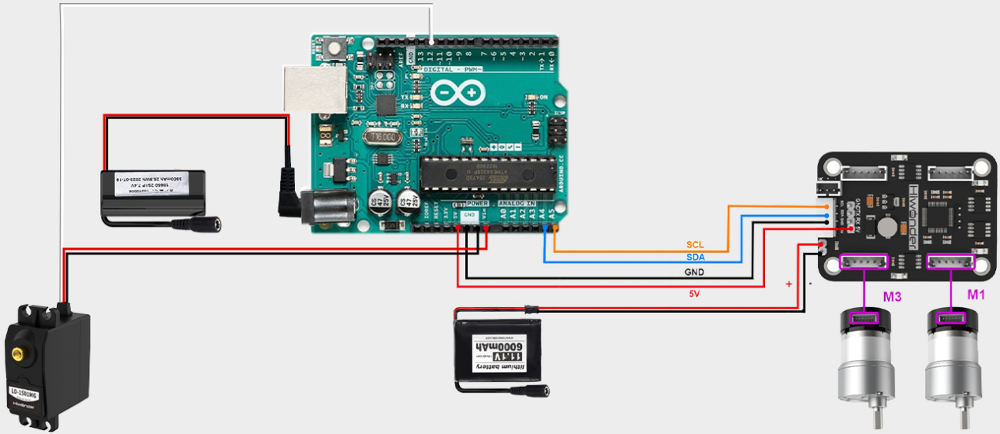
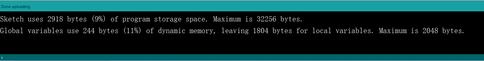

# 3. Arduino Version

## 3.1 Introduction

### 3.1.1 Arduino Introduction to the Required Hardware for Development

<p>
<iframe width="100%" height="713" src="https://www.youtube.com/embed/PWT2Nt6tZuo" title="Ardunio Development Hardware Introduction" frameborder="0" allow="accelerometer; autoplay; clipboard-write; encrypted-media; gyroscope; picture-in-picture; web-share" referrerpolicy="strict-origin-when-cross-origin" allowfullscreen></iframe>
</p>

### 3.1.2 Install the motor drive module

<p>
<iframe width="100%" height="713" src="https://www.youtube.com/embed/dGeaY-VIu6Q" title="Arduino Development -- Install Motor Driver Module" frameborder="0" allow="accelerometer; autoplay; clipboard-write; encrypted-media; gyroscope; picture-in-picture; web-share" referrerpolicy="strict-origin-when-cross-origin" allowfullscreen></iframe>
</p>

### 3.1.3 Install the Arduino development board

<p>
<iframe width="100%" height="713" src="https://www.youtube.com/embed/ufkTrW1kKQM" title="Arduino Development -- Install Arduino Development Board" frameborder="0" allow="accelerometer; autoplay; clipboard-write; encrypted-media; gyroscope; picture-in-picture; web-share" referrerpolicy="strict-origin-when-cross-origin" allowfullscreen></iframe>
</p>

### 3.1.4 Connection Instructions

<p>
<iframe width="100%" height="713" src="https://www.youtube.com/embed/VxJE-gEcRqI" title="Arduino Development -- Battery Wiring" frameborder="0" allow="accelerometer; autoplay; clipboard-write; encrypted-media; gyroscope; picture-in-picture; web-share" referrerpolicy="strict-origin-when-cross-origin" allowfullscreen></iframe>
</p>

### 3.1.5 Battery connection and power supply precautions

* **Development Tutorial (Arduino Version)**

(1) Forward for 4 seconds.

(2) Back for 4 seconds.

(3) Turn left for 4 seconds.

(4) Return to the initial position.

(5) Forward to the right for 4 seconds.

(6) Return to the original position.

## 3.2 Hardware Introduction

### 3.2.1 Arduino UNO Controller

Arduino is a convenient, flexible, and user-friendly open-source electronic prototyping platform. It features 14 digital input/output pins (with 6 capable of PWM output), 6 analog inputs, a 16 MHz ceramic resonator (CSTCE16M0V53-R0), a USB connection, a power socket, an ICSP header, and a reset button.

The following diagram illustrates the physical pin layout of Arduino UNO (please refer to your specific Arduino UNO main control board for accurate details):


### 3.2.2 4-Channel Encoder Motor Driver

This is a motor drive module designed to work with a microcontroller for driving TT motors or magnetic encoder motors. Each channel is equipped with a `YX-4055AM` motor drive chip, and its voltage range is DC 3V-12V. The specific voltage depends on the voltage requirements of the connected motor. The interface distribution is illustrated in the figure below:


The introduction to the interface on the driver is as below:

<table class="docutils-nobg" border="1">
<thead>
<tr>
<th>Interface type</th>
<th>NO.</th>
<th>Function</th>
</tr>
</thead>
<tbody>
<tr>
<td rowspan="7"><strong>Encoder motor interface</strong></td>
<td>GND</td>
<td>Negative electrode of the Hall power</td>
</tr>
<tr>
<td>A</td>
<td>A-phase pulse signal output terminal</td>
</tr>
<tr>
<td>B</td>
<td>B-phase pulse signal output terminal</td>
</tr>
<tr>
<td>VCC</td>
<td>Positive electrode of the Hall power</td>
</tr>
<tr>
<td>M+</td>
<td>Positive electrode of the motor power supply</td>
</tr>
<tr>
<td>M-</td>
<td>Positive electrode of the motor power supply</td>
</tr>
<tr>
<td></td>
<td><strong>Note:</strong><br>
1. The voltage between VCC and GND is determined based on the power supply voltage of the microcontroller used. Typically, 3.3V or 5V is used.<br>
2. When the spindle rotates clockwise, the output pulse signal of channel A is ahead of channel B; when the spindle rotates counterclockwise, the signal of channel A is behind channel B.<br>
3. The voltage between M+ and M- is determined based on the voltage requirements of the motor used.</td>
</tr>
<tr>
<td rowspan="4"><strong>IIC</strong></td>
<td>SCL</td>
<td>Clock line</td>
</tr>
<tr>
<td>SDA</td>
<td>Bi-directional data line</td>
</tr>
<tr>
<td>GND</td>
<td>Power ground line</td>
</tr>
<tr>
<td>5V</td>
<td>5V DC output</td>
</tr>
<tr>
<td rowspan="1"><strong>3Pin power</strong></td>
<td>-</td>
<td>Power negative electrode</td>
</tr>
<tr>
<td rowspan="2"><strong>port</strong></td>
<td>+</td>
<td>Power positive input</td>
</tr>
<tr>
<td>NC</td>
<td>Empty</td>
</tr>
<tr>
<td rowspan="2"><strong>Power port</strong></td>
<td>+</td>
<td>Power positive input</td>
</tr>
<tr>
<td>-</td>
<td>Power negative electrode</td>
</tr>
</tbody>
</table>

### 3.2.3 Steering Servo


The steering servo in this chassis utilizes the `LD-1501MG PWM` servo model.

The `LD-1501MG` operates on a `PWM` servo mechanism. To control it, a `PWM` signal with a 20ms period is sent to the signal end. The servo angle is adjusted by manipulating the pulse width within the range of 500 to 2500μs. This corresponds to an angle range of 0 to 180°, and the recommended operating voltage is between `6V` and `8.4V`.

The `PWM` waveform signal is employed to regulate the servo position. When the `PWM` signal is fed into the motor drive circuit, the motor rotation is controlled based on the signal level. A high `PWM` duty cycle results in a greater driving force, enabling a larger rotation angle. Conversely, a low duty cycle yields a smaller driving force, resulting in a reduced motor rotation angle.

By continuously fine-tuning the `PWM` duty cycle, the microcontroller can precisely control the motor's rotation angle. This, in turn, drives the mechanical structure to rotate, achieving accurate position control of the steering gear output shaft.


The diagram above illustrates the wiring port distribution for the bus servo, accompanied by the pin distribution table below. **"Please note: When the servo and the microcontroller are powered by different sources, ensure both power supplies are grounded together."**

| **PIN** | **Description** |
|:-------:|:---------------:|
| White | Signal wire |
| Red | Positive power electrode |
| Black | Ground wire |

### 3.2.4 Encoder Geared Motor

The motor model employed in this chassis is `JGB37-520R30-12`. Here's the breakdown: **"J"** signifies a DC motor, **"GB"** denotes an eccentric output shaft, **"37"** indicates the diameter of the reduction box, **"520"** represents the motor model, **"R30"** stands for the reduction ratio of 1:30, and **"12"** signifies the rated voltage of `12V`. Please refer to the interface description illustrated in the figure below:


## 3.3 Wiring

The `Arduino Uno` is outfitted with a 4-channel motor driver. It operates using an `11.1V 6000mAh` lithium battery to power the motor, while a separate `7.4V` battery is utilized to power the steering servo. Refer to the image below for the `Arduino UNO` wiring diagram.




## 3.4 Environment Configuration and Program Download

### 3.4.1 Environment Configuration

Prior to downloading, ensure that the **"Arduino IDE"** is installed on your computer. You can find the software package in the [2. Software Tools->01 Arduino Installation Package](Appendix.md).

### 3.4.2 Program Running

Open the `control.ino` program saved in [3. Programs->control](../_static/source_code/cotrol.zip) using **"Arduino IDE"**.

(1) Choose the Arduino development board type. In this case, select **"Arduino UNO"**.


(2) Select the USB port the Arduino currently connecting to your computer. The IDE will detect it automatically; in this case, choose **"COM56"**.


(3) Connect `Arduino UNO` to the computer. Select **"Arduino UNO"** in the tool bar, and click-on  to download the program.

(4) The software will compile the program automatically. Please wait until the compilation process is successfully completed.


(5) Wait for the program to finish uploading.



### 3.4.3 Program Outcome

Once the program is downloaded, the car chassis executes the following actions in sequence: 

(1) Move forward for 4 seconds; 

(2) Move backward for 4 seconds; 

(3) Turn left for 4 seconds; 

(4) Return to the initial position; 

(5) Move forward to the right for 4 seconds;

 (6) Return to the original position. There is a 1-second interval between each action.

## 3.5 Program Analysis

[Source Code](../_static/source_code/cotrol.zip)

### 3.5.1 Import Necessary Library

{lineno-start=1}
```c
#include <Wire.h>
```

The library is integrated into the **"Arduino IDE"**. To add it, navigate to **"Sketch -> Include Library"**. It incorporates write methods for `I2C` communication, enabling the control of motor rotation.

### 3.5.2 Initialize Communication Address

{lineno-start=3}
```c
#define I2C_ADDR        0x34

#define ADC_BAT_ADDR                  0
#define MOTOR_TYPE_ADDR               20 //Encoding motor type Settings
#define MOTOR_ENCODER_POLARITY_ADDR   21 //Set the polarity of the encoding direction. If it is found that the motor speed is completely out of control, either rotate at the maximum speed or stop. The value of this address can be reset to range 0 or 1. The default is 0
#define MOTOR_FIXED_PWM_ADDR      31 //Fixed PWM control, belonging to open-loop control, with a range of (-100 to 100)
//#define SERVOS_ADDR_CMD 40        
#define MOTOR_FIXED_SPEED_ADDR    51 //Fixed-speed control, belonging to closed-loop control, unit: pulse count per 10 milliseconds, range (depending on the specific encoded motor, affected by the number of encoded lines, voltage size, load size, etc., generally within ±50)

#define MOTOR_ENCODER_TOTAL_ADDR  60 //The total pulse values of each of the four encoded motors
//If it is known that the number of pulses per revolution of the motor is U and the diameter of the wheel is D, then the distance traveled by each wheel can be known through pulse counting
//For instance, if the total number of pulses of motor 1 is read as P, then the distance traveled is (P/U) * (3.14159*D).
//For different motors, you can test the pulse number U per revolution by yourself. You can manually rotate 10 revolutions to read the pulse number and then take the average value to obtain it
```

Define the `I2C` communication address and address codes for different types of encoded motors as macros, facilitating subsequent calls. The `I2C` communication address connected to the driver board is set as `0x34`; this value is hardware-specific, and the default can be retained here. The encoded motor type is designated as `20`, and its direction polarity is defined as `21`. It's essential to note that these two numbers represent the address positions for writing parameters, not the actual parameter values. These values are hardware-specific, and for simplicity, the default values can be maintained in this context.

### 3.5.3 Initialize Motor Type

{lineno-start=21}
```c
//Specific values of the motor type
#define MOTOR_TYPE_WITHOUT_ENCODER        0
#define MOTOR_TYPE_TT                     1
#define MOTOR_TYPE_N20                    2
#define MOTOR_TYPE_JGB                    3  //The magnetic ring has 44 pulses per revolution, with a reduction ratio of 131 by default
```

The 4-channel motor driver module is versatile and supports different motor types, such as `TTL`, `N20`, and `JGB` motors. Here, we use macro definitions to specify these types. For this development, `JGB` motors are employed, and their motor type is macro-defined as `3`.

### 3.5.4 Control Servo Using Function

{lineno-start=27}
```c
void servo(int myangle)
{
	pulsewidth=map(myangle,0,180,500,2500);	//Map the 0°-180° range to the 500-2500 range (i.e., the conversion from Angle to duty cycle)
	digitalWrite(servopin,HIGH);			//Output high level
	delayMicroseconds(pulsewidth);			//The analog duty cycle outputs a high-level signal
	digitalWrite(servopin,LOW);			//output low level
	delay(20-pulsewidth/1000);				//delayed
}
```

This function utilizes the `myangle` parameter to represent the servo's rotation angle, ranging from 0 to 180 degrees. Subsequently, this parameter is mapped to a pulse width spanning from 0 to 2500 using the `map` function. The signal's duty cycle, crucial for determining the output angle, is determined by this pulse width.

Firstly, a high-level signal is produced via `digitalWrite(servopin, HIGH)`. Then, a simulated duty cycle is generated by producing a high-level signal for the duration specified by `delayMicroseconds(pulsewidth)`. Following this, the function returns to a low-level signal using `digitalWrite(servopin, LOW)`.

Lastly, the `delay` function is employed to prevent the servo from immediately returning to its transition position after halting. This buffer period is crucial because if the servo halts abruptly after traversing from one end to the other, it might experience forward rotation due to inertia. Hence, this function introduces a buffer period to facilitate a smooth return to the specified position.

### 3.5.5 Configure & Control Motor

{lineno-start=88}
```cpp
uint8_t MotorType = MOTOR_TYPE_JGB;
uint8_t MotorEncoderPolarity = 0; 

void setup()
{
  
  Wire.begin();
  delay(200);
  WireWriteDataArray(MOTOR_TYPE_ADDR,&MotorType,1);
  delay(5);
  WireWriteDataArray(MOTOR_ENCODER_POLARITY_ADDR,&MotorEncoderPolarity,1);
  delay(2000);
}

int8_t car_forward[4]={30,-30,-30,30};                  // go forward
int8_t car_back[4]={-30,30,30,-30};                     // retreat
```

The lines **"MOTOR_TYPE_JGB37_520_12V_110RPM"** and **"MotorEncoderPolarity = 0"** serve to define the motor type and encoder polarity, respectively.

`MOTOR_TYPE_JGB37_520_12V_110RPM` is a predefined constant representing a specific motor model with a `12V` voltage requirement and a maximum speed of 110 rpm. Meanwhile, `MotorEncoderPolarity` being set to `0` indicates that the encoder polarity is configured to its default setting.

The function `Wire.begin();` initiates `IIC` communication, while `pinMode(servopin, OUTPUT);` configures the `servopin` pin to output mode, enabling control over the servo rotation.

The pauses introduced by `delay(200);` and `delay(5);` allow the program to wait for the hardware devices to respond and become ready.

The subsequent lines, `WireWriteDataArray(MOTOR_TYPE_ADDR, &MotorType, 1);` and `WireWriteDataArray(MOTOR_ENCODER_POLARITY_ADDR, &MotorEncoderPolarity, 1);` utilize the `IIC` protocol to transmit the motor type and encoder polarity settings to specified addresses.

Calling `servo(90);` rotates the servo to a 90-degree position. Additionally, functions like `int8_t car_forward[4] = {-16, 0, 16, 0};` define command sequences for the chassis to execute forward, backward, and stop movements. These sequences include speed values corresponding to motor rotation, with the absolute value indicating rotation speed, and the sign denoting the direction of rotation. The specific command sequence may vary based on motor characteristics and program implementation.

### 3.5.6 Main Function

{lineno-start=112}
```c++
  /* The car moves forward */
  WireWriteDataArray(MOTOR_FIXED_SPEED_ADDR,car_retreat,4);
  delay(4000);
  WireWriteDataArray(MOTOR_FIXED_SPEED_ADDR,car_stop,4);
  delay(1000);
  /* The car moves backward */
  WireWriteDataArray(MOTOR_FIXED_SPEED_ADDR,car_forward,4);
  delay(4000);
  WireWriteDataArray(MOTOR_FIXED_SPEED_ADDR,car_stop,4);
  delay(1000);    
  /* The car moved to the left front. After 4 seconds, the direction remained unchanged and it returned to the starting point. */
  LobotSerialServoMove(Serial, 254, 625, 200);
  WireWriteDataArray(MOTOR_FIXED_SPEED_ADDR,car_retreat,4);
  delay(4000);
  WireWriteDataArray(MOTOR_FIXED_SPEED_ADDR,car_stop,4);
  delay(1000); 
  WireWriteDataArray(MOTOR_FIXED_SPEED_ADDR,car_forward,4);
  delay(4000);
  LobotSerialServoMove(Serial, 254, 500, 200);
  WireWriteDataArray(MOTOR_FIXED_SPEED_ADDR,car_stop,4);
  delay(1000);
  /* The car moved forward to the right. After 4 seconds, the steering remained unchanged and it returned to the starting point.
 */
  LobotSerialServoMove(Serial, 254, 335, 200);    
  WireWriteDataArray(MOTOR_FIXED_SPEED_ADDR,car_retreat,4);
  delay(4000);
  WireWriteDataArray(MOTOR_FIXED_SPEED_ADDR,car_stop,4);
  delay(1000);
  WireWriteDataArray(MOTOR_FIXED_SPEED_ADDR,car_forward,4);
  delay(4000);
  LobotSerialServoMove(Serial, 254, 500, 200);
  WireWriteDataArray(MOTOR_FIXED_SPEED_ADDR,car_stop,4);
  delay(1000); 
```

In the main function, the motor's operating mode is determined using the `WireWriteDataArray` function. Here, we'll focus on the forward movement of the car as an example.

For instance, calling `WireWriteDataArray(MOTOR_FIXED_SPEED_ADDR, car_retreat, 4)` establishes the forward mode. This mode corresponds to the `int8_t car_forward[4] = {-16, 0, 16, 0}` function, which sets the motor rotation speed for the `M1` and `M3` interfaces. Given that the motors' installation directions are opposite, the speed control values in `car_forward` include both positive and negative values (`-16` and `16`). Adjusting the absolute value of this parameter allows fine-tuning of the motor speed: the larger the absolute value, the faster the speed.

Furthermore, executing `servo(45)` directs the steering servo to turn left. Conversely, if the value passed to `servo` is negative, it turns the servo to the right. Subsequent control of the car chassis to achieve reverse turning can be implemented based on the aforementioned principles.

## 3.6 Development Notices

(1) Given that the `Arduino Uno` operates at a rated working voltage of `5V`, the encoding motor utilized in this car chassis (`Ackerman`) requires a `12V` power supply for operation.

(2) Utilizing the `IIC` interface solution of the four-channel encoded motor drive module to provide power is unfeasible. This is because the `5V` provided by this interface serves solely as a voltage input and cannot be used for output. Additionally, it is not advisable to employ other interfaces of the motor driver module to power the `Arduino Uno`, as this could lead to unstable voltage output from the `Arduino Uno`.

(3) To ensure the steering gear, responsible for controlling the vehicle's steering, receives its required operating voltage, a `7.4V` lithium battery is employed in the tutorial. This battery powers the `Arduino Uno` main control board, thereby facilitating the steering gear's operation through the corresponding pin interface.

## 3.7 Car Assembly and Control Examples

### 3.7.1 Arduino UNO Assembly demo video

<p>
<iframe width="100%" height="713" src="https://www.youtube.com/embed/jLTu05SVkwI" title="Ackermann Chassis Tutorials-Arduino UNO Assembly" frameborder="0" allow="accelerometer; autoplay; clipboard-write; encrypted-media; gyroscope; picture-in-picture; web-share" referrerpolicy="strict-origin-when-cross-origin" allowfullscreen></iframe>
</p>


### 3.7.2 Ackermann Chassis Bluetooth Control

In this section, the car is controlled to move by receiving data sent from the mobile app via the Bluetooth module.

*   **Program Logic**


*   **Bluetooth Module**

(1) Module Introduction


The Bluetooth module is a hardware component that integrates Bluetooth communication capabilities and is commonly used for wireless data transmission between electronic devices. It fundamentally communicates through a `UART serial interface`.

(2) Module Connection

Connect the Bluetooth module to the Bluetooth port of the expansion board as below:


*   **Program Download**

[Source Code](../_static/source_code/Akerman_app.zip)

::: {Note}
*   Please remove the Bluetooth module before downloading the program. Otherwise, a serial port conflict may occur, resulting in a failed download.
*   When connecting the Type-B download cable, make sure the battery box switch is set to the **"OFF"** position. This helps prevent accidental contact between the cable and the power pins on the expansion board, which could cause a short circuit.
:::

(1) Locate and open the program file **"3.2.3 Programs\Akerman_app\Akerman_app.ino"** in the same directory as this section.


(2) Connect the Arduino to your computer using a Type-B USB data cable. Click on **"Select Board"** — the software will automatically detect the current Arduino port. Click to establish the connection.


(3) Click the **Upload**  button to download the program to the Arduino. Wait for the upload to complete.


*   **Program Outcome**

Once the mobile app is connected to the Bluetooth module, you can control the Ackermann chassis movement directly through the app's buttons.

*   **Program Analysis**

[Source Code](../_static/source_code/Akerman_app.zip)

(1) Import Library Files

Import the chassis control library required for this activity.

{lineno-start=1}

```c
#include "Akerman_chassis.h"
```

(2) Define Variables and Create Objects

① First, an enumeration type is defined to represent the various control states of the chassis. Then, a key-value pair structure is defined to store the control states. An array of key-value pairs is initialized to map the app's commands to their corresponding control states.

{lineno-start=3}

```c
typedef enum
{
  NULL_KEY = 0,
  STOP,
  GO_FORWARD,
  TURN_LEFT,
  TURN_RIGHT,
  GO_BACK,
  SPEED_UP,
  SPEED_DOWN,
  LEFT_SPIN,
  RIGHT_SPIN
}Mode_State;

// Define key-value pair structure
typedef struct {
    const char *value;
    Mode_State key;
} HashTableEntry;

/* Hash table */
#define TABLE_SIZE 9
HashTableEntry table[TABLE_SIZE] = {
    {"A", GO_FORWARD},
    {"C", TURN_LEFT},
    {"G", TURN_RIGHT},
    {"E", GO_BACK},
    {"I", STOP},
    {"j", SPEED_UP},
    {"n", SPEED_DOWN},
    {"l", LEFT_SPIN},
    {"p", RIGHT_SPIN}
};
```

② An `Ackermann chassis control object` is defined, with the initial control state set to `"none"`. A variable is created to store the `speed`, initialized at 150 mm/s. The `speed_limit` variable is used to define the maximum allowable speed.

{lineno-start=37}

```c
Akerman akerman;
Mode_State key = NULL_KEY;

float speed = 150.0f;
float speed_limit = 300.0f;
```

(3) Initialize Settings

In the `setup()` function, the serial port is first initialized with a baud rate of `9600` for communication. Then, the Ackermann chassis is initialized.

{lineno-start=56}

```c
void setup() {
  Serial.begin(9600);
  akerman.begin(MINACKER_CHASSIS);
}
```

(4) Main Function

① In the main function, `Serial.available()` is used to check whether there is incoming Bluetooth data in the buffer. If the value is greater than 0, it means Bluetooth data is available, which is then read using `Serial.read()` and stored in the `cmd` variable. The `lookup()` function is then called to determine the corresponding control state based on the received data.

{lineno-start=61}

```c
void loop() {
  if(Serial.available() > 0)
  {
    char cmd;
    cmd = Serial.read();
    key = lookup(cmd);
```

② Based on the control state, the `akerman.move()` function is called to move the car accordingly. The car can be controlled to stop, move forward, turn left, turn right, or move backward.

{lineno-start=68}

```c
    switch(key)
    {
    case STOP:
      akerman.move(0, 0.0f);
      break;

    case GO_FORWARD:
      akerman.move(speed, 0.0f);
      break;

    case TURN_LEFT:
      akerman.move(speed, -400.0f);
      break;

    case TURN_RIGHT:
      akerman.move(speed, 400.0f);
      break;

    case GO_BACK:
      akerman.move(-speed, 0.0f);
      break;
```

③ If the parsed data corresponds to speed control, the `speed` variable is increased or decreased by 10 units with each command.

{lineno-start=90}

```c
    case SPEED_UP:
      if(speed < speed_limit)
      {
          speed += 10.0f;
      }
      break;

    case SPEED_DOWN:
      if(speed > 0)
      {
          speed -= 10.0f;
      }
      break;

    case LEFT_SPIN:
      if(akerman.cal_left_wheel_speed() > 0){
        akerman.move(speed, -230.0f);
      }else if(akerman.cal_left_wheel_speed() < 0){
        akerman.move(-speed, -230.0f);
      }
      
      break;
    
    case RIGHT_SPIN:
      if(akerman.cal_left_wheel_speed() > 0){
        akerman.move(speed, 230.0f);
      }else if(akerman.cal_left_wheel_speed() < 0){
        akerman.move(-speed, 230.0f);
      }
      break;

    default:
      break;
    }
```

④ If the data corresponds to a left or right rotation command, the chassis is controlled to move in a circular path with a radius of 230 mm, either counterclockwise or clockwise. After each command is executed, the received data is cleared to prepare for the next operation.

{lineno-start=104}

```c
    case LEFT_SPIN:
      if(akerman.cal_left_wheel_speed() > 0){
        akerman.move(speed, -230.0f);
      }else if(akerman.cal_left_wheel_speed() < 0){
        akerman.move(-speed, -230.0f);
      }
      
      break;
    
    case RIGHT_SPIN:
      if(akerman.cal_left_wheel_speed() > 0){
        akerman.move(speed, 230.0f);
      }else if(akerman.cal_left_wheel_speed() < 0){
        akerman.move(-speed, 230.0f);
      }
      break;

    default:
      break;
    }
    key = NULL_KEY;
  }
```

(5) Key-Value Lookup Function

This function is primarily used to search the predefined list of key-value pairs based on the received data. It returns the corresponding value if a match is found; otherwise, it returns `NULL_KEY`.

{lineno-start=44}

```c
Mode_State lookup(char val)
{
    for (int i = 0; i < TABLE_SIZE && table[i].value != NULL; ++i)
    {
        if (strcmp(table[i].value, &val) == 0)
        {
            return table[i].key;
        }
    }
    return NULL_KEY;
}
```

(6) Chassis Control Function

① In the chassis control function, motor and servo control values are calculated based on Ackermann kinematics. The parameter `v` controls the motor speed of the car (positive values indicate forward movement, negative values indicate reverse, with units in mm/s). The parameter `r` controls the turning radius of the car (positive for clockwise rotation, negative for counterclockwise rotation, units in mm). When the linear velocity `v` is not zero, the function calculates the speeds for the left and right wheels during turning. Since the right wheel follows a larger radius during a turn, it moves faster than the left wheel, which follows a smaller radius. The turning radius `r` determines these speeds. After calculating the wheel speeds, the steering angle needed for the turn is also computed.

{lineno-start=39}

```c++
void Akerman::move(float v, float r)
{
  float akerman_vr, akerman_vl, akerman_angle;

  if(r == 0.0f)
  {
      akerman_vl = v;
      akerman_vr = v;
      akerman_angle = 0;
  }
  else
  {
      akerman_vl = v / r * (r + akerman.wheelbase / 2);
      akerman_vr = v / r * (r - akerman.wheelbase / 2);
      akerman_angle = atan(akerman.shaft_length / r);
  }
```

② After obtaining the steering angle, the angular velocity is checked. If the angular velocity is zero, it means the car is moving straight and no steering adjustment is needed. The steering angle is then constrained within the range of -π/5 to π/5 radians to ensure safe turning limits.

{lineno-start=56}

```c++
if(akerman_angle >= PI / 5.0f)
  {
      akerman_angle = PI / 5.0f;
  }
  else if(akerman_angle <= -PI / 5.0f)
  {
      akerman_angle = -PI / 5.0f;
  }
```

③ Once the steering angle is determined, it is mapped to the servo control value. This value is stored in the `akerman.angle` variable. At the same time, the rotational speeds for the left and right motors are calculated.

{lineno-start=65}

```c++
  if(akerman.chassis_type == TIACKER_CHASSIS){
    akerman.angle = -2000 / PI * akerman_angle + 1500; //Calculate the steering angle
  }else if(akerman.chassis_type == MINACKER_CHASSIS){
    akerman.angle = 2000 / PI * akerman_angle + 1500; //Calculate the steering angle
  }
  
  akerman.vl = linear_speed_to_rps(&akerman,  akerman_vl);
  akerman.vr = linear_speed_to_rps(&akerman,  akerman_vr);

  servos.set_servo(4, (uint16_t)akerman.angle);  
  motor.set_speed(akerman.motor_type, 1, 0, akerman.vr);
  motor.set_speed(akerman.motor_type, 2, 0, akerman.vl); 
```

④ Finally, the servo is commanded to rotate to the calculated angle, and the motors are controlled to rotate at the specified speeds, enabling the Ackermann chassis to move as intended.

{lineno-start=65}

```c++
  if(akerman.chassis_type == TIACKER_CHASSIS){
    akerman.angle = -2000 / PI * akerman_angle + 1500; //Calculate the steering angle
  }else if(akerman.chassis_type == MINACKER_CHASSIS){
    akerman.angle = 2000 / PI * akerman_angle + 1500; //Calculate the steering angle
  }
  
  akerman.vl = linear_speed_to_rps(&akerman,  akerman_vl);
  akerman.vr = linear_speed_to_rps(&akerman,  akerman_vr);

  servos.set_servo(4, (uint16_t)akerman.angle);  
  motor.set_speed(akerman.motor_type, 1, 0, akerman.vr);
  motor.set_speed(akerman.motor_type, 2, 0, akerman.vl); 

}
```

*   **FAQ**

(1) Code upload failed.

A: Please check if the Bluetooth module is connected to the expansion board. If it is, remove the Bluetooth module before attempting to upload the code again.

(2) Unable to find Bluetooth device.

A: Please ensure that the Bluetooth function on your phone is turned on. If it is already on, try restarting the app.