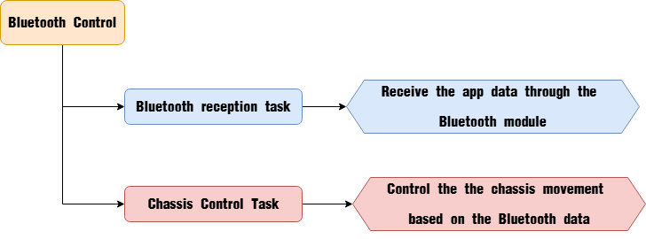
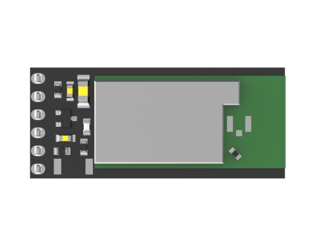
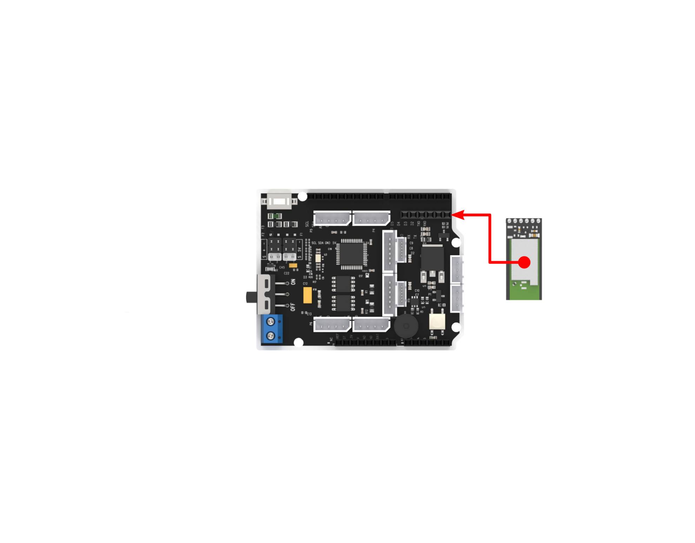

# 4. Robotic Car Applications

## 4.2 Car Assembly and Control Examples

### 4.2.1 Arduino UNO Assembly demo video

[Arduino UNO Assembly demo video](https://youtu.be/jLTu05SVkwI)

### 4.2.2 Ackermann Chassis Bluetooth Control

In this section, the car is controlled to move by receiving data sent from the mobile app via the Bluetooth module.

*   **Program Logic**



*   **Bluetooth Module**

(1) Module Introduction



The Bluetooth module is a hardware component that integrates Bluetooth communication capabilities and is commonly used for wireless data transmission between electronic devices. It fundamentally communicates through a `UART serial interface`.

(2) Module Connection

Connect the Bluetooth module to the Bluetooth port of the expansion board as below:



*   **Program Download**

[Source Code]()

::: {Note}
*   Please remove the Bluetooth module before downloading the program. Otherwise, a serial port conflict may occur, resulting in a failed download.
*   When connecting the Type-B download cable, make sure the battery box switch is set to the **"OFF"** position. This helps prevent accidental contact between the cable and the power pins on the expansion board, which could cause a short circuit.
:::

(1) Locate and open the program file **"3.2.3 Programs\Akerman_app\Akerman_app.ino"** in the same directory as this section.


(2) Connect the Arduino to your computer using a Type-B USB data cable. Click on **"Select Board"** — the software will automatically detect the current Arduino port. Click to establish the connection.


(3) Click the **Upload**  button to download the program to the Arduino. Wait for the upload to complete.


*   **Program Outcome**

Once the mobile app is connected to the Bluetooth module, you can control the Ackermann chassis movement directly through the app’s buttons.

*   **Program Analysis**

[Source Code]()

(1) Import Library Files

Import the chassis control library required for this activity.

{lineno-start=1}
```c
#include "Akerman_chassis.h"
```
(2) Define Variables and Create Objects

① First, an enumeration type is defined to represent the various control states of the chassis. Then, a key-value pair structure is defined to store the control states. An array of key-value pairs is initialized to map the app's commands to their corresponding control states.

{lineno-start=3}
```c
typedef enum
{
  NULL_KEY = 0,
  STOP,
  GO_FORWARD,
  TURN_LEFT,
  TURN_RIGHT,
  GO_BACK,
  SPEED_UP,
  SPEED_DOWN,
  LEFT_SPIN,
  RIGHT_SPIN
}Mode_State;

// Define key-value pair structure
typedef struct {
    const char *value;
    Mode_State key;
} HashTableEntry;

/* Hash table */
#define TABLE_SIZE 9
HashTableEntry table[TABLE_SIZE] = {
    {"A", GO_FORWARD},
    {"C", TURN_LEFT},
    {"G", TURN_RIGHT},
    {"E", GO_BACK},
    {"I", STOP},
    {"j", SPEED_UP},
    {"n", SPEED_DOWN},
    {"l", LEFT_SPIN},
    {"p", RIGHT_SPIN}
};
```
② An `Ackermann chassis control object` is defined, with the initial control state set to `"none"`. A variable is created to store the `speed`, initialized at 150 mm/s. The `speed_limit` variable is used to define the maximum allowable speed.

{lineno-start=37}
```c
Akerman akerman;
Mode_State key = NULL_KEY;

float speed = 150.0f;
float speed_limit = 300.0f;
```
(3) Initialize Settings

In the `setup()` function, the serial port is first initialized with a baud rate of `9600` for communication. Then, the Ackermann chassis is initialized.

{lineno-start=56}
```c
void setup() {
  Serial.begin(9600);
  akerman.begin(MINACKER_CHASSIS);
}
```
(4) Main Function

① In the main function, `Serial.available()` is used to check whether there is incoming Bluetooth data in the buffer. If the value is greater than 0, it means Bluetooth data is available, which is then read using `Serial.read()` and stored in the `cmd` variable. The `lookup()` function is then called to determine the corresponding control state based on the received data.

{lineno-start=61}
```c
void loop() {
  if(Serial.available() > 0)
  {
    char cmd;
    cmd = Serial.read();
    key = lookup(cmd);
```
② Based on the control state, the `akerman.move()` function is called to move the car accordingly. The car can be controlled to stop, move forward, turn left, turn right, or move backward.

{lineno-start=68}
```c
    switch(key)
    {
    case STOP:
      akerman.move(0, 0.0f);
      break;

    case GO_FORWARD:
      akerman.move(speed, 0.0f);
      break;

    case TURN_LEFT:
      akerman.move(speed, -400.0f);
      break;

    case TURN_RIGHT:
      akerman.move(speed, 400.0f);
      break;

    case GO_BACK:
      akerman.move(-speed, 0.0f);
      break;
```
③ If the parsed data corresponds to speed control, the `speed` variable is increased or decreased by 10 units with each command.

{lineno-start=90}
```c
    case SPEED_UP:
      if(speed < speed_limit)
      {
          speed += 10.0f;
      }
      break;

    case SPEED_DOWN:
      if(speed > 0)
      {
          speed -= 10.0f;
      }
      break;

    case LEFT_SPIN:
      if(akerman.cal_left_wheel_speed() > 0){
        akerman.move(speed, -230.0f);
      }else if(akerman.cal_left_wheel_speed() < 0){
        akerman.move(-speed, -230.0f);
      }
      
      break;
    
    case RIGHT_SPIN:
      if(akerman.cal_left_wheel_speed() > 0){
        akerman.move(speed, 230.0f);
      }else if(akerman.cal_left_wheel_speed() < 0){
        akerman.move(-speed, 230.0f);
      }
      break;

    default:
      break;
    }
```
④ If the data corresponds to a left or right rotation command, the chassis is controlled to move in a circular path with a radius of 230 mm, either counterclockwise or clockwise. After each command is executed, the received data is cleared to prepare for the next operation.

{lineno-start=104}
```c
    case LEFT_SPIN:
      if(akerman.cal_left_wheel_speed() > 0){
        akerman.move(speed, -230.0f);
      }else if(akerman.cal_left_wheel_speed() < 0){
        akerman.move(-speed, -230.0f);
      }
      
      break;
    
    case RIGHT_SPIN:
      if(akerman.cal_left_wheel_speed() > 0){
        akerman.move(speed, 230.0f);
      }else if(akerman.cal_left_wheel_speed() < 0){
        akerman.move(-speed, 230.0f);
      }
      break;

    default:
      break;
    }
    key = NULL_KEY;
  }
```
(5) Key-Value Lookup Function

This function is primarily used to search the predefined list of key-value pairs based on the received data. It returns the corresponding value if a match is found; otherwise, it returns `NULL_KEY`.

{lineno-start=44}
```c
Mode_State lookup(char val)
{
    for (int i = 0; i < TABLE_SIZE && table[i].value != NULL; ++i)
    {
        if (strcmp(table[i].value, &val) == 0)
        {
            return table[i].key;
        }
    }
    return NULL_KEY;
}
```
(6) Chassis Control Function

① In the chassis control function, motor and servo control values are calculated based on Ackermann kinematics. The parameter `v` controls the motor speed of the car (positive values indicate forward movement, negative values indicate reverse, with units in mm/s). The parameter `r` controls the turning radius of the car (positive for clockwise rotation, negative for counterclockwise rotation, units in mm). When the linear velocity `v` is not zero, the function calculates the speeds for the left and right wheels during turning. Since the right wheel follows a larger radius during a turn, it moves faster than the left wheel, which follows a smaller radius. The turning radius `r` determines these speeds. After calculating the wheel speeds, the steering angle needed for the turn is also computed.

{lineno-start=39}
```c++
void Akerman::move(float v, float r)
{
  float akerman_vr, akerman_vl, akerman_angle;

  if(r == 0.0f)
  {
      akerman_vl = v;
      akerman_vr = v;
      akerman_angle = 0;
  }
  else
  {
      akerman_vl = v / r * (r + akerman.wheelbase / 2);
      akerman_vr = v / r * (r - akerman.wheelbase / 2);
      akerman_angle = atan(akerman.shaft_length / r);
  }
```
② After obtaining the steering angle, the angular velocity is checked. If the angular velocity is zero, it means the car is moving straight and no steering adjustment is needed. The steering angle is then constrained within the range of -π/5 to π/5 radians to ensure safe turning limits.

{lineno-start=56}
```c++
if(akerman_angle >= PI / 5.0f)
  {
      akerman_angle = PI / 5.0f;
  }
  else if(akerman_angle <= -PI / 5.0f)
  {
      akerman_angle = -PI / 5.0f;
  }
```
③ Once the steering angle is determined, it is mapped to the servo control value. This value is stored in the `akerman.angle` variable. At the same time, the rotational speeds for the left and right motors are calculated.

{lineno-start=65}
```c++
  if(akerman.chassis_type == TIACKER_CHASSIS){
    akerman.angle = -2000 / PI * akerman_angle + 1500; //Calculate the steering angle
  }else if(akerman.chassis_type == MINACKER_CHASSIS){
    akerman.angle = 2000 / PI * akerman_angle + 1500; //Calculate the steering angle
  }
  
  akerman.vl = linear_speed_to_rps(&akerman,  akerman_vl);
  akerman.vr = linear_speed_to_rps(&akerman,  akerman_vr);

  servos.set_servo(4, (uint16_t)akerman.angle);  
  motor.set_speed(akerman.motor_type, 1, 0, akerman.vr);
  motor.set_speed(akerman.motor_type, 2, 0, akerman.vl); 
```
④ Finally, the servo is commanded to rotate to the calculated angle, and the motors are controlled to rotate at the specified speeds, enabling the Ackermann chassis to move as intended.

{lineno-start=65}
```c++
  if(akerman.chassis_type == TIACKER_CHASSIS){
    akerman.angle = -2000 / PI * akerman_angle + 1500; //Calculate the steering angle
  }else if(akerman.chassis_type == MINACKER_CHASSIS){
    akerman.angle = 2000 / PI * akerman_angle + 1500; //Calculate the steering angle
  }
  
  akerman.vl = linear_speed_to_rps(&akerman,  akerman_vl);
  akerman.vr = linear_speed_to_rps(&akerman,  akerman_vr);

  servos.set_servo(4, (uint16_t)akerman.angle);  
  motor.set_speed(akerman.motor_type, 1, 0, akerman.vr);
  motor.set_speed(akerman.motor_type, 2, 0, akerman.vl); 

}
```
*   **FAQ**

(1) Code upload failed.

A: Please check if the Bluetooth module is connected to the expansion board. If it is, remove the Bluetooth module before attempting to upload the code again.

(2) Unable to find Bluetooth device.

A: Please ensure that the Bluetooth function on your phone is turned on. If it is already on, try restarting the app.