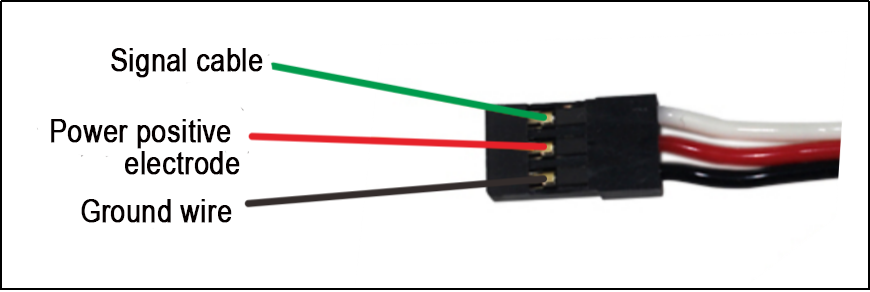
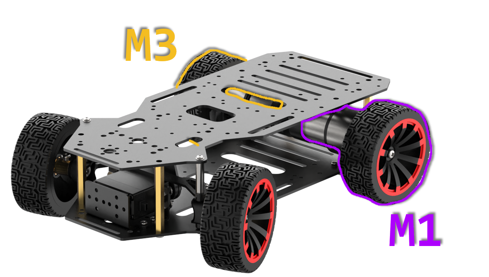

# 5. Development Tutorial (Raspberry Pi Version)

## 5.1 Program Overview

### 5.1.1 Program Actions

(1) Forward motion for 4 seconds.

(2) Reverse motion for 4 seconds.

(3) Left turn for 4 seconds.

(4) Return to the initial position.

(5) Right turn for 4 seconds.

(6) Return to the original position.

There is a 1-second interval between each action.

## 5.2 Hardware Introduction

### 5.2.1 Raspberry Pi 4B Controller

The Raspberry Pi 4B is a compact embedded computer featuring a built-in GPU with a frequency of 500MHz, equipped with 1/2/4GB LPDDR4 memory, a Gigabit network card, Bluetooth 5.0, USB 3.0 interface, and microHDMI interface. With the mentioned configuration, the Raspberry Pi provides a favorable hardware environment for programming and development.

The diagram below illustrates the pin port distribution of the Raspberry Pi 4B, which will be further discussed in the subsequent wiring and development process.


### 5.2.2 4-Channel Encoder Motor Driver

This is a motor drive module designed to work with a microcontroller for driving TT motors or magnetic encoder motors. Each channel is equipped with a YX-4055AM motor drive chip, and its voltage range is DC 3V-12V. The specific voltage depends on the voltage requirements of the connected motor. The interface distribution is illustrated in the figure below:


The introduction to the interface on the driver is as below:

<table>
<thead>
<tr>
<th>Interface type</th>
<th>NO.</th>
<th>Function</th>
</tr>
</thead>
<tbody>
<tr>
<td rowspan="7"><strong>Encoder motor interface</strong></td>
<td>GND</td>
<td>Negative electrode of the Hall power</td>
</tr>
<tr>
<td>A</td>
<td>A-phase pulse signal output terminal</td>
</tr>
<tr>
<td>B</td>
<td>B-phase pulse signal output terminal</td>
</tr>
<tr>
<td>VCC</td>
<td>Positive electrode of the Hall power</td>
</tr>
<tr>
<td>M+</td>
<td>Positive electrode of the motor power supply</td>
</tr>
<tr>
<td>M-</td>
<td>Positive electrode of the motor power supply</td>
</tr>
<tr>
<td></td>
<td><strong>Note:</strong><br>
1. The voltage between VCC and GND is determined based on the power supply voltage of the microcontroller used. Typically, 3.3V or 5V is used.<br>
2. When the spindle rotates clockwise, the output pulse signal of channel A is ahead of channel B; when the spindle rotates counterclockwise, the signal of channel A is behind channel B.<br>
3. The voltage between M+ and M- is determined based on the voltage requirements of the motor used.</td>
</tr>
<tr>
<td rowspan="4"><strong>IIC</strong></td>
<td>SCL</td>
<td>Clock line</td>
</tr>
<tr>
<td>SDA</td>
<td>Bi-directional data line</td>
</tr>
<tr>
<td>GND</td>
<td>Power ground line</td>
</tr>
<tr>
<td>5V</td>
<td>5V DC output</td>
</tr>
<tr>
<td rowspan="1"><strong>3Pin power</strong></td>
<td>-</td>
<td>Power negative electrode</td>
</tr>
<tr>
<td rowspan="2"><strong>port</strong></td>
<td>+</td>
<td>Power positive input</td>
</tr>
<tr>
<td>NC</td>
<td>Empty</td>
</tr>
<tr>
<td rowspan="2"><strong>Power port</strong></td>
<td>+</td>
<td>Power positive input</td>
</tr>
<tr>
<td>-</td>
<td>Power negative electrode</td>
</tr>
</tbody>
</table>

### 5.2.3 Steering Servo


The steering servo in this chassis utilizes the `LD-1501MG` PWM servo model.

The `LD-1501MG` operates on a PWM servo mechanism. To control it, a PWM signal with a 20ms period is sent to the signal end. The servo angle is adjusted by manipulating the pulse width within the range of 500 to 2500μs. This corresponds to an angle range of 0 to 180°, and the recommended operating voltage is between 6V and 8.4V.



| **PIN** | **Description** |
|:-------:|:---------------:|
| White | Signal wire |
| Red | Positive power electrode |
| Black | Ground wire |

### 5.2.4 Encoder Geared Motor

The motor model employed in this chassis is `JGB37-520R30-12`. Here's the breakdown: "`J`" signifies a DC motor, "`GB`" denotes an eccentric output shaft, "`37`" indicates the diameter of the reduction box, "`520`" represents the motor model, "`R30`" stands for the reduction ratio of 1:30, and "`12`" signifies the rated voltage of 12V. Please refer to the interface description illustrated in the figure below:


## 5.3 Wiring

The example in this section utilizes a Raspberry Pi mainboard, a Raspberry Pi expansion board, and a 4-channel encoded motor driver, powered by an 11.1V 6000mAh lithium battery. The general wiring diagram controlled by the Raspberry Pi is depicted below. In the diagram, the left motor responsible for forward motion of the car is labeled as `M1`, while the right motor is labeled as `M3`. It's important to note that the wiring illustration provided is a representation, and the terminal pins correspond to their real counterparts. This depiction does not affect the actual application outcome, and all connections should adhere to the specifications of the real product.




## 5.4 Environment Configuration and Program Running

### 5.4.1 Environment Configuration

Prior to downloading, ensure that the **"Arduino IDE"** is installed on your computer. You can find the software package in the **[2. Software Tools->03 Remote Desktop Connection Tool (Raspberry Pi)]()**.

### 5.4.2 Program Running

First, you must establish a remote connection to the robot, and subsequently, transfer the program files to the designated directory within the system.

1. Open `NoMachine` software, and connect the software to the device.

   

2. Drag the demo file under the **"3 Program"** folder to the system image desktop, as shown in the figure below.

   

   

3. To access the terminal interface using `NoMachine`, follow these steps: Right-click on the desktop, and choose **"Open Terminal Here"**.


4.  Enter the following command `sudo chmod +x acker_controller_dark_demo.py` to grant executable permissions to the program.

```
sudo chmod +x acker_controller_dark_demo.py
```

5.  Type the command `python3 acker_controller_dark_demo.py` to launch the car's control program.

```
python3 acker_controller_dark_demo.py
```

6.  After the program is loaded, the car will execute corresponding movements as defined in the program.

    

7.  To exit the program, simply press **'Ctrl+C'** in the terminal to close it.

### 5.4.3 Program Outcome

After the program is downloaded, the car chassis performs the following actions in the specified order:

(1) Forward motion for 4 seconds.

(2) Reverse motion for 4 seconds.

(3) Left turn for 4 seconds.

(4) Return to the initial position.

(5) Right turn for 4 seconds.

(6) Return to the original position.

There is a 1-second interval between each action.

## 5.5 Case Analysis

[Source Code]()

### 5.5.1 Import Required Module

Import the necessary configuration libraries, with key ones including:

{lineno-start=3}
```python
import sys
import rospy
import serial
import pigpio
import time
import RPi.GPIO as GPIO
```

`sys` for system control;

`rospy` for starting `ROS` services and executing corresponding functions;

`serial` for sending data via serial ports and controlling bus servos;

`Pigpio` for managing `GPIO` port pins on the Raspberry Pi to control `PWM` servos;

`smbus2` for handling `I2C` communication to control the rotation of the car motor.

### 5.5.2 Car Related Initialization Parameter Settings

{lineno-start=36}
```python
car_speed = 0 # Speed of the car
car_speed_move = 80
car_wheel_angle = 90  # Just keep the default direction Angle of the car
car_wheel_rotate = 0  # The yaw parameters of the trolley can be kept at the default level
car_turn_mode = ['go','back','turn_left','left_back','turn_right','right_back']
```

The parameters mentioned above are explained within the program. Among them, `car_turn_mode` signifies the current movement state of the car, including `go`, `back`, `turn_left`, `left_back`, `turn_right`, and `right_back`. These states will be referenced in the subsequent sections of the program.

### 5.5.3 Initialization Parameter Settings Related to Servos

{lineno-start=42}
```python
# The steering gear controls the Angle
steering_servor_angle_pulse = 1500  # Median position (500-2500
steering_serv_turn_time = 100  # The time of the target Angle
```

You can consult the comments provided. `steering_servor_angle_pulse` utilizes pulse width to control the orientation of the `PWM` servo. An angle of 0° corresponds to a pulse width of 500, while an angle of 180° corresponds to a pulse width of 2500. When the pulse width is set to 1500, the servo is in a neutral state, meaning the front wheels of the car are straight. We have the flexibility to define the initial width as needed.

### 5.5.4 Define GPIO Port Pin 12 to Control the PWM Servo

Define `GPIO` port `pin 12` to control the `PWM` servo, specify the output range and frequency, and initialize the servo control position to 1500.

{lineno-start=49}
```python
pin = 12 # The io port of the steering gear for the front steering wheels
pi = pigpio.pi()
pi.set_PWM_range(pin, 20000)#5 is the IO port for outputting PWM, and 20000 sets the adjustment range of PWM
                            # The control signal of our servo is 50Hz, which means a cycle of 20ms. It's 20,000 US.
                            # Set it to 20000, which means the minimum adjustment is 1us
pi.set_PWM_frequency(pin, 50) #Set the frequency of the PWM. 5 is the IO port to be set, and 50 is the frequency
pi.set_PWM_dutycycle(pin, 1500)
```

### 5.5.5 Angle Control Function (`servo_angle`)

This function takes pulse width as input, with `dc` representing the pulse width passed into the function.

{lineno-start=56}
```python
def servo_angle(dc):
    pi.set_PWM_dutycycle(pin, dc) #Set the pulse width of the pwm, where pin is the pin and i is the pulse width
    time.sleep(0.5)
```

### 5.5.6 Node Initialization

Node initialization: This initializes the node, enabling the `ROS` master node to locate the current program's node location. Subsequently, it publishes messages through `ROS` to control motor rotation.

{lineno-start=69}
```python
# Initialize the node
rospy.init_node('car_forward_demo', log_level=rospy.DEBUG)
rospy.on_shutdown(stop)
```

### 5.5.7 Chassis Control Section

{lineno-start=72}
```python
# Chassis control
set_velocity = rospy.Publisher('/chassis_control/set_velocity', SetVelocity, queue_size=1)
set_velocity.publish(car_speed,car_wheel_angle,car_wheel_rotate)
servo_angle(steering_servor_angle_pulse)
```

`set_velocity`: This function controls the car chassis. `"/chassis_control/set_velocity"` denotes the control topic, with `SetVelocity` indicating the message type for control functions. `queue_size=1` specifies the message queue length, which is set to 1 by default.

`servo_angle`: Used for controlling the angle of the bus servo. The input parameter `steering_servor_angle_pulse` represents the input pulse width, currently set to 1500.

`set_velocity`: Publishes the car's speed topic to the main node, enabling control over the current car speed. Before the program initiates loop execution, the car's speed defaults to 0.

### 5.5.8 Loop Execution Control

In the program fragment below, the car executes actions via a `while` loop. Different motion modes are determined by the variable `i`, where `mode` denotes the current motion state. Six motion states are defined. `car_speed` indicates the speed of movement, while `steering_servor_angle_pulse` specifies the servo position adjustment.

{lineno-start=76}
```python
car_turn_mode = ['go','back','turn_left','left_back','turn_right','right_back']
    mode = None  # motor pattern

    i = 0
    while start:
        # Chassis control message released: Linear speed 60, yaw angular velocity 0(less than 0, clockwise direction)
        # The car moves forward.
        rospy.sleep(1)
        if i >= 6:
            i = 0
        mode = car_turn_mode[i]
        # car_speed Indicate the speed of the car
        # steering_servor_angle = It indicates the Angle to which the servo rotates
        if mode == 'go':
            car_speed = car_speed_move
            steering_servor_angle_pulse = 1500
        elif mode == 'back':
            car_speed = -car_speed_move
            steering_servor_angle_pulse = 1500
        elif mode == 'turn_left':
            car_speed = car_speed_move
            steering_servor_angle_pulse = 1000
        elif mode == 'left_back':
            car_speed = -car_speed_move
            steering_servor_angle_pulse = 1000
        elif mode == 'turn_right':
            car_speed = car_speed_move
            steering_servor_angle_pulse = 2000
        elif mode == 'right_back':
            car_speed = -car_speed_move
            steering_servor_angle_pulse = 2000
        else:
            print('wait the message')
```

The speed and direction of the car chassis movement can be adjusted by modifying the absolute values of these two parameters. It's important to note that in the position control of the bus servo, specifically in controlling the angle through `steering_servor_angle_pulse`, the range is limited to 500-2500. This limitation is intended to ensure that the rotation angle of the front wheels of the car chassis remains within the designed safety range. When `mode == 'go'`, the car is in straight mode, with `car_speed_move` set to 80. A positive value indicates forward movement, while a negative value indicates backward movement.

`car_speed_move` = 80

If the `steering_servor_angle_pulse` parameter equals 1500, the servo maintains its neutral position.

If `mode == 'go'`:
`car_speed` = `car_speed_move`
`steering_servor_angle_pulse` = 1500

A `steering_servor_angle_pulse` value less than 1500 indicates a left turn, while a value greater than 1500 indicates a right turn.

If `mode == 'turn_left'`:
`car_speed` = `car_speed_move`
`steering_servor_angle_pulse` = 1000

## 5.6 Development Notices

### 5.6.1 Power Supply Considerations

Considering the rated operating voltage of the Raspberry Pi 4B motherboard is 5V, it's essential to note that the four-channel encoded `IIC` interface (`5V`, `GND`, `SCL`, `SDA`) solution from the motor drive module cannot be directly used for power supply. This is because the `5V` of this interface only supports voltage input and cannot be used for output. However, using other interfaces of the motor driver module to power the Raspberry Pi `GPIO` is not recommended. It is advised to adopt a dual power supply solution, providing a separate external power supply to the motor drive module. For instance, using an 11.1V lithium battery (fully charged at 12V) to power the motor drive module, and supplying Raspberry Pi 4B with an additional 5V3A power supply for independent power.


Here, we clarify that powering the Raspberry Pi through the `GPIO` port is not recommended due to the following reasons:

*   The Raspberry Pi lacks an additional protection circuit for the `GPIO` port. If power is supplied solely through the `GPIO`, unstable voltage may lead to current reactions that could potentially damage the built-in `CPU`, posing a risk to the device.

*   Simultaneously, inadequate external current through the `GPIO` port may result in improper functioning of the Raspberry Pi 4B, while excessively high current can lead to damage to the built-in components. Therefore, it is advisable to power the Raspberry Pi 4B through the `Type-C` port, using a stable power source such as a power bank with specified current and voltage (`5V`, `2.5A` or `5V`, `3A`) to ensure the normal operation of the Raspberry Pi 4B motherboard.

Using a separate power supply for the Raspberry Pi not only ensures its normal operation but also preserves the `5V` and `GND` pins of the Raspberry Pi, facilitating future expansions of the Raspberry Pi.

### 5.6.2 Coding Pin Wiring Diagram of Raspberry Pi

The diagram below illustrates the physical pin layout of the Raspberry Pi, featuring two encoding methods: `BCM` encoding and `wiringPi` encoding. It is evident from the picture that when writing code, you have the flexibility to set different encoding methods within the program for effective programming.

